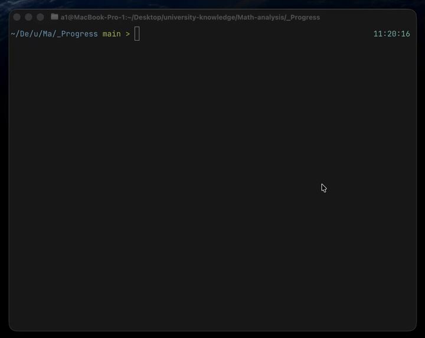

# Билеты по линейной алгебре — CLI


Простой CLI для тренировки билетов по линейной алгебре и отслеживания прогресса.

## Превью


## Требования
- Node.js 18+

## Установка
```bash
npm install
```

## Сборка
```bash
npm run build
```

## Запуск
```bash
npm start
```

## Данные
- Билеты: `src/data/tickets.json`
- История (создаётся автоматически): `src/data/history.json`
