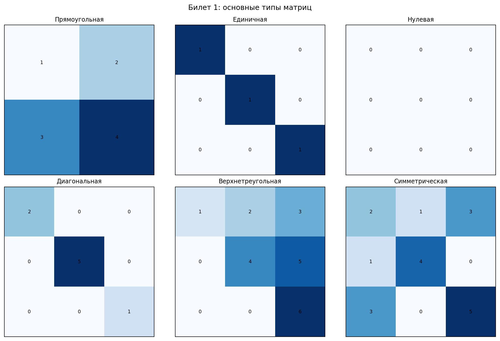

# Билет 1. Определение матрицы. Формы записи матрицы. Виды матриц. Действия с матрицами. Сложение матриц. Умножение матриц на число. Умножение матриц.

## Определения

**Матрица** — прямоугольная таблица элементов, состоящая из m строк и n столбцов: A = (aᵢⱼ), размер m×n.

**Квадратная матрица** — матрица, у которой число строк равно числу столбцов (m = n).

**Нулевая матрица** — матрица, все элементы которой равны нулю: O.

**Единичная матрица** — квадратная матрица с единицами на главной диагонали и нулями вне её: E.

**Диагональная матрица** — квадратная матрица, у которой все элементы вне главной диагонали равны нулю.

**Треугольная матрица** — квадратная матрица, у которой все элементы выше (или ниже) главной диагонали равны нулю.

**Симметрическая матрица** — квадратная матрица, равная своей транспонированной: Aᵀ = A.

## Операции с матрицами

**Сложение**: (A + B)ᵢⱼ = aᵢⱼ + bᵢⱼ (матрицы одинакового размера)

**Умножение на число**: (λA)ᵢⱼ = λ · aᵢⱼ

**Умножение матриц**: (AB)ᵢⱼ = Σₖ aᵢₖ · bₖⱼ (число столбцов A = числу строк B)

## Свойства умножения
- A(BC) = (AB)C
- A(B + C) = AB + AC
- AB ≠ BA (в общем случае)
- AE = EA = A

**Алгебраическое определение:** Определитель вычисляется как сумма произведений элементов матрицы, взятых по одному из каждой строки и каждого столбца, с учетом знака соответствующей перестановки.

## Наглядное представление

### Основные типы матриц из билета

