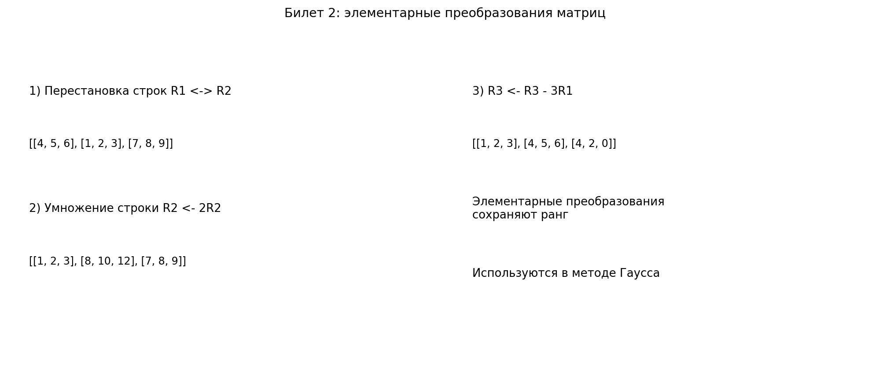

# Билет 2. Элементарные преобразования. Элементарная матрица. Ступенчатая матрица. Приведение матриц к главному ступенчатому виду. Линейная зависимость и линейная независимость строк и столбцов матрицы.

## Определения

**Элементарные преобразования матрицы**:
1. Перестановка двух строк (столбцов)
2. Умножение строки (столбца) на ненулевое число λ ≠ 0
3. Прибавление к строке (столбцу) другой строки (столбца), умноженной на число

**Элементарная матрица** — матрица, полученная из единичной применением одного элементарного преобразования.

**Ступенчатая матрица** — матрица, у которой:
- все нулевые строки расположены ниже ненулевых
- ведущий элемент каждой ненулевой строки находится правее ведущего элемента предыдущей строки

**Главный ступенчатый вид (приведённая ступенчатая форма)** — ступенчатая матрица, в которой:
- все ведущие элементы равны 1
- в столбце каждого ведущего элемента все остальные элементы равны 0

**Линейная зависимость строк** — существует нетривиальная линейная комбинация строк, равная нулевой строке.

**Линейная независимость** — только тривиальная (нулевая) линейная комбинация даёт нулевой вектор.

## Теорема

**Теорема о сохранении ранга**: элементарные преобразования не изменяют ранг матрицы.

## Наглядное представление

### Три типа элементарных преобразований строк

