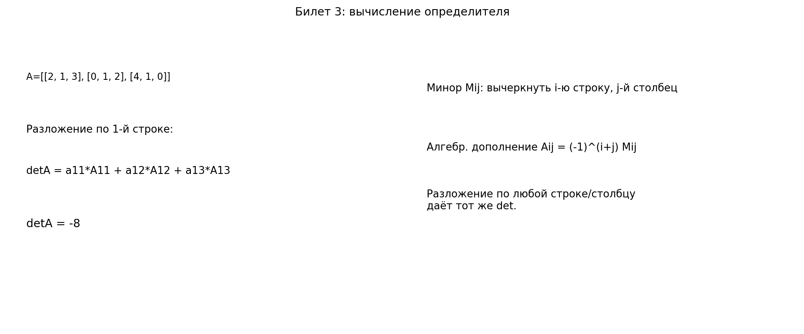

# Билет 3. Определители матриц. Вычисление определителя с помощью разложения по строке и столбцу. Миноры и алгебраические дополнения. Теорема о независимости разложения определителя по строке или столбцу.

## Определения

**Алгебраическое определение:** Определитель вычисляется как сумма произведений элементов матрицы, взятых по одному из каждой строки и каждого столбца, с учетом знака соответствующей перестановки.

**Определитель 2×2**:
det A = |a₁₁ a₁₂| = a₁₁a₂₂ − a₁₂a₂₁
        |a₂₁ a₂₂|

**Минор элемента Mᵢⱼ** — определитель матрицы, полученной вычёркиванием i-й строки и j-го столбца.

**Алгебраическое дополнение**: Aᵢⱼ = (−1)^{i+j} · Mᵢⱼ

## Теоремы

**Разложение по строке**: det A = Σⱼ aᵢⱼ · Aᵢⱼ

**Разложение по столбцу**: det A = Σᵢ aᵢⱼ · Aᵢⱼ

**Теорема о независимости разложения**: разложение определителя по любой строке или столбцу даёт одно и то же значение.

## Наглядное представление

### Разложение определителя по строке/столбцу через миноры

