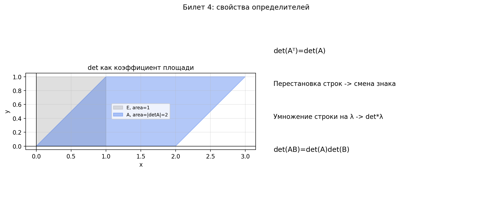

# Билет 4. Определители матриц. Определитель транспонированной матрицы. Определитель матрицы при элементарных преобразованиях. Определитель вырожденной матрицы.

## Теоремы

**Теорема о транспонировании**: det Aᵀ = det A.

**Теорема о перестановке строк**: при перестановке двух строк (столбцов) определитель меняет знак.

**Теорема об умножении строки**: при умножении строки на число λ определитель умножается на λ.

**Теорема о линейной зависимости**: если строки (столбцы) линейно зависимы, то det A = 0.

**Вырожденная матрица** — квадратная матрица с det A = 0.

**Теорема об определителе произведения**: det(AB) = det A · det B.

## Наглядное представление

### Геометрический смысл свойств определителя

