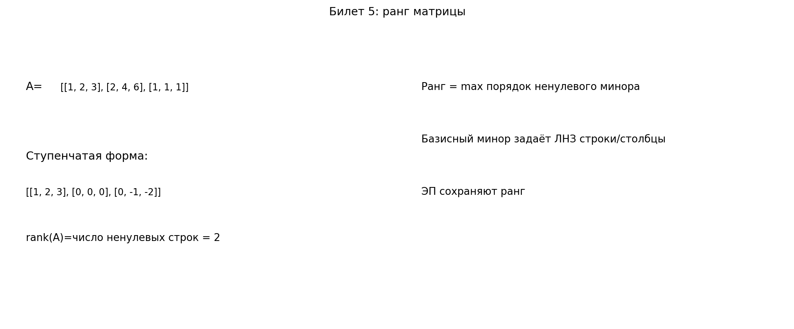

# Билет 5. Ранг матрицы. Методы вычисления ранга матрицы. Теорема о базисном миноре.

## Определения

**Ранг матрицы** — максимальное число линейно независимых строк (или столбцов) матрицы.

Эквивалентные формулировки:
- rank A = максимальный порядок ненулевого минора;
- rank A = число ведущих элементов (pivot) в ступенчатом виде;
- rank A = dim(пространства строк) = dim(пространства столбцов).

**Базисный минор** — любой ненулевой минор максимального порядка (порядка rank A).

Для матрицы A размера m × n всегда:
0 ≤ rank A ≤ min(m, n).

## Теоремы

**Критерий ранга через миноры**:
rank A = r тогда и только тогда, когда:
1. существует хотя бы один ненулевой минор порядка r;
2. все миноры порядка r+1 равны нулю.

**Теорема о базисном миноре**:
если минор порядка r ненулевой и является базисным, то:
1. строки и столбцы, из которых он составлен, линейно независимы;
2. любая другая строка матрицы линейно выражается через эти r строк;
3. любой другой столбец матрицы линейно выражается через эти r столбцов.

**Следствие**: ранг по строкам равен рангу по столбцам.

## Методы вычисления ранга

1. **Метод Гаусса (основной)**:
- элементарными преобразованиями приводим матрицу к ступенчатому виду;
- rank A равен числу ненулевых строк (или числу pivot).

2. **Метод миноров**:
- ищем ненулевой минор максимально возможного порядка;
- порядок этого минора и есть rank A.

3. **Метод окаймляющих миноров**:
- начинаем с найденного ненулевого минора;
- пытаемся увеличить его порядок добавлением строки и столбца;
- когда увеличить порядок нельзя, полученный максимум и есть ранг.

## Пример

Найти rank A для
$$
A=
\begin{pmatrix}
1&2&3\\
2&4&6\\
1&1&1
\end{pmatrix}.
$$

1. Вторая строка равна 2·первой, поэтому rank A < 3.
2. Минор порядка 2:
$$
\begin{vmatrix}
1&2\\
1&1
\end{vmatrix}
=-1\neq 0.
$$
Значит rank A ≥ 2.
3. Следовательно, rank A = 2.

## Наглядное представление

### Ранг матрицы через ступенчатый вид и базисный минор

