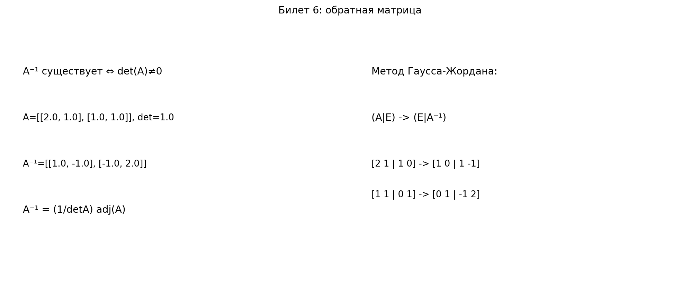

# Билет 6. Обратная матрица. Свойства обратной матрицы. Вычисление обратной матрицы с помощью союзной (присоединённой) матрицы и с помощью метода Гаусса.

## Определения

**Обратная матрица** — матрица A⁻¹, такая что AA⁻¹ = A⁻¹A = E.

**Союзная (присоединённая) матрица** — матрица adj A, где (adj A)ᵢⱼ = Aⱼᵢ (транспонированная матрица алгебраических дополнений).

## Теоремы

**Критерий существования**: A⁻¹ существует ⇔ det A ≠ 0.

**Формула через союзную матрицу**: A⁻¹ = (1/det A) · adj A

**Метод Гаусса**: (A|E) → (E|A⁻¹)

## Свойства
- (AB)⁻¹ = B⁻¹A⁻¹
- (Aᵀ)⁻¹ = (A⁻¹)ᵀ
- (A⁻¹)⁻¹ = A
- det(A⁻¹) = 1/det A

## Примеры

### 1) Нахождение обратной через союзную матрицу

Пусть
$$\Large
A=\begin{pmatrix}4&7\\2&6\end{pmatrix}.
$$

Сначала найдём определитель:
$$\Large
\det A = 4\cdot 6 - 7\cdot 2 = 10 \neq 0.
$$
Следовательно, обратная матрица существует.

Алгебраические дополнения:
$$\Large
A_{11}=6,\quad A_{12}=-2,\quad A_{21}=-7,\quad A_{22}=4.
$$

Матрица алгебраических дополнений:
$$\Large
C=\begin{pmatrix}6&-2\\-7&4\end{pmatrix}.
$$

Союзная матрица:
$$\Large
\operatorname{adj}A=C^T=\begin{pmatrix}6&-7\\-2&4\end{pmatrix}.
$$

Тогда
$$\Large
A^{-1}=\frac{1}{\det A}\operatorname{adj}A
=\frac1{10}\begin{pmatrix}6&-7\\-2&4\end{pmatrix}.
$$

### 2) Нахождение обратной методом Гаусса

Пусть
$$\Large
B=\begin{pmatrix}
1&1&0\\
0&1&1\\
1&0&1
\end{pmatrix}.
$$

Составим расширенную матрицу:
$$\Large
\left(
\begin{array}{ccc|ccc}
1&1&0&1&0&0\\
0&1&1&0&1&0\\
1&0&1&0&0&1
\end{array}
\right).
$$

Преобразования строк:
$$\Large
R_3\leftarrow R_3-R_1:
\left(
\begin{array}{ccc|ccc}
1&1&0&1&0&0\\
0&1&1&0&1&0\\
0&-1&1&-1&0&1
\end{array}
\right),
$$
$$\Large
R_3\leftarrow R_3+R_2:
\left(
\begin{array}{ccc|ccc}
1&1&0&1&0&0\\
0&1&1&0&1&0\\
0&0&2&-1&1&1
\end{array}
\right),
$$
$$\Large
R_3\leftarrow \frac12 R_3:
\left(
\begin{array}{ccc|ccc}
1&1&0&1&0&0\\
0&1&1&0&1&0\\
0&0&1&-\frac12&\frac12&\frac12
\end{array}
\right),
$$
$$\Large
R_2\leftarrow R_2-R_3:
\left(
\begin{array}{ccc|ccc}
1&1&0&1&0&0\\
0&1&0&\frac12&\frac12&-\frac12\\
0&0&1&-\frac12&\frac12&\frac12
\end{array}
\right),
$$
$$\Large
R_1\leftarrow R_1-R_2:
\left(
\begin{array}{ccc|ccc}
1&0&0&\frac12&-\frac12&\frac12\\
0&1&0&\frac12&\frac12&-\frac12\\
0&0&1&-\frac12&\frac12&\frac12
\end{array}
\right).
$$

Получили \((E\,|\,B^{-1})\), значит
$$\Large
B^{-1}=
\begin{pmatrix}
\frac12&-\frac12&\frac12\\
\frac12&\frac12&-\frac12\\
-\frac12&\frac12&\frac12
\end{pmatrix}.
$$

## Наглядное представление

### Обратная матрица: критерий существования и метод Гаусса

