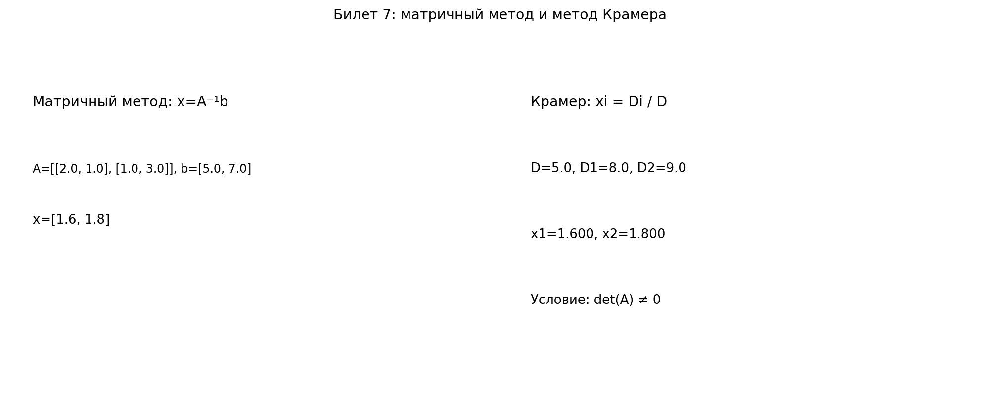

\Large

# Билет 7. Системы линейных алгебраических уравнений. Матричный метод решения систем. Метод Крамера.

## 1. Постановка задачи

Рассматриваем систему линейных уравнений
$$
Ax=b,
$$
где:
- $A \in M_n(F)$ — матрица коэффициентов,
- $x \in F^n$ — столбец неизвестных,
- $b \in F^n$ — столбец свободных членов.

Для матричного метода и метода Крамера нужно, чтобы система была **квадратной** и $\det A \ne 0$.

## 2. Матричный метод

### Определение
Если $\det A \ne 0$, то существует обратная матрица $A^{-1}$, и решение:
$$
x=A^{-1}b.
$$

### Алгоритм
1. Вычислить $\det A$.
2. Если $\det A=0$, метод неприменим.
3. Найти $A^{-1}$ (через формулу $A^{-1}=\frac{1}{\det A}\operatorname{adj}A$ или методом Гаусса).
4. Вычислить $x=A^{-1}b$.

### Комментарий
Метод удобен, когда обратная матрица уже найдена или её легко получить.

## 3. Метод Крамера

### Определение
Для каждого $i=1,\dots,n$ строим матрицу $A_i$: в $A$ заменяем $i$-й столбец на $b$.
Тогда:
$$
x_i=\frac{\det A_i}{\det A}, \quad i=1,\dots,n.
$$

### Алгоритм
1. Вычислить $\det A$.
2. Если $\det A=0$, метод неприменим.
3. Для каждого $i$ вычислить $\det A_i$.
4. Найти все $x_i$ по формуле Крамера.

### Комментарий
Для больших $n$ метод вычислительно тяжёлый (нужно считать много определителей), поэтому на практике чаще применяют метод Гаусса. Для $2\times2$, $3\times3$ метод удобен и нагляден.

## 4. Условия применимости (для обоих методов)
- Система квадратная: $n$ уравнений и $n$ неизвестных.
- $\det A \ne 0$.
- Следствие: система имеет единственное решение.

Если $\det A=0$, то может быть либо нет решений, либо бесконечно много решений; в этом случае используют метод Гаусса и теорему Кронекера-Капелли.

## 5. Связь методов

Оба метода дают одно и то же решение при $\det A \ne 0$:
- матричный метод через $x=A^{-1}b$,
- Крамер через отношения определителей.

Метод Крамера можно получить из формулы $A^{-1}=\frac{1}{\det A}\operatorname{adj}A$, поэтому это не разные ответы, а две формы одной теории.

## 6. Пример

Решить систему:
$$
\begin{cases}
2x_1-x_2=1,\\
3x_1+2x_2=12.
\end{cases}
$$

$$
A=\begin{pmatrix}2&-1\\3&2\end{pmatrix},\quad
b=\begin{pmatrix}1\\12\end{pmatrix},\quad
\det A=2\cdot2-(-1)\cdot3=7\ne0.
$$

### По Крамеру
$$
A_1=\begin{pmatrix}1&-1\\12&2\end{pmatrix},\quad
\det A_1=1\cdot2-(-1)\cdot12=14,\quad
x_1=\frac{14}{7}=2.
$$
$$
A_2=\begin{pmatrix}2&1\\3&12\end{pmatrix},\quad
\det A_2=2\cdot12-1\cdot3=21,\quad
x_2=\frac{21}{7}=3.
$$

### Матричным методом
$$
A^{-1}=\frac{1}{7}\begin{pmatrix}2&1\\-3&2\end{pmatrix},
\quad
x=A^{-1}b=
\frac{1}{7}\begin{pmatrix}2&1\\-3&2\end{pmatrix}
\begin{pmatrix}1\\12\end{pmatrix}
=\begin{pmatrix}2\\3\end{pmatrix}.
$$

Ответ: $x_1=2,\;x_2=3$.

### Дополнительный пример (только матричный метод)

Решить систему:
$$
\begin{cases}
2x_1+x_2=5,\\
x_1-x_2=1.
\end{cases}
$$

Запишем в виде $Ax=b$:
$$
A=\begin{pmatrix}2&1\\1&-1\end{pmatrix},\quad
x=\begin{pmatrix}x_1\\x_2\end{pmatrix},\quad
b=\begin{pmatrix}5\\1\end{pmatrix}.
$$

Проверим обратимость:
$$
\det A=2\cdot(-1)-1\cdot1=-3\ne0.
$$
Значит, $A^{-1}$ существует.

Найдём обратную матрицу:
$$
A^{-1}=\frac{1}{-3}
\begin{pmatrix}
-1 & -1\\
-1 & 2
\end{pmatrix}
=
\begin{pmatrix}
\frac13 & \frac13\\
\frac13 & -\frac23
\end{pmatrix}.
$$

Найдём решение:
$$
x=A^{-1}b=
\begin{pmatrix}
\frac13 & \frac13\\
\frac13 & -\frac23
\end{pmatrix}
\begin{pmatrix}
5\\
1
\end{pmatrix}
=
\begin{pmatrix}
2\\
1
\end{pmatrix}.
$$

Ответ: $x_1=2,\;x_2=1$.

### Дополнительный пример (из задания: матричный метод, 2 неизвестных)

Решить систему:
$$
\begin{cases}
3x_1+2x_2=7,\\
x_1-x_2=1.
\end{cases}
$$

Запишем в виде $Ax=b$:
$$
A=\begin{pmatrix}3&2\\1&-1\end{pmatrix},\quad
x=\begin{pmatrix}x_1\\x_2\end{pmatrix},\quad
b=\begin{pmatrix}7\\1\end{pmatrix}.
$$

Проверим обратимость:
$$
\det A=3\cdot(-1)-2\cdot1=-5\ne0.
$$
Значит, $A^{-1}$ существует.

Найдём обратную матрицу:
$$
A^{-1}=\frac{1}{-5}
\begin{pmatrix}
-1 & -2\\
-1 & 3
\end{pmatrix}
=
\begin{pmatrix}
\frac15 & \frac25\\
\frac15 & -\frac35
\end{pmatrix}.
$$

Найдём решение:
$$
x=A^{-1}b=
\begin{pmatrix}
\frac15 & \frac25\\
\frac15 & -\frac35
\end{pmatrix}
\begin{pmatrix}
7\\
1
\end{pmatrix}
=
\begin{pmatrix}
\frac95\\
\frac45
\end{pmatrix}.
$$

Ответ: $x_1=\frac95,\;x_2=\frac45$.

## 7. Что важно сказать на экзамене
- Оба метода работают только при $\det A\ne0$.
- Это методы для квадратных систем.
- Крамер удобен для малых размерностей, матричный метод опирается на обратную матрицу.
- При $\det A=0$ переходят к Гауссу и анализу рангов.

## Наглядное представление

### Сравнение матричного метода и метода Крамера на одном примере

