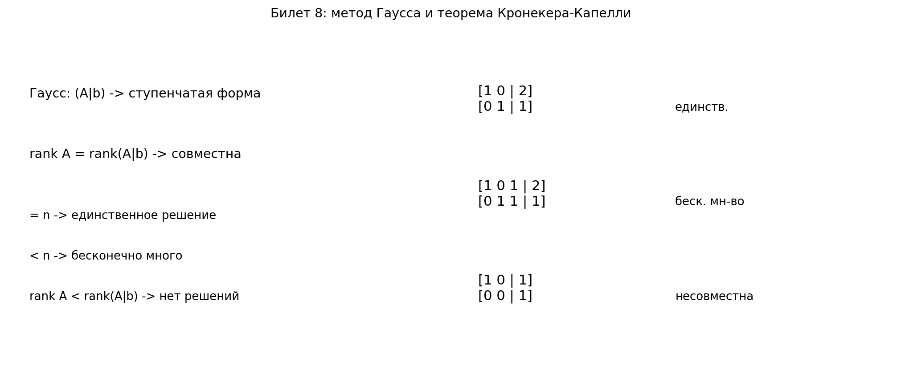

# Билет 8. Решение систем линейных алгебраических уравнений методом Гаусса. Теорема Кронекера-Капелли.

## Определения

**Расширенная матрица системы** — матрица (A|b).

**Метод Гаусса** — метод решения СЛАУ путём приведения расширенной матрицы к ступенчатому виду элементарными преобразованиями.

**Совместная система** — система, имеющая хотя бы одно решение.

**Несовместная система** — система, не имеющая решений.

## Теорема Кронекера-Капелли

Система Ax = b совместна ⇔ rank A = rank(A|b).

При этом:
- Если rank A = rank(A|b) = n (число неизвестных) — единственное решение
- Если rank A = rank(A|b) < n — бесконечно много решений

## Наглядное представление

### Классификация СЛАУ через ранги после метода Гаусса

