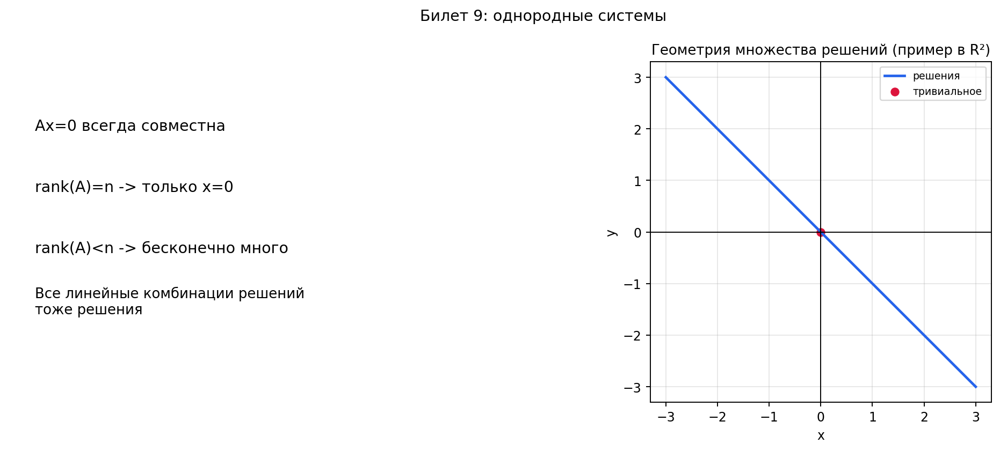

# Билет 9. Однородные системы линейных алгебраических уравнений. Условие существования ненулевого решения. Свойства решений однородной системы.

---

## 1. Определение однородной системы

**Однородная СЛАУ** — это система вида:

$$A\mathbf{x} = \mathbf{0}$$

то есть система, у которой **все свободные члены равны нулю**:

$$\begin{cases}
a_{11}x_1 + a_{12}x_2 + \ldots + a_{1n}x_n = 0 \\
a_{21}x_1 + a_{22}x_2 + \ldots + a_{2n}x_n = 0 \\
\vdots \\
a_{m1}x_1 + a_{m2}x_2 + \ldots + a_{mn}x_n = 0
\end{cases}$$

где $A$ — матрица коэффициентов размера $m \times n$, $\mathbf{x}$ — столбец неизвестных.

**Тривиальное (нулевое) решение** — решение $\mathbf{x} = \mathbf{0}$, то есть $x_1 = x_2 = \ldots = x_n = 0$.

**Словами:** в правой части везде нули. Подставив $x_1 = \ldots = x_n = 0$, всегда получим $0 = 0$ — значит нулевой вектор всегда подходит.

---

## 2. Однородная система всегда совместна

**Утверждение.** Однородная система $A\mathbf{x} = \mathbf{0}$ **всегда имеет хотя бы одно решение** — тривиальное $\mathbf{x} = \mathbf{0}$.

**Почему:** подставляем $\mathbf{x} = \mathbf{0}$ в $A\mathbf{x}$:

$$A \cdot \mathbf{0} = \mathbf{0} \;\checkmark$$

Это следует и из теоремы Кронекера-Капелли: для однородной системы расширенная матрица $(A \mid \mathbf{0})$ имеет тот же ранг, что и $A$ (столбец нулей не увеличивает ранг), поэтому:

$$\operatorname{rank} A = \operatorname{rank}(A \mid \mathbf{0}) \quad \text{всегда}$$

Значит система всегда совместна.

---

## 3. Критерий существования ненулевого решения

### Теорема

Однородная система $A\mathbf{x} = \mathbf{0}$ имеет **ненулевое решение** тогда и только тогда, когда:

$$\boxed{\operatorname{rank} A < n}$$

где $n$ — число неизвестных.

### Следствие: два случая

| Условие | Что получаем |
|---------|-------------|
| $\operatorname{rank} A = n$ | **Только тривиальное** решение $\mathbf{x} = \mathbf{0}$ |
| $\operatorname{rank} A < n$ | **Бесконечно много** решений (есть ненулевые) |

**Словами:** если ранг матрицы равен числу неизвестных — все переменные «заняты», свободных нет, единственное решение — ноль. Если ранг меньше — появляются свободные переменные, которые можно выбирать как угодно, и решений бесконечно много.

### Частный случай: квадратная система

Если $A$ — **квадратная** матрица ($m = n$), то:

$$\operatorname{rank} A < n \iff \det A = 0$$

Поэтому:

$$\boxed{\text{Ненулевое решение } \iff \det A = 0}$$

**Словами:** для квадратной системы достаточно посчитать определитель. Если он ноль — есть ненулевые решения. Если не ноль — только нулевое.

---

## 4. Свойства решений однородной системы

### Свойство 1. Замкнутость относительно сложения

Если $\mathbf{x}_1$ и $\mathbf{x}_2$ — решения $A\mathbf{x} = \mathbf{0}$, то $\mathbf{x}_1 + \mathbf{x}_2$ тоже решение.

**Доказательство:**

$$A(\mathbf{x}_1 + \mathbf{x}_2) = A\mathbf{x}_1 + A\mathbf{x}_2 = \mathbf{0} + \mathbf{0} = \mathbf{0} \;\checkmark$$

### Свойство 2. Замкнутость относительно умножения на число

Если $\mathbf{x}_1$ — решение и $\alpha \in \mathbb{R}$, то $\alpha \mathbf{x}_1$ тоже решение.

**Доказательство:**

$$A(\alpha \mathbf{x}_1) = \alpha (A\mathbf{x}_1) = \alpha \cdot \mathbf{0} = \mathbf{0} \;\checkmark$$

### Свойство 3. Замкнутость относительно линейных комбинаций

Если $\mathbf{x}_1, \mathbf{x}_2, \ldots, \mathbf{x}_k$ — решения, то **любая линейная комбинация**

$$\alpha_1 \mathbf{x}_1 + \alpha_2 \mathbf{x}_2 + \ldots + \alpha_k \mathbf{x}_k$$

тоже является решением.

**Доказательство:**

$$A(\alpha_1 \mathbf{x}_1 + \ldots + \alpha_k \mathbf{x}_k) = \alpha_1 A\mathbf{x}_1 + \ldots + \alpha_k A\mathbf{x}_k = \alpha_1 \cdot \mathbf{0} + \ldots + \alpha_k \cdot \mathbf{0} = \mathbf{0} \;\checkmark$$

### Что это значит геометрически

Множество всех решений однородной системы образует **подпространство** в $\mathbb{R}^n$ — это **ядро** матрицы $A$:

$$\ker A = \{\mathbf{x} \in \mathbb{R}^n \mid A\mathbf{x} = \mathbf{0}\}$$

**Словами:** решения однородной системы — это не просто «набор точек», а целое линейное подпространство. Можно складывать решения, умножать на числа — и всегда останемся среди решений. Это отличает однородные системы от неоднородных.

> **Важно:** для **неоднородной** системы $A\mathbf{x} = \mathbf{b}$ ($\mathbf{b} \neq \mathbf{0}$) это свойство **не выполняется**: сумма двух решений неоднородной системы — **не** решение (подставьте и проверьте: получится $\mathbf{b} + \mathbf{b} = 2\mathbf{b} \neq \mathbf{b}$).

---

## 5. Связь с ФСР и общим решением

Размерность пространства решений:

$$\dim \ker A = n - \operatorname{rank} A$$

Если $\operatorname{rank} A = r < n$, то существует **фундаментальная система решений** (ФСР) из $n - r$ векторов $\{\eta_1, \eta_2, \ldots, \eta_{n-r}\}$, и **общее решение** однородной системы:

$$\mathbf{x} = c_1 \eta_1 + c_2 \eta_2 + \ldots + c_{n-r} \eta_{n-r}, \quad c_i \in \mathbb{R}$$

> Подробнее о ФСР — в **Билете 10**.

---

## 6. Числовые примеры

### Пример 1: только тривиальное решение

$$\begin{cases} x_1 + 2x_2 = 0 \\ 3x_1 + 7x_2 = 0 \end{cases}$$

$$A = \begin{pmatrix} 1 & 2 \\ 3 & 7 \end{pmatrix}, \quad \det A = 7 - 6 = 1 \neq 0$$

$\operatorname{rank} A = 2 = n$ → **только тривиальное решение** $x_1 = x_2 = 0$.

### Пример 2: бесконечно много решений

$$\begin{cases} x_1 + 2x_2 + 3x_3 = 0 \\ 2x_1 + 4x_2 + 6x_3 = 0 \end{cases}$$

Вторая строка = первая $\times 2$, значит $\operatorname{rank} A = 1$, $n = 3$.

$\operatorname{rank} A = 1 < 3 = n$ → **есть ненулевые решения**.

Число свободных переменных: $n - r = 3 - 1 = 2$ (свободные: $x_2, x_3$).

Из первой строки: $x_1 = -2x_2 - 3x_3$.

Общее решение:

$$\mathbf{x} = x_2 \begin{pmatrix} -2 \\ 1 \\ 0 \end{pmatrix} + x_3 \begin{pmatrix} -3 \\ 0 \\ 1 \end{pmatrix}$$

Например:
- $x_2 = 1, x_3 = 0$ → $\mathbf{x} = (-2, 1, 0)$
- $x_2 = 0, x_3 = 1$ → $\mathbf{x} = (-3, 0, 1)$

Проверка $(-2, 1, 0)$: $-2 + 2(1) + 3(0) = 0$ ✓

### Пример 3: квадратная система 3×3

$$\begin{cases} x_1 + x_2 + x_3 = 0 \\ x_1 + 2x_2 + 3x_3 = 0 \\ 2x_1 + 3x_2 + 4x_3 = 0 \end{cases}$$

$$\det A = \begin{vmatrix} 1 & 1 & 1 \\ 1 & 2 & 3 \\ 2 & 3 & 4 \end{vmatrix} = 1(8-9) - 1(4-6) + 1(3-4) = -1 + 2 - 1 = 0$$

$\det A = 0$ → есть ненулевые решения.

Метод Гаусса:

$$\begin{pmatrix} 1 & 1 & 1 \\ 1 & 2 & 3 \\ 2 & 3 & 4 \end{pmatrix} \xrightarrow{R_2 - R_1,\; R_3 - 2R_1} \begin{pmatrix} 1 & 1 & 1 \\ 0 & 1 & 2 \\ 0 & 1 & 2 \end{pmatrix} \xrightarrow{R_3 - R_2} \begin{pmatrix} 1 & 1 & 1 \\ 0 & 1 & 2 \\ 0 & 0 & 0 \end{pmatrix}$$

$\operatorname{rank} A = 2$, $n = 3$, свободная переменная: $x_3$.

Из $R_2$: $x_2 = -2x_3$. Из $R_1$: $x_1 = -x_2 - x_3 = 2x_3 - x_3 = x_3$.

$$\mathbf{x} = x_3 \begin{pmatrix} 1 \\ -2 \\ 1 \end{pmatrix}$$

Проверка $(1, -2, 1)$: $1 - 2 + 1 = 0$ ✓, $1 - 4 + 3 = 0$ ✓, $2 - 6 + 4 = 0$ ✓

---

## 7. Сводная таблица

| | Однородная $A\mathbf{x} = \mathbf{0}$ | Неоднородная $A\mathbf{x} = \mathbf{b}$ |
|---|---|---|
| Всегда совместна? | **Да** (есть $\mathbf{x} = \mathbf{0}$) | Нет (нужно $\operatorname{rank} A = \operatorname{rank}(A \mid \mathbf{b})$) |
| Ненулевое решение | $\operatorname{rank} A < n$ | — |
| Единственное решение | $\operatorname{rank} A = n$ (только $\mathbf{x} = \mathbf{0}$) | $\operatorname{rank} A = n$ |
| Сумма решений — решение? | **Да** | **Нет** |
| Множество решений | Подпространство ($\ker A$) | Линейное многообразие |

---

## Как запомнить

- Однородная = правая часть нули → ноль всегда подходит → всегда совместна
- $\operatorname{rank} A < n$ → есть свободные переменные → бесконечно много решений
- $\operatorname{rank} A = n$ → свободных нет → только ноль
- Решения можно складывать и умножать на числа (подпространство)
- Для квадратной: $\det A = 0$ ↔ есть ненулевые решения

## Наглядное представление

### Однородная система: от тривиального к пространству решений

