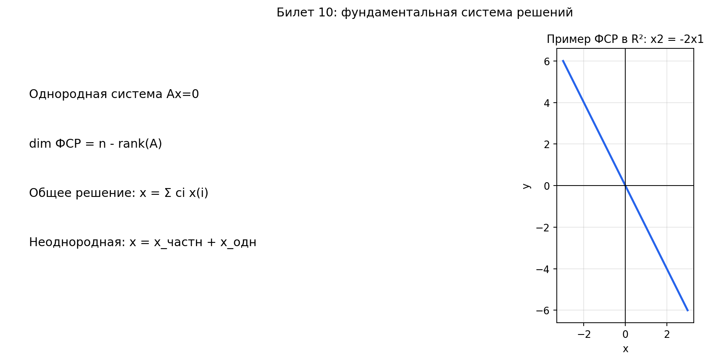

# Билет 10. Фундаментальная матрица решений. Теорема об общем решении системы линейных алгебраических уравнений.

## Определения

**Фундаментальная система решений (ФСР)** — максимальная линейно независимая система решений однородной СЛАУ.

**Фундаментальная матрица** — матрица, столбцы которой образуют ФСР.

## Теоремы

**Размерность ФСР**:
$$\Large
\dim \text{ФСР} = n - \operatorname{rank}A.
$$

## Что означает \(n-\operatorname{rank}A\)

$$\Large
n-\operatorname{rank}A=\dim\ker A=\operatorname{nullity}(A).
$$

$$\Large
\ker A=\{x\in\mathbb{R}^n\mid Ax=0\}
$$

\(\ker A\) — ядро матрицы \(A\), то есть множество всех решений однородной системы \(Ax=0\).

$$\Large
\operatorname{nullity}(A)=\dim(\ker A)
$$

\(\operatorname{nullity}(A)\) — размерность ядра, то есть число свободных переменных.

Это:
- размерность пространства решений однородной системы \(Ax=0\);
- число свободных переменных;
- число векторов в фундаментальной системе решений.

Эту величину называют **дефектом** матрицы (или **nullity**).

$$\Large
\operatorname{rank}A+\operatorname{nullity}(A)=n.
$$

**Теорема об общем решении однородной системы**: общее решение однородной системы — это все линейные комбинации векторов ФСР.

**Теорема об общем решении неоднородной системы**: x = x_частн + x_одн, где x_одн — общее решение соответствующей однородной системы.

## Пример

Найти ФСР системы:
```
x₁ + 2x₂ − x₃ + x₄ = 0
2x₁ + 4x₂ + x₃ − 2x₄ = 0
```

**Решение**:

1. Приводим к ступенчатому виду:
```
(1  2  -1   1 | 0)     (1  2  -1   1 | 0)
(2  4   1  -2 | 0)  →  (0  0   3  -4 | 0)
```

2. Находим rank A = 2, число неизвестных n = 4.
   Значит dim ФСР = n − rank A = 4 − 2 = 2.

3. Базисные переменные: x₁, x₃. Свободные переменные: x₂, x₄.

4. Из второй строки: 3x₃ = 4x₄, то есть x₃ = (4/3)x₄
   Из первой строки: x₁ = −2x₂ + x₃ − x₄ = −2x₂ + (4/3)x₄ − x₄ = −2x₂ + (1/3)x₄

5. Общее решение: x = x₂(−2, 1, 0, 0) + x₄(1/3, 0, 4/3, 1)

6. **ФСР**: e₁ = (−2, 1, 0, 0), e₂ = (1, 0, 4, 3) (умножили на 3 для целых чисел)

**Ответ**: ФСР состоит из двух векторов: {(−2, 1, 0, 0), (1, 0, 4, 3)}

## Наглядное представление

### ФСР как базис пространства решений Ax=0

