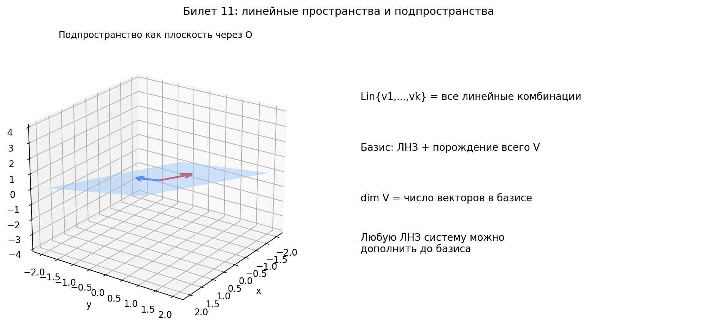

# Билет 11. Линейные пространства. Линейные подпространства и их свойства. Линейная оболочка. Базис и размерность линейных пространств.

## Определения линейного пространства

**Линейное (векторное) пространство над полем F** — множество V с операциями сложения и умножения на скаляр, удовлетворяющими 8 аксиомам (для любых x, y, z ∈ V и α, β ∈ F):
1. x + y = y + x
2. (x + y) + z = x + (y + z)
3. ∃ 0: x + 0 = x
4. ∀x ∃(−x): x + (−x) = 0
5. 1 · x = x
6. (αβ)x = α(βx)
7. (α + β)x = αx + βx
8. α(x + y) = αx + αy

**Поле скаляров** — множество чисел, из которого берутся коэффициенты (обычно R или C).

**Линейная комбинация** векторов v₁, ..., vₖ — вектор вида α₁v₁ + ... + αₖvₖ.
v - вектор 
a - скаляр 
**Линейная независимость**: векторы v₁, ..., vₖ линейно независимы, если
α₁v₁ + ... + αₖvₖ = 0 ⇒ α₁ = ... = αₖ = 0.

**Линейная зависимость**: существует нетривиальная линейная комбинация, равная нулю.

**Базис** — линейно независимая система векторов, порождающая всё пространство.

**Размерность**: dim V — число векторов в базисе (для конечномерного пространства).

**Конечномерное пространство** — пространство с конечным базисом. Иначе пространство бесконечномерно.

## Базовые свойства линейного пространства

1. Нулевой вектор единственный.
2. Для каждого x противоположный вектор −x единственный.
3. Для любого x и α: 0·x = 0, α·0 = 0, (−1)·x = −x.
4. Если αx = 0, то α = 0 или x = 0.

## Линейные подпространства

**Линейное подпространство** — подмножество, замкнутое относительно линейных операций.

**Критерий подпространства**: непустое подмножество L' пространства L является подпространством тогда и только тогда, когда:
1. Сумма любых двух векторов из L' принадлежит L'.
2. Произведение любого вектора из L' на любой скаляр принадлежит L'.

Иными словами: любая линейная комбинация векторов из L' остаётся в L'.

Примеры подпространств:
1. {0} и всё пространство V.
2. Множество решений однородной системы Ax = 0 (ядро матрицы A).
3. Множество многочленов степени не выше n в пространстве многочленов.

## Свойства линейных подпространств

1. Любое подпространство содержит нулевой вектор (0 ∈ L').
2. Пересечение любого числа подпространств является подпространством.
3. Сумма L₁ + L₂ = {x + y : x ∈ L₁, y ∈ L₂} является подпространством.
4. Сумма называется прямой (L₁ ⊕ L₂), если L₁ ∩ L₂ = {0}. Тогда разложение вектора x = x₁ + x₂ единственно.
5. Объединение двух подпространств обычно не является подпространством (кроме случая, когда одно вложено в другое).
6. Для конечномерного L: dim L' ≤ dim L, причём равенство достигается только при L' = L.

## Линейная оболочка

**Определение.** Линейная оболочка множества векторов $M = \{v_1, \ldots, v_k\}$ — это **множество всех возможных линейных комбинаций** этих векторов:

$$\operatorname{Lin}(M) = \operatorname{Lin}\{v_1, \ldots, v_k\} = \left\{\alpha_1 v_1 + \alpha_2 v_2 + \ldots + \alpha_k v_k \;\middle|\; \alpha_1, \ldots, \alpha_k \in \mathbb{R}\right\}$$

**Словами:** берём данные векторы, умножаем каждый на какое хотим число, складываем — получаем один вектор. Множество **всех** таких результатов (при всех возможных коэффициентах) — и есть линейная оболочка.

### Примеры

**Пример 1.** $\operatorname{Lin}\{(1, 0)\}$ в $\mathbb{R}^2$ — это все векторы вида $\alpha(1, 0) = (\alpha, 0)$, то есть **ось $Ox$** (прямая).

**Пример 2.** $\operatorname{Lin}\{(1, 0), (0, 1)\}$ в $\mathbb{R}^2$ — это все векторы $\alpha(1,0) + \beta(0,1) = (\alpha, \beta)$, то есть **вся плоскость** $\mathbb{R}^2$.

**Пример 3.** $\operatorname{Lin}\{(1, 2), (2, 4)\}$ — второй вектор = первый $\times 2$, поэтому линейная оболочка — это просто $\operatorname{Lin}\{(1, 2)\}$ — **прямая** через начало координат в направлении $(1, 2)$.

### Свойства линейной оболочки

1. $\operatorname{Lin}(M)$ — **подпространство** (содержит $\mathbf{0}$, замкнуто относительно сложения и умножения на скаляр).
2. $\operatorname{Lin}(M)$ — **наименьшее подпространство**, содержащее все векторы из $M$.
3. $M$ порождает $V$ тогда и только тогда, когда $\operatorname{Lin}(M) = V$.
4. Векторы линейно зависимы $\iff$ один из них выражается через остальные $\iff$ его можно выкинуть, и оболочка не изменится.

## Базис и размерность

**Координаты вектора в базисе**: если e₁, ..., eₙ — базис V, то любой x ∈ V единственным образом представим как
x = α₁e₁ + ... + αₙeₙ.

**Теорема о базисе**:
1. Любая линейно независимая система векторов в конечномерном пространстве может быть дополнена до базиса.
2. Любая порождающая система содержит базис.

**Следствия**:
1. Все базисы одного пространства содержат одинаковое число векторов.
2. В n-мерном пространстве:
   - любая линейно независимая система из n векторов является базисом;
   - любая порождающая система из n векторов является базисом.

**Формулы размерности**:
1. Для подпространства L' ⊆ L: dim L' ≤ dim L.
2. dim(L₁ + L₂) = dim L₁ + dim L₂ − dim(L₁ ∩ L₂).
3. Если сумма прямая, то dim(L₁ ⊕ L₂) = dim L₁ + dim L₂.

## Примеры линейных пространств

1. Rⁿ с обычными операциями сложения и умножения на число.
2. Mₘₓₙ(R) — пространство всех матриц размера m × n.
3. Pₙ — пространство многочленов степени не выше n.
4. C[a, b] — пространство непрерывных функций на [a, b].

## Наглядное представление

### Подпространство, линейная оболочка, базис и размерность

