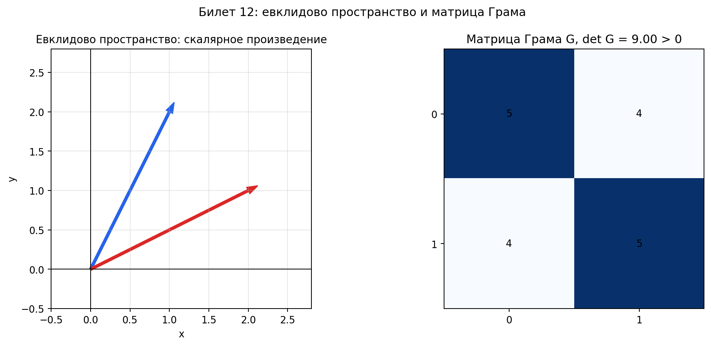

# Билет 12. Евклидовы пространства. Скалярное произведение. Матрица Грама и ее свойства.

## Определения

**Евклидово пространство** — вещественное линейное пространство со скалярным произведением.

**Скалярное произведение** — отображение (x, y), удовлетворяющее:
1. (x, y) = (y, x) — симметричность
2. (αx, y) = α(x, y) — линейность
3. (x + y, z) = (x, z) + (y, z) — аддитивность
4. (x, x) ≥ 0; (x, x) = 0 ⇔ x = 0 — положительная определённость

**Матрица Грама** системы векторов v₁, ..., vₖ:
G = ((vᵢ, vⱼ))₍ᵢ,ⱼ₌₁₎ᵏ.

Это матрица всех попарных скалярных произведений (не только для базиса, а для любой системы векторов).

Если A — матрица, столбцы которой равны координатам v₁, ..., vₖ в ортонормированном базисе, то:
G = AᵀA.

## Свойства матрицы Грама

1. G симметрична: Gᵀ = G.
2. G неотрицательно определена: для любого x ∈ Rᵏ выполняется xᵀGx ≥ 0.
3. det G ≥ 0.
4. det G > 0 тогда и только тогда, когда векторы v₁, ..., vₖ линейно независимы.
5. det G = 0 тогда и только тогда, когда векторы линейно зависимы.
6. rank G = dim Lin{v₁, ..., vₖ}.
7. Если система ортогональна, то G диагональна; если ортонормирована, то G = I.

## Геометрический смысл

**Определитель Грама** равен квадрату k-мерного объёма параллелепипеда, натянутого на v₁, ..., vₖ:
det G = Volₖ(v₁, ..., vₖ)².

Для двух векторов:
det G = ||v₁||²||v₂||² − (v₁, v₂)² = ||v₁||²||v₂||² sin²φ.

Отсюда следует неравенство Коши-Буняковского:
|(v₁, v₂)| ≤ ||v₁||·||v₂||.

## Пример

Пусть v₁ = (1, 0, 1), v₂ = (1, 1, 0). Тогда:
G = [[(v₁,v₁), (v₁,v₂)],
     [(v₂,v₁), (v₂,v₂)]]
  = [[2, 1],
     [1, 2]].

det G = 4 − 1 = 3 > 0, значит v₁ и v₂ линейно независимы, а площадь натянутого на них параллелограмма равна √3.

## Наглядное представление

### Матрица Грама как таблица всех скалярных произведений

