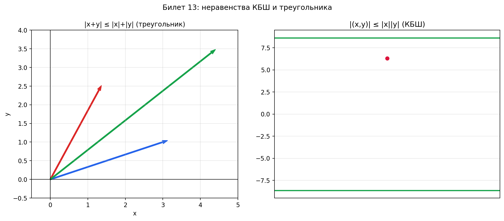

# Билет 13. Неравенство Коши-Буняковского-Шварца. Неравенство треугольника. Длина вектора. Угол между векторами.

---

## 1. Длина (норма) вектора

**Определение:**

$$\|x\| = \sqrt{(x, x)}$$

**Словами:** длина вектора — это корень из скалярного произведения вектора на самого себя. Работает в любом евклидовом пространстве, не только в $\mathbb{R}^3$.

### В координатах ($\mathbb{R}^n$)

Если $x = (x_1, x_2, \ldots, x_n)$, то:

$$\|x\| = \sqrt{x_1^2 + x_2^2 + \ldots + x_n^2}$$

### Длина вектора между двумя точками

Если $A(a_1, a_2, a_3)$ и $B(b_1, b_2, b_3)$, то вектор $\overrightarrow{AB} = (b_1 - a_1,\; b_2 - a_2,\; b_3 - a_3)$ и его длина:

$$|\overrightarrow{AB}| = \sqrt{(b_1 - a_1)^2 + (b_2 - a_2)^2 + (b_3 - a_3)^2}$$

### Числовой пример

$A(1, 2, 3)$, $B(4, 6, 3)$:

$$\overrightarrow{AB} = (3, 4, 0), \quad |\overrightarrow{AB}| = \sqrt{9 + 16 + 0} = \sqrt{25} = 5$$

### Свойства нормы

| Свойство | Формула | Словами |
|----------|---------|---------|
| Неотрицательность | $\|x\| \geq 0$; $\|x\| = 0 \iff x = 0$ | Длина всегда $\geq 0$, ноль только у нулевого вектора |
| Однородность | $\|\alpha x\| = |\alpha| \cdot \|x\|$ | Растянул вектор в $\alpha$ раз — длина увеличилась в $|\alpha|$ раз |
| Неравенство треугольника | $\|x + y\| \leq \|x\| + \|y\|$ | Напрямик не длиннее, чем в обход |

---

## 2. Угол между векторами

**Определение:**

$$\cos \varphi = \frac{(x, y)}{\|x\| \cdot \|y\|}$$

**Словами:** косинус угла — это скалярное произведение, делённое на произведение длин. Результат всегда от $-1$ до $1$ (это гарантирует неравенство КБШ).

### Частные случаи

| Угол | $\cos \varphi$ | Что значит |
|------|----------------|------------|
| $\varphi = 0°$ | $\cos \varphi = 1$ | Векторы сонаправлены |
| $\varphi = 90°$ | $\cos \varphi = 0$ | Векторы ортогональны (перпендикулярны) |
| $\varphi = 180°$ | $\cos \varphi = -1$ | Векторы противоположно направлены |

### Числовой пример

$x = (1, 0, 0)$, $y = (1, 1, 0)$:

$$(x, y) = 1 \cdot 1 + 0 \cdot 1 + 0 \cdot 0 = 1$$

$$\|x\| = 1, \quad \|y\| = \sqrt{1 + 1} = \sqrt{2}$$

$$\cos \varphi = \frac{1}{1 \cdot \sqrt{2}} = \frac{1}{\sqrt{2}} \;\Rightarrow\; \varphi = 45°$$

### Ортогональность

Векторы **ортогональны** (перпендикулярны), если:

$$(x, y) = 0$$

**Пример:** $x = (1, 2, -1)$, $y = (3, -1, 1)$:

$$(x, y) = 3 - 2 - 1 = 0 \;\Rightarrow\; \text{ортогональны}$$

---

## 3. Неравенство Коши–Буняковского–Шварца (КБШ)

**Формулировка:**

$$\boxed{|(x, y)| \leq \|x\| \cdot \|y\|}$$

**Словами:** модуль скалярного произведения не больше произведения длин. На пальцах: проекция одного вектора на другой не может быть длиннее самого вектора.

**Равенство** достигается $\iff$ векторы **коллинеарны** ($x = \lambda y$).

### Почему это работает

Из формулы угла: $\cos \varphi = \frac{(x,y)}{\|x\| \cdot \|y\|}$. Мы знаем, что $|\cos \varphi| \leq 1$. Значит:

$$\frac{|(x,y)|}{\|x\| \cdot \|y\|} \leq 1 \;\Rightarrow\; |(x,y)| \leq \|x\| \cdot \|y\|$$

На самом деле всё наоборот: сначала доказывают КБШ, а потом из него определяют угол (чтобы косинус был корректен).

### Числовой пример

$x = (1, 2)$, $y = (3, 4)$:

- $(x, y) = 3 + 8 = 11$, значит $|(x,y)| = 11$
- $\|x\| = \sqrt{1 + 4} = \sqrt{5}$
- $\|y\| = \sqrt{9 + 16} = \sqrt{25} = 5$
- $\|x\| \cdot \|y\| = 5\sqrt{5} \approx 11.18$

$$11 \leq 11.18 \;\checkmark$$

### Когда равенство

$x = (2, 4)$, $y = (1, 2)$ — коллинеарны ($x = 2y$):

- $(x, y) = 2 + 8 = 10$
- $\|x\| = \sqrt{4 + 16} = \sqrt{20} = 2\sqrt{5}$
- $\|y\| = \sqrt{1 + 4} = \sqrt{5}$
- $\|x\| \cdot \|y\| = 2\sqrt{5} \cdot \sqrt{5} = 10$

$$10 = 10 \;\checkmark \quad \text{(равенство, т.к. коллинеарны)}$$

### В координатах ($\mathbb{R}^n$)

КБШ записывается как:

$$\left|\sum_{i=1}^n x_i y_i\right| \leq \sqrt{\sum_{i=1}^n x_i^2} \cdot \sqrt{\sum_{i=1}^n y_i^2}$$

---

## 4. Неравенство треугольника

**Формулировка:**

$$\boxed{\|x + y\| \leq \|x\| + \|y\|}$$

**Словами:** длина суммы не больше суммы длин. Геометрически: в треугольнике одна сторона всегда меньше суммы двух других. Путь напрямик (вектор $x + y$) не длиннее, чем путь через промежуточную точку (сначала $x$, потом $y$).

**Равенство** достигается $\iff$ векторы **коллинеарны и сонаправлены** ($x = \lambda y$, $\lambda \geq 0$).

### Доказательство (через КБШ)

$$\|x + y\|^2 = (x + y, x + y) = (x,x) + 2(x,y) + (y,y) = \|x\|^2 + 2(x,y) + \|y\|^2$$

По КБШ: $(x,y) \leq |(x,y)| \leq \|x\| \cdot \|y\|$, значит:

$$\|x + y\|^2 \leq \|x\|^2 + 2\|x\|\cdot\|y\| + \|y\|^2 = (\|x\| + \|y\|)^2$$

Берём корень из обеих частей:

$$\|x + y\| \leq \|x\| + \|y\| \quad \blacksquare$$

### Числовой пример

$x = (3, 0)$, $y = (0, 4)$:

- $\|x + y\| = \|(3, 4)\| = \sqrt{9 + 16} = 5$
- $\|x\| + \|y\| = 3 + 4 = 7$

$$5 \leq 7 \;\checkmark$$

Это прямоугольный треугольник: гипотенуза (5) меньше суммы катетов (7).

### Когда равенство

$x = (1, 2)$, $y = (2, 4)$ — коллинеарны и сонаправлены ($y = 2x$):

- $\|x + y\| = \|(3, 6)\| = \sqrt{9 + 36} = \sqrt{45} = 3\sqrt{5}$
- $\|x\| + \|y\| = \sqrt{5} + 2\sqrt{5} = 3\sqrt{5}$

$$3\sqrt{5} = 3\sqrt{5} \;\checkmark \quad \text{(равенство, т.к. сонаправлены)}$$

---

## 5. Коллинеарные векторы

**Определение:** векторы $x$ и $y$ **коллинеарны**, если $x = \lambda y$ для некоторого $\lambda \in \mathbb{R}$.

**Словами:** один вектор — это растянутая (или сжатая, или перевёрнутая) копия другого. Они лежат на одной прямой.

- $\lambda > 0$ — **сонаправлены** (в одну сторону)
- $\lambda < 0$ — **противоположно направлены**
- $\lambda = 0$ — один из векторов нулевой

---

## 6. Связь всех понятий

```
Скалярное произведение (x, y)
        │
        ├── Длина: ‖x‖ = √(x,x)
        │
        ├── Угол: cos φ = (x,y) / (‖x‖·‖y‖)
        │
        ├── КБШ: |(x,y)| ≤ ‖x‖·‖y‖
        │         (гарантирует |cos φ| ≤ 1)
        │
        └── Неравенство треугольника: ‖x+y‖ ≤ ‖x‖+‖y‖
                  (следует из КБШ)
```

Всё строится на скалярном произведении. КБШ гарантирует, что угол определён корректно, а из КБШ следует неравенство треугольника.

## Наглядное представление

### Геометрический смысл неравенств КБШ и треугольника

