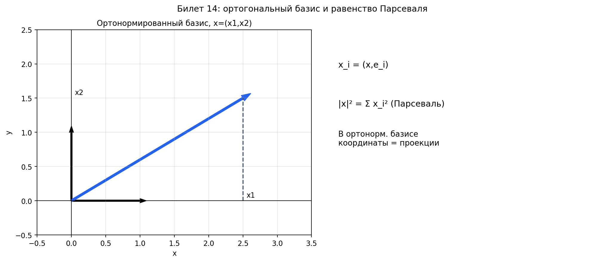

# Билет 14. Ортогональный базис. Равенство Парсеваля.

## Определения

**Ортогональный вектор**: вектор `y` называется ортогональным вектору `x`, если их
скалярное произведение равно нулю: `(x, y) = 0`.

Для ненулевых векторов это эквивалентно углу `90°` между ними. Нулевой вектор
ортогонален любому вектору.

**Ортогональный базис** — базис из попарно ортогональных векторов.

**Ортонормированный базис** — ортогональный базис из единичных векторов: (eᵢ, eⱼ) = δᵢⱼ

## Теоремы

**Равенство Парсеваля**: пусть `e₁, ..., eₙ` — ортонормированный базис и
`x = Σ xᵢeᵢ`. Тогда

`|x|² = (x, x) = Σ xᵢ² = Σ (x, eᵢ)²`.

То есть квадрат длины вектора равен сумме квадратов его координат в
ортонормированном базисе.

Для ортогонального (не обязательно нормированного) базиса:

`|x|² = Σ xᵢ²|eᵢ|²`.

**Координаты в ортонормированном базисе**: xᵢ = (x, eᵢ)

Смысл формулы: скалярное произведение `(x, eᵢ)` даёт i-ю координату вектора `x`,
потому что это подписанная длина проекции `x` на направление `eᵢ`.

Действительно, если `x = Σ xₖeₖ`, то
`(x, eᵢ) = Σ xₖ(eₖ, eᵢ) = xᵢ`, так как `(eₖ, eᵢ) = 0` при `k ≠ i` и `1` при `k = i`.

## Примеры

**Пример ортогонального базиса в R³**:
- e₁ = (1, 0, 0)
- e₂ = (0, 1, 0)
- e₃ = (0, 0, 1)

Это также ортонормированный базис, так как все векторы единичные.

**Пример ортогонального, но не ортонормированного базиса**:
- e₁ = (2, 0, 0)
- e₂ = (0, 3, 0)
- e₃ = (0, 0, 5)

Векторы попарно ортогональны, но |e₁| = 2, |e₂| = 3, |e₃| = 5 ≠ 1.

**Пример применения равенства Парсеваля**:

В стандартном базисе R³ вектор x = (3, 4, 0).

|x|² = 3² + 4² + 0² = 9 + 16 = 25, значит |x| = 5.

**Пример нахождения координат через скалярное произведение**:

Ортонормированный базис: e₁ = (1, 0), e₂ = (0, 1).
Вектор x = (3, 5).

x₁ = (x, e₁) = 3·1 + 5·0 = 3
x₂ = (x, e₂) = 3·0 + 5·1 = 5

## Наглядное представление

### Ортонормированный базис: координаты как скалярные произведения

