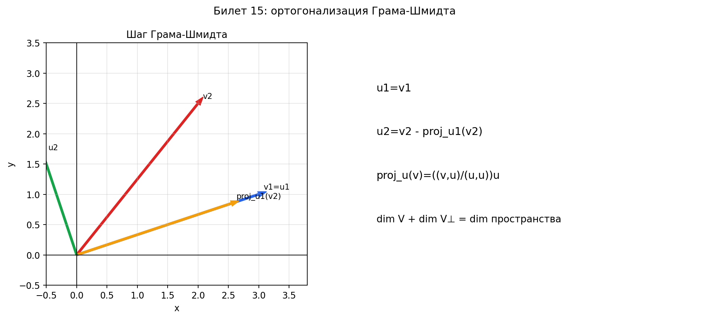

# Билет 15. Ортогональные проекции. Ортогональное дополнение. Метод ортогонализации Грама-Шмидта.

---

## 1. Скалярная и векторная проекция

### Скалярная проекция

**Определение:** скалярная проекция вектора $x$ на ненулевой вектор $y$ — это **число**:

$$\text{пр}_y(x) = \frac{(x, y)}{\|y\|}$$

**Словами:** это длина "тени" вектора $x$ на направление вектора $y$. Может быть отрицательным (если векторы смотрят в разные стороны).

**Геометрический смысл:**

$$\text{пр}_y(x) = \|x\| \cos \varphi$$

где $\varphi$ — угол между $x$ и $y$.

### Векторная проекция

**Определение:** векторная (ортогональная) проекция вектора $x$ на $y$:

$$\boxed{\text{пр}\vec{}_y(x) = \frac{(x, y)}{(y, y)} \cdot y = \frac{(x, y)}{\|y\|^2} \cdot y}$$

**Словами:** это вектор, направленный вдоль $y$, такой что разность $x - \text{пр}\vec{}_y(x)$ перпендикулярна $y$. То есть сам вектор-тень.

**Числовой пример:**

$x = (3, 4)$, $y = (2, 1)$:

$$(x, y) = 6 + 4 = 10, \quad (y, y) = 4 + 1 = 5$$

$$\text{пр}\vec{}_y(x) = \frac{10}{5} \cdot (2, 1) = 2 \cdot (2, 1) = (4, 2)$$

Проверка ортогональности остатка:

$$x - \text{пр}\vec{}_y(x) = (3, 4) - (4, 2) = (-1, 2)$$

$$((-1, 2), (2, 1)) = -2 + 2 = 0 \;\checkmark \text{ перпендикулярны}$$

### Разложение вектора

Любой вектор $x$ можно разложить на **две ортогональные составляющие**:

$$x = \text{пр}\vec{}_y(x) + (x - \text{пр}\vec{}_y(x))$$

где:
- $\text{пр}\vec{}_y(x)$ — компонента вдоль $y$
- $x - \text{пр}\vec{}_y(x)$ — компонента перпендикулярная $y$

---

## 2. Ортогональное дополнение

**Определение.** Пусть $V$ — подпространство евклидова пространства $E$. **Ортогональное дополнение** $V^\perp$ — это множество всех векторов, перпендикулярных каждому вектору из $V$:

$$V^\perp = \{x \in E \mid (x, v) = 0 \text{ для всех } v \in V\}$$

### Свойства

1. $V^\perp$ — подпространство
2. $V \cap V^\perp = \{0\}$ — пересечение только нулевой вектор
3. $E = V \oplus V^\perp$ — ортогональная прямая сумма (каждый вектор раскладывается единственным образом)
4. $\dim V + \dim V^\perp = \dim E$ — размерности дополняют друг друга

### Числовой пример в $\mathbb{R}^3$

Пусть $V = \text{span}\{(1, 0, 0), (0, 1, 0)\}$ — плоскость $xy$ (вертикальная координата = 0).

Найдём $V^\perp$. Вектор $(x, y, z) \in V^\perp$, если он перпендикулярен любому вектору из $V$:

- $(x, y, z) \perp (1, 0, 0)$ → $x = 0$
- $(x, y, z) \perp (0, 1, 0)$ → $y = 0$

Значит $V^\perp = \{(0, 0, z) \mid z \in \mathbb{R}\} = \text{span}\{(0, 0, 1)\}$ — ось $z$.

Проверка: $\dim V = 2$, $\dim V^\perp = 1$, $\dim \mathbb{R}^3 = 3 = 2 + 1$ ✓

### Ортогональное дополнение прямой

$V = \text{span}\{(1, 2, 3)\}$ — прямая в $\mathbb{R}^3$.

Вектор $(x, y, z) \in V^\perp$, если $(x, y, z) \perp (1, 2, 3)$:

$$x + 2y + 3z = 0$$

Это уравнение плоскости через начало координат → $V^\perp$ — плоскость, $\dim V^\perp = 2$.

---

## 3. Процесс ортогонализации Грама-Шмидта

**Задача:** даны линейно независимые векторы $v_1, v_2, \ldots, v_m$. Хотим получить ортогональный (или ортонормированный) базис того же подпространства.

### Алгоритм

**Шаг 1.** Первый вектор оставляем как есть:

$$u_1 = v_1$$

**Шаг 2.** Из второго вектора вычитаем его проекцию на $u_1$:

$$u_2 = v_2 - \text{пр}\vec{}_{u_1}(v_2) = v_2 - \frac{(v_2, u_1)}{(u_1, u_1)} u_1$$

Теперь $u_2 \perp u_1$.

**Шаг 3.** Из третьего вектора вычитаем проекции на $u_1$ и $u_2$:

$$u_3 = v_3 - \text{пр}\vec{}_{u_1}(v_3) - \text{пр}\vec{}_{u_2}(v_3) = v_3 - \frac{(v_3, u_1)}{(u_1, u_1)} u_1 - \frac{(v_3, u_2)}{(u_2, u_2)} u_2$$

Теперь $u_3 \perp u_1$ и $u_3 \perp u_2$.

**Общая формула:**

$$\boxed{u_k = v_k - \sum_{i=1}^{k-1} \frac{(v_k, u_i)}{(u_i, u_i)} u_i}$$

**Нормировка** (чтобы получить ортонормированный базис):

$$e_i = \frac{u_i}{\|u_i\|}$$

### Числовой пример в $\mathbb{R}^2$

Даны векторы: $v_1 = (1, 1)$, $v_2 = (1, 0)$.

**Шаг 1:** $u_1 = v_1 = (1, 1)$.

**Шаг 2:** Вычисляем проекцию $v_2$ на $u_1$:

$$(v_2, u_1) = 1 \cdot 1 + 0 \cdot 1 = 1$$

$$(u_1, u_1) = 1 + 1 = 2$$

$$\text{пр}\vec{}_{u_1}(v_2) = \frac{1}{2}(1, 1) = \left(\frac{1}{2}, \frac{1}{2}\right)$$

$$u_2 = v_2 - \text{пр}\vec{}_{u_1}(v_2) = (1, 0) - \left(\frac{1}{2}, \frac{1}{2}\right) = \left(\frac{1}{2}, -\frac{1}{2}\right)$$

Проверка ортогональности:

$$(u_1, u_2) = 1 \cdot \frac{1}{2} + 1 \cdot \left(-\frac{1}{2}\right) = 0 \;\checkmark$$

**Нормировка:**

$$\|u_1\| = \sqrt{1 + 1} = \sqrt{2}, \quad e_1 = \frac{1}{\sqrt{2}}(1, 1) = \left(\frac{1}{\sqrt{2}}, \frac{1}{\sqrt{2}}\right)$$

$$\|u_2\| = \sqrt{\frac{1}{4} + \frac{1}{4}} = \frac{1}{\sqrt{2}}, \quad e_2 = \sqrt{2} \cdot \left(\frac{1}{2}, -\frac{1}{2}\right) = \left(\frac{1}{\sqrt{2}}, -\frac{1}{\sqrt{2}}\right)$$

Проверка:

$$(e_1, e_2) = \frac{1}{2} - \frac{1}{2} = 0 \;\checkmark$$

$$\|e_1\| = \|e_2\| = 1 \;\checkmark$$

### Числовой пример в $\mathbb{R}^3$

Даны векторы: $v_1 = (1, 0, 0)$, $v_2 = (1, 1, 0)$, $v_3 = (1, 1, 1)$.

**Шаг 1:** $u_1 = (1, 0, 0)$.

**Шаг 2:**

$$(v_2, u_1) = 1, \quad (u_1, u_1) = 1$$

$$u_2 = (1, 1, 0) - 1 \cdot (1, 0, 0) = (0, 1, 0)$$

**Шаг 3:**

$$(v_3, u_1) = 1, \quad (v_3, u_2) = 1$$

$$(u_1, u_1) = 1, \quad (u_2, u_2) = 1$$

$$u_3 = (1, 1, 1) - 1 \cdot (1, 0, 0) - 1 \cdot (0, 1, 0) = (0, 0, 1)$$

Получили стандартный ортонормированный базис $\mathbb{R}^3$ (в этом примере векторы уже были единичными).

---

## 4. Зачем нужна ортогонализация

1. **Упрощение вычислений** — в ортонормированном базисе координаты вычисляются просто: $c_i = (x, e_i)$
2. **QR-разложение матрицы** — в численных методах
3. **Метод наименьших квадратов** — для приближённого решения переопределённых систем
4. **Построение ортонормированного базиса** из любого набора линейно независимых векторов

---

## 5. Сводка формул

| Понятие | Формула |
|---------|---------|
| Скалярная проекция | $\text{пр}_y(x) = \dfrac{(x, y)}{\|y\|}$ |
| Векторная проекция | $\text{пр}\vec{}_y(x) = \dfrac{(x, y)}{(y, y)} \cdot y$ |
| Ортогональное дополнение | $V^\perp = \{x \mid (x, v) = 0 \;\forall v \in V\}$ |
| Размерность | $\dim V + \dim V^\perp = \dim E$ |
| Грам-Шмидт | $u_k = v_k - \displaystyle\sum_{i=1}^{k-1} \dfrac{(v_k, u_i)}{(u_i, u_i)} u_i$ |
| Нормировка | $e_i = \dfrac{u_i}{\|u_i\|}$ |

## Наглядное представление

### Ортогонализация: вычитание проекции

