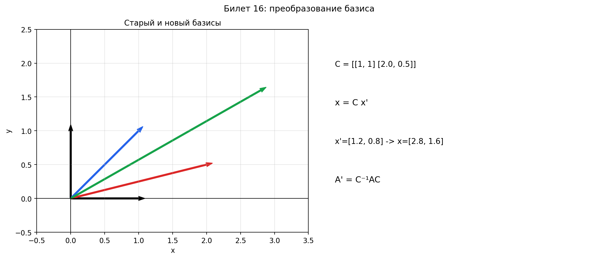

# Билет 16. Преобразование базиса. Матрица преобразования базиса. Преобразование векторов при смене базиса.

## Определения

**Матрица перехода** C — матрица, столбцы которой — координаты векторов нового базиса в старом.

## Теоремы

**Преобразование координат вектора**: x = Cx', где x — координаты в старом базисе, x' — в новом.

**Свойства матрицы перехода**:
- det C ≠ 0
- Матрица перехода от нового к старому: C⁻¹

## Формулы для смены базиса

| Что преобразуем                         | Формула          |
| --------------------------------------- | ---------------- |
| Связь базисов                           | e' = e · C       |
| Координаты вектора (старые через новые) | x = C · x'       |
| Координаты вектора (новые через старые) | x' = C⁻¹ · x     |
| Матрица линейного оператора             | A' = C⁻¹ · A · C |
| Матрица билинейной/квадратичной формы   | B' = Cᵀ · B · C  |
| Коэффициенты линейной формы             | a' = Cᵀ · a      |

**Обозначения**:
- e = {e₁, e₂, ..., eₙ} — старый базис
- e' = {e'₁, e'₂, ..., e'ₙ} — новый базис
- C — матрица перехода от старого базиса к новому (столбцы — координаты векторов нового базиса в старом)
- x — координаты вектора в старом базисе
- x' — координаты того же вектора в новом базисе
- A — матрица линейного оператора в старом базисе
- A' — матрица того же оператора в новом базисе
- B — матрица билинейной/квадратичной формы в старом базисе
- B' — матрица той же формы в новом базисе
- a — коэффициенты линейной формы в старом базисе
- a' — коэффициенты той же формы в новом базисе

**Как найти матрицу перехода C**:

1. Записать координаты каждого вектора нового базиса e'ⱼ в старом базисе e
2. Эти координаты образуют j-й столбец матрицы C

То есть если e'₁ = c₁₁e₁ + c₂₁e₂ + ... + cₙ₁eₙ, то первый столбец C равен (c₁₁, c₂₁, ..., cₙ₁)ᵀ

**Если старый базис — стандартный** (e₁, e₂, ..., eₙ — единичные векторы):
- Столбцы матрицы C — просто координаты векторов нового базиса

**Если оба базиса нестандартные**:
- Выразить каждый вектор e'ⱼ через векторы eᵢ, решив систему уравнений

## Наглядное представление

### Матрица перехода и преобразование координат

