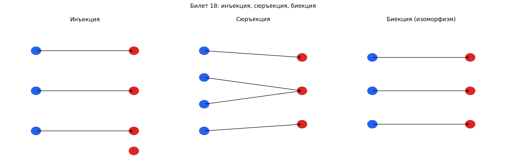

# Билет 18. Инъективные, сюръективные и биективные отображения. Изоморфизм линейных пространств.

## Определения

Пусть `f: V → W` — линейное отображение векторных пространств над одним полем `F`.

**Ядро отображения**:
`Ker f = {x ∈ V | f(x) = 0}` — множество всех векторов, переходящих в нуль.
Ker f является подпространством в `V`.

**Образ отображения**:
`Im f = {f(x) | x ∈ V}` — множество всех значений отображения.
Im f является подпространством в `W`.

Инъективность — разные элементы V переходят в разные
  элементы W. Никакие два вектора из V не «склеиваются» в
  один вектор в W. Но при этом в W могут остаться
  «непокрытые» элементы.

  Сюръективность — каждый элемент W имеет хотя бы один
  прообраз в V. Всё W покрыто, но у одного элемента W может
  быть несколько прообразов.

  Биективность — каждый элемент W имеет ровно один прообраз в
   V. Это и есть инъективность + сюръективность вместе:
  ничего не склеивается и ничего не пропущено.

**Изоморфизм линейных пространств**:
биективное линейное отображение `f: V → W` называется изоморфизмом.
Если такое отображение существует, пространства `V` и `W` называются изоморфными: `V ≅ W`.
Изоморфные пространства имеют одинаковую линейную структуру — они различаются лишь «названиями» элементов.

## Критерии через ядро и образ

| Свойство      | Критерий                                  |
| ------------- | ----------------------------------------- |
| Инъективность | `Ker f = {0}`                             |
| Сюръективность| `Im f = W`                                |
| Биективность  | `Ker f = {0}` и `Im f = W` одновременно  |

**Почему Ker f = {0} эквивалентно инъективности**:
если `f(x₁) = f(x₂)`, то `f(x₁ - x₂) = 0` (по линейности), то есть `x₁ - x₂ ∈ Ker f`.
Если `Ker f = {0}`, то `x₁ - x₂ = 0`, значит `x₁ = x₂`.

## Теоремы

**Теорема о размерности (ранг + дефект)**:
для линейного отображения `f: V → W` конечномерных пространств:

`dim V = dim Ker f + dim Im f`

где `dim Ker f` — дефект, `dim Im f` — ранг отображения.

**Теорема: эквивалентность свойств при равных размерностях**.
Если `dim V = dim W = n`, то для линейного отображения `f: V → W` следующие условия эквивалентны:
1. `f` инъективно;
2. `f` сюръективно;
3. `f` биективно (изоморфизм).

Доказательство: из теоремы о размерности `n = dim Ker f + dim Im f`.
- Если `f` инъективно, то `dim Ker f = 0`, значит `dim Im f = n = dim W`, значит `f` сюръективно.
- Если `f` сюръективно, то `dim Im f = n`, значит `dim Ker f = 0`, значит `f` инъективно.
- Если выполнено хотя бы одно, выполнены оба, то есть `f` биективно.

**Теорема об изоморфизме конечномерных пространств**:
два конечномерных линейных пространства над одним полем `F` изоморфны тогда и только тогда, когда их размерности равны:

`V ≅ W  ⟺  dim V = dim W`

Доказательство:
- (⇒) Если `f: V → W` — изоморфизм, то `f` переводит базис `V` в базис `W` (линейная независимость и порождение сохраняются), поэтому `dim V = dim W`.
- (⇐) Пусть `dim V = dim W = n`. Выберем базисы `{e₁, ..., eₙ}` в `V` и `{g₁, ..., gₙ}` в `W`. Зададим `f(eᵢ) = gᵢ` и продолжим по линейности. Это отображение линейно и биективно.

**Следствие**: любое конечномерное n-мерное вещественное пространство изоморфно `Rⁿ`.

## Свойства изоморфизма

1. Обратное отображение `f⁻¹: W → V` тоже является изоморфизмом.
2. Композиция изоморфизмов — изоморфизм.
3. Тождественное отображение `id: V → V` — изоморфизм.
4. Изоморфизм сохраняет линейную зависимость/независимость, базис, размерность, подпространства.

## Как определить тип отображения по матрице

Пусть `A` — матрица линейного отображения `f: Fⁿ → Fᵐ`, `r = rank A`.

| Свойство       | Условие на ранг            | Пояснение                              |
| -------------- | -------------------------- | -------------------------------------- |
| Инъективность  | `r = n`                    | Все столбцы линейно независимы         |
| Сюръективность | `r = m`                    | Образ заполняет всё целевое пространство|
| Биективность   | `r = n = m`                | Матрица квадратная и невырожденная     |

## Примеры

**1. Биективное отображение (изоморфизм)**:
`f: R² → R²`, `f(x, y) = (x + y, x − y)`.

Матрица: A = |1  1|, det A = −2 ≠ 0.
             |1 −1|

`Ker f = {0}`, `Im f = R²` — отображение биективно, это изоморфизм.

**2. Инъективное, но не сюръективное**:
`f: R² → R³`, `f(x, y) = (x, y, 0)`.

Матрица: A = |1 0|
             |0 1|, rank A = 2 = n.
             |0 0|

`Ker f = {0}` (инъективно), но `Im f = {(a, b, 0)}` — лишь плоскость в R³, а не всё R³ (не сюръективно).

**3. Сюръективное, но не инъективное**:
`f: R³ → R²`, `f(x, y, z) = (x + y, z)`.

Матрица: A = |1 1 0|, rank A = 2 = m.
             |0 0 1|

`Im f = R²` (сюръективно), но `Ker f = {(−t, t, 0) | t ∈ R} ≠ {0}` (не инъективно).

**4. Изоморфизм пространства многочленов и R³**:
`f: P₂ → R³`, `f(a₀ + a₁t + a₂t²) = (a₀, a₁, a₂)`.

Это биективное линейное отображение. Значит `P₂ ≅ R³`, что согласуется с `dim P₂ = 3 = dim R³`.

## Наглядное представление

### Инъекция, сюръекция, биекция и изоморфизм

