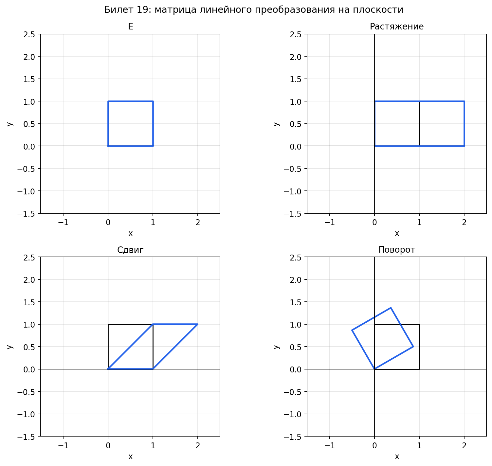

# Билет 19. Матрица линейного отображения. Матрицы тождественного преобразования, сдвига, растяжения и поворота плоскости. Матрица преобразования подобия. Преобразование матрицы линейного отображения при смене базиса.

## Матрица линейного отображения

Матрица линейного отображения — это способ записать линейное отображение
в виде таблицы чисел, чтобы вместо абстрактного `f(x)` можно было просто
умножить матрицу на вектор-столбец координат.

Пусть `f: V → W` — линейное отображение, выбраны базис `{e₁, ..., eₙ}` в `V`
и базис `{g₁, ..., gₘ}` в `W`. Тогда действие `f` на каждый базисный вектор
даёт вектор из `W`, который раскладывается по базису `{g₁, ..., gₘ}`:

`f(eⱼ) = a₁ⱼg₁ + a₂ⱼg₂ + ... + aₘⱼgₘ`

Коэффициенты `aᵢⱼ` образуют матрицу `A` размера `m × n` — это и есть
матрица линейного отображения `f` в данных базисах. Столбец с номером `j`
— это координаты образа `j`-го базисного вектора.

После этого для любого вектора `x` с координатами `(x₁, ..., xₙ)` в базисе `V`:

`f(x) = Ax`

То есть координаты образа получаются простым умножением матрицы на столбец координат.

Главная идея: линейное отображение полностью определяется тем, куда переходят
базисные векторы. Знаем образы базиса — знаем всё отображение. А матрица
как раз и хранит эти образы по столбцам.

## Матрицы преобразований плоскости

Все примеры ниже — линейные преобразования `f: R² → R²` (из плоскости в себя).

**Тождественное преобразование** — каждый вектор остаётся на месте.
`f(x, y) = (x, y)`. Ничего не меняется.

Матрица: `E = |1 0|`
              `|0 1|`

Это единичная матрица. Умножение на неё ничего не делает: `Ex = x`.

**Растяжение (сжатие) вдоль осей** — масштабирует вектор по каждой оси
со своим коэффициентом. `f(x, y) = (k₁·x, k₂·y)`.

Матрица: `D = |k₁  0|`
              `| 0 k₂|`

Если `k₁ = k₂ = k`, получается гомотетия — равномерное растяжение во все стороны.
Если `k₁ ≠ k₂`, фигура растягивается неравномерно (круг превращается в эллипс).

Пример: `k₁ = 2, k₂ = 0.5` — вдоль `x` растянули вдвое, вдоль `y` сжали вдвое.
Точка `(1, 4)` переходит в `(2, 2)`.

**Сдвиг (сдвиговый срез)** — вектор «съезжает» вдоль одной оси пропорционально
другой координате. `f(x, y) = (x + k·y, y)`.

Матрица: `S = |1 k|`
              `|0 1|`

Координата `y` не меняется, а к `x` прибавляется `k·y`. Геометрически: каждая
горизонтальная «полоска» сдвигается вправо тем сильнее, чем выше она расположена.
Квадрат превращается в параллелограмм.

Пример: `k = 2`, точка `(1, 3)` переходит в `(1 + 2·3, 3) = (7, 3)`.

Важно: обычный перенос `x → x + a` (сдвиг на постоянный вектор) — это НЕ линейное
преобразование, потому что нарушается `f(0) = 0`.

**Поворот плоскости** — поворачивает каждый вектор вокруг начала координат
на угол `θ` против часовой стрелки.

Матрица: `R = |cos θ  −sin θ|`
              `|sin θ   cos θ|`

Откуда берётся эта формула: базисный вектор `(1, 0)` после поворота на `θ`
становится `(cos θ, sin θ)` — это первый столбец. Вектор `(0, 1)` после
поворота становится `(−sin θ, cos θ)` — это второй столбец.

Пример: поворот на `90°`. `cos 90° = 0, sin 90° = 1`.
`R = | 0  −1|`
     `| 1   0|`
Точка `(1, 0)` переходит в `(0, 1)`, точка `(0, 1)` переходит в `(−1, 0)`.

## Матрица преобразования подобия

Преобразование подобия — это одно и то же линейное преобразование, но записанное
в другом базисе. Геометрически действие не меняется — меняется только система
координат, в которой мы его описываем.

Матрицы `A` и `A'` называются подобными, если существует невырожденная матрица `C`
такая, что:

`A' = C⁻¹AC`

где `C` — матрица перехода от старого базиса к новому (столбцы `C` — координаты
векторов нового базиса, записанные в старом базисе).

Смысл формулы по шагам:
1. `C` — переводит координаты из нового базиса в старый
2. `A` — применяет преобразование в старом базисе
3. `C⁻¹` — переводит результат обратно в новый базис

Итого `C⁻¹AC` — «перешли в старый базис → применили преобразование → вернулись в новый».

Подобные матрицы описывают одно и то же преобразование, поэтому у них совпадают:
- определитель: `det A' = det A`
- след: `tr A' = tr A`
- ранг: `rank A' = rank A`
- характеристический многочлен и собственные значения

## Преобразование матрицы при смене базиса

Суть проблемы: у тебя есть преобразование `f` и его матрица `A` в каком-то
базисе. Ты решил поменять базис. Само преобразование никуда не делось —
оно по-прежнему делает то же самое с векторами. Но числа в матрице изменятся,
потому что координаты тех же векторов в новом базисе другие.

Аналогия: представь, что ты описываешь поворот комнаты. Стоишь лицом к двери —
«вправо» это одно направление. Повернулся к окну — «вправо» уже другое.
Но сам поворот комнаты не изменился. Изменилось только твоё описание.

**Формула**: `A' = C⁻¹AC`

где `A` — матрица в старом базисе, `A'` — в новом, `C` — матрица перехода.

**Что делает формула по шагам**:

У тебя есть вектор `x'` — его координаты в новом базисе. Ты хочешь применить
преобразование и получить результат тоже в новом базисе. Но матрица `A` умеет
работать только со старыми координатами. Поэтому делаешь три шага:

1. **`C · x'`** — переводишь координаты из нового базиса в старый
   (теперь у тебя обычные «старые» координаты)
2. **`A · (Cx')`** — применяешь преобразование в старом базисе
   (матрица `A` умеет это делать)
3. **`C⁻¹ · (ACx')`** — переводишь результат обратно в новый базис

Итого: `A'x' = C⁻¹ · A · C · x'`, значит `A' = C⁻¹AC`.

**Числовой пример**:

Преобразование `f` удваивает первую координату: `f(x, y) = (2x, y)`.

В стандартном базисе `{(1,0), (0,1)}` матрица простая:
`A = |2 0|`
     `|0 1|`

Переходим в базис `{(1,1), (0,1)}`. Матрица перехода:
`C = |1 0|`  (столбцы — координаты новых базисных векторов в старом базисе)
     `|1 1|`

`C⁻¹ = | 1  0|`
       `|−1  1|`

Считаем по шагам:
`AC = |2 0| · |1 0| = |2 0|`
      `|0 1|   |1 1|   |1 1|`

`A' = C⁻¹ · (AC) = | 1  0| · |2 0| = | 2  0|`
                     `|−1  1|   |1 1|   |−1  1|`

Матрица изменилась (`A ≠ A'`), но преобразование то же самое — просто
теперь оно записано в другой системе координат.

Для линейного отображения `f: V → W` (разные пространства) формула аналогична,
но с двумя матрицами перехода:

`A' = D⁻¹AC`

где `C` — матрица перехода в `V`, `D` — матрица перехода в `W`.

## Сводная таблица формул смены базиса

| Что преобразуем                       | Формула          |
| ------------------------------------- | ---------------- |
| Связь базисов                         | e' = e · C       |
| Координаты вектора (старые → новые)   | x' = C⁻¹ · x    |
| Координаты вектора (новые → старые)   | x = C · x'       |
| Матрица линейного преобразования      | A' = C⁻¹ · A · C|
| Матрица билинейной/квадратичной формы | B' = Cᵀ · B · C |

## Примеры

**1. Найти матрицу отображения**:
`f: R² → R²`, `f(x, y) = (2x + 3y, x − y)` в стандартном базисе.

`f(e₁) = f(1, 0) = (2, 1)` — первый столбец.
`f(e₂) = f(0, 1) = (3, −1)` — второй столбец.

Матрица: `A = |2   3|`
              `|1  −1|`

Проверка: `A · (x, y)ᵀ = (2x + 3y, x − y)ᵀ` — совпадает.

**2. Смена базиса**:
В стандартном базисе преобразование имеет матрицу `A = |1 2|`.
                                                       `|0 1|`

Перейдём в базис `e'₁ = (1, 1), e'₂ = (1, −1)`.

Матрица перехода: `C = |1  1|`, `C⁻¹ = 1/(-2) · |−1 −1| = | 1/2  1/2|`
                       `|1 −1|`                    `|−1  1|   | 1/2 −1/2|`

`A' = C⁻¹AC = |1/2  1/2| · |1 2| · |1  1| = |1/2  1/2| · |3 −1| = |2  0|`
              `|1/2 −1/2|   |0 1|   |1 −1|   |1/2 −1/2|   |1 −1|   |1 −1|`

Нулевое значение в `A'` — это не обязательно, зависит от конкретного примера.

## Наглядное представление

### Как разные матрицы действуют на фигуру

