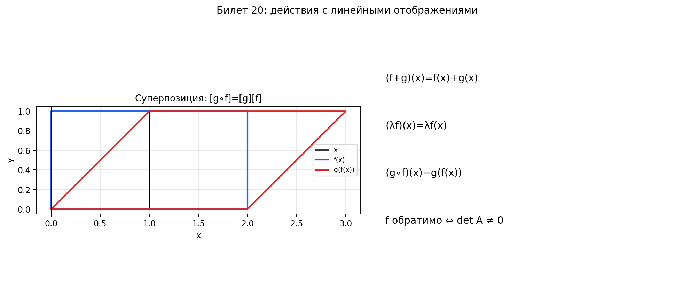

# Билет 20. Действия с линейными отображениями: сложение отображений, умножение на действительное число и произведение (суперпозиция) отображений. Обратное линейное отображение.

## Главная идея

С линейными отображениями можно делать те же операции, что и с числами:
складывать, умножать на число, перемножать (композиция) и «делить»
(обратное отображение). И каждой из этих операций соответствует
такая же операция с их матрицами.

## Сложение отображений

Пусть `f: V → W` и `g: V → W` — два линейных отображения из одного
пространства в другое. Их сумма — это новое отображение, которое
к каждому вектору применяет оба отображения и складывает результаты:

`(f + g)(x) = f(x) + g(x)`

Результат `f + g` тоже линейное отображение (сумма линейных — линейна).

На уровне матриц: если `f` имеет матрицу `A`, а `g` — матрицу `B`
(в одних и тех же базисах), то `f + g` имеет матрицу `A + B`.
Просто складываем матрицы поэлементно.

Пример: `f(x, y) = (x + y, 2x)` и `g(x, y) = (3x, y − x)`.

`(f + g)(x, y) = (x + y + 3x, 2x + y − x) = (4x + y, x + y)`

Матрицы: `A = |1 1|`, `B = |3 0|`, `A + B = |4 1|` — совпадает.
              `|2 0|`       `|−1 1|`           `|1 1|`

## Умножение на число

Пусть `f: V → W` — линейное отображение, `λ` — число (скаляр).
Умножение на число — это новое отображение, которое масштабирует
результат в `λ` раз:

`(λf)(x) = λ · f(x)`

Результат `λf` тоже линейное отображение.

На уровне матриц: если `f` имеет матрицу `A`, то `λf` имеет матрицу `λA`.
Просто умножаем каждый элемент матрицы на `λ`.

Пример: `f(x, y) = (x + y, 2x)`, `λ = 3`.

`(3f)(x, y) = 3 · (x + y, 2x) = (3x + 3y, 6x)`

Матрица: `3A = 3 · |1 1| = |3 3|` — совпадает.
                    `|2 0|   |6 0|`

## Пространство линейных отображений

Благодаря сложению и умножению на число множество всех линейных
отображений из `V` в `W` само образует линейное пространство,
обозначается `Hom(V, W)` или `L(V, W)`.

Если `dim V = n` и `dim W = m`, то `dim Hom(V, W) = m · n`
(столько элементов в матрице `m × n`).

## Суперпозиция (композиция) отображений

Пусть `f: V → W` и `g: W → U` — линейные отображения (важно: `f` приходит
в то же пространство, откуда начинается `g`). Их композиция — это
отображение, которое сначала применяет `f`, потом к результату применяет `g`:

`(g ∘ f)(x) = g(f(x))`

Порядок записи: `g ∘ f` читается «сначала `f`, потом `g`»
(справа налево, как при умножении матриц).

Результат `g ∘ f` тоже линейное отображение (`V → U`).

На уровне матриц: если `f` имеет матрицу `A`, а `g` — матрицу `B`,
то `g ∘ f` имеет матрицу `B · A`. Матрица композиции — это произведение
матриц в том же порядке.

Пример: `f: R² → R²`, `f(x, y) = (x + y, x − y)` и
`g: R² → R²`, `g(x, y) = (2x, 3y)`.

`(g ∘ f)(x, y) = g(x + y, x − y) = (2(x + y), 3(x − y)) = (2x + 2y, 3x − 3y)`

Матрицы: `A = |1  1|`, `B = |2 0|`
              `|1 −1|`       `|0 3|`

`BA = |2 0| · |1  1| = |2   2|` — совпадает.
      `|0 3|   |1 −1|   |3  −3|`

Важно: композиция не коммутативна — в общем случае `g ∘ f ≠ f ∘ g`.
Порядок имеет значение (как и при умножении матриц).

## Свойства операций

| Свойство                        | Формула                            |
| ------------------------------- | ---------------------------------- |
| Ассоциативность сложения        | `(f + g) + h = f + (g + h)`        |
| Коммутативность сложения        | `f + g = g + f`                    |
| Ассоциативность композиции      | `(h ∘ g) ∘ f = h ∘ (g ∘ f)`       |
| Дистрибутивность (слева)        | `h ∘ (f + g) = h ∘ f + h ∘ g`     |
| Дистрибутивность (справа)       | `(f + g) ∘ h = f ∘ h + g ∘ h`     |
| Композиция с тождественным      | `f ∘ id = id ∘ f = f`             |
| Композиция НЕ коммутативна      | `g ∘ f ≠ f ∘ g` в общем случае    |

## Обратное линейное отображение

Обратное отображение `f⁻¹` — это такое отображение, которое «отменяет»
действие `f`. То есть если `f` перевёл вектор `x` в `y`, то `f⁻¹`
переводит `y` обратно в `x`:

`f⁻¹(f(x)) = x`  и  `f(f⁻¹(y)) = y`

Другими словами: `f⁻¹ ∘ f = id` и `f ∘ f⁻¹ = id` (тождественное отображение).

**Когда обратное существует**: отображение `f` обратимо тогда и только тогда,
когда оно биективно (инъективно + сюръективно). Для конечномерных пространств
это эквивалентно:
- `det A ≠ 0` (матрица невырождена)
- `rank A = n` (ранг равен размерности)
- `Ker f = {0}` (ядро тривиально)

Все эти условия — одно и то же, просто сказанное разными словами.

На уровне матриц: если `f` имеет матрицу `A`, то `f⁻¹` имеет матрицу `A⁻¹`.
Обратное отображение ↔ обратная матрица.

**Свойства обратного отображения**:
1. `f⁻¹` тоже линейное отображение
2. `(f⁻¹)⁻¹ = f` (обратное к обратному — исходное)
3. `(g ∘ f)⁻¹ = f⁻¹ ∘ g⁻¹` (при обращении композиции порядок меняется, как при снятии одежды — что надел последним, снимаешь первым)

## Сводная таблица: операция над отображениями → операция над матрицами

| Операция с отображениями  | Операция с матрицами  |
| ------------------------- | --------------------- |
| `f + g`                   | `A + B`               |
| `λf`                      | `λA`                  |
| `g ∘ f`                   | `B · A`               |
| `f⁻¹`                     | `A⁻¹`                 |
| `id`                      | `E` (единичная)       |

## Примеры

**1. Проверить обратимость и найти обратное**:

`f: R² → R²`, `f(x, y) = (2x + y, x + y)`.

Матрица: `A = |2 1|`, `det A = 2 − 1 = 1 ≠ 0` — обратимо.
              `|1 1|`

`A⁻¹ = | 1 −1|`
       `|−1  2|`

Значит `f⁻¹(x, y) = (x − y, −x + 2y)`.

Проверка: `f⁻¹(f(x, y)) = f⁻¹(2x + y, x + y) = ((2x + y) − (x + y), −(2x + y) + 2(x + y)) = (x, y)` — верно.

**2. Необратимое отображение**:

`f: R² → R²`, `f(x, y) = (x + y, 2x + 2y)`.

Матрица: `A = |1 1|`, `det A = 2 − 2 = 0` — необратимо.
              `|2 2|`

`Ker f = {(t, −t) | t ∈ R} ≠ {0}` — ядро нетривиально, разные векторы
«склеиваются» в один, поэтому обратить нельзя (потеряна информация).

## Наглядное представление

### Сложение, масштабирование, композиция и обратимость отображений

