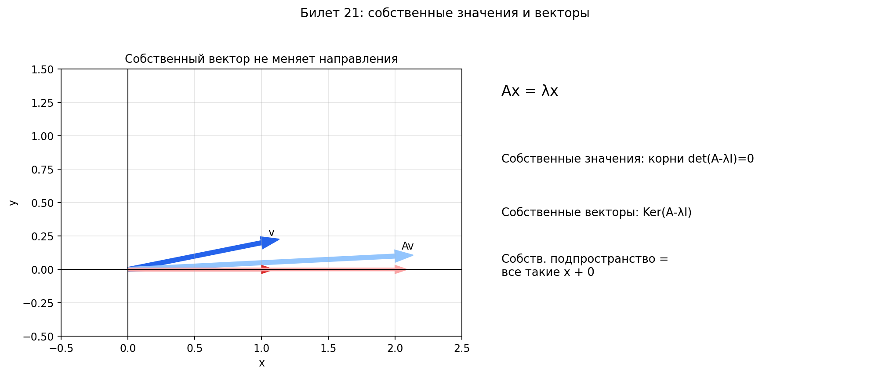

# Билет 21. Собственные значение и собственные векторы матрицы линейного преобразования. Примеры для преобразований гомотетии, растяжения, сдвига и поворота плоскости.

## Определения

**Собственный вектор и собственное значение**:

Матрица `A` — это машина, которая берёт вектор и что-то с ним делает:
крутит, тянет, сплющивает. Большинство векторов после этого улетают
в другую сторону.

Но есть особые векторы, которые после преобразования остаются на той же
прямой, на которой лежали. Их не развернуло вбок — только растянуло,
сжало или перевернуло. Вот это и есть **собственные векторы**.

А **собственное значение `λ`** — это во сколько раз этот вектор растянулся.

Формально: пусть `A` — квадратная матрица `n × n`. Если для ненулевого
вектора `x` выполняется

`Ax = λx`

то `x` — собственный вектор, `λ` — собственное значение.

Что здесь что:
- `A` — матрица линейного преобразования `f: V → V` (квадратная `n × n`).
  Это и есть то самое преобразование, записанное в виде таблицы чисел.
  Когда мы умножаем `A` на вектор — мы применяем преобразование к этому вектору.
- `x` — собственный вектор (ненулевой вектор-столбец из `n` чисел)
- `λ` — собственное значение (одно число, скаляр)
- `Ax` — левая часть: результат умножения матрицы на вектор, то есть
  то, во что преобразование превратило вектор `x`
- `λx` — правая часть: тот же вектор `x`, умноженный на число `λ`

Равенство `Ax = λx` буквально говорит: «применили преобразование к вектору `x`,
получили тот же `x`, только умноженный на число `λ`».

Что значит конкретное `λ`:
- `λ = 2` — вектор растянулся вдвое (в ту же сторону)
- `λ = 0.5` — сжался вдвое
- `λ = −1` — перевернулся (направление на противоположное, но прямая та же)
- `λ = 1` — вообще не изменился
- `λ = 0` — схлопнулся в ноль

Собственный вектор всегда ненулевой — нулевой удовлетворяет `A · 0 = λ · 0`
для любого `λ`, поэтому он бесполезен.

**Пример на пальцах**: растяжение по `x` вдвое, по `y` втрое: `f(x,y) = (2x, 3y)`.

Берём `(1, 0)` — смотрит вдоль оси `x`. После преобразования: `(2, 0)`.
Та же прямая, просто в 2 раза длиннее. Значит `(1, 0)` — собственный
вектор, `λ = 2`.

Берём `(0, 1)` — вдоль оси `y`. После: `(0, 3)`. Та же прямая, в 3 раза
длиннее. Собственный вектор, `λ = 3`.

Берём `(1, 1)` — по диагонали. После: `(2, 3)`. Это уже другое
направление (было 45°, стало не 45°). Значит `(1, 1)` — НЕ собственный
вектор. Преобразование его «сломало».

**Зачем это нужно**: если найти базис из собственных векторов, то в этом
базисе матрица преобразования станет диагональной — просто числа
`λ₁, λ₂, ...` на диагонали. А с диагональной матрицей работать элементарно.

**Собственное подпространство**:

Для данного `λ` собственное подпространство — это все собственные векторы
с этим `λ` плюс нулевой вектор:

`Vλ = {x ∈ V | Ax = λx} = Ker(A − λE)`

Почему это подпространство: если `x₁` и `x₂` — собственные векторы с одним
и тем же `λ`, то и любая их линейная комбинация тоже собственный вектор
с тем же `λ` (замкнуто относительно сложения и умножения на скаляр).

**Спектр матрицы** — множество всех собственных значений матрицы `A`.

## Как найти собственные значения и собственные векторы

Уравнение `Ax = λx` можно переписать как `(A − λE)x = 0`. Это однородная
система. Она имеет ненулевое решение тогда и только тогда, когда:

`det(A − λE) = 0`

Это называется **характеристическое уравнение**. Его корни — собственные значения.

Алгоритм:
1. Составить матрицу `A − λE` (из диагональных элементов вычесть `λ`)
2. Вычислить `det(A − λE)` — получится многочлен от `λ` (характеристический многочлен)
3. Решить `det(A − λE) = 0` — корни `λ₁, λ₂, ...` это собственные значения
4. Для каждого `λᵢ` решить систему `(A − λᵢE)x = 0` — ненулевые решения
   это собственные векторы, отвечающие `λᵢ`

## Примеры преобразований плоскости

**Гомотетия** — равномерное растяжение/сжатие от начала координат.
`f(x, y) = (λx, λy)`, то есть каждый вектор умножается на одно и то же число.

Матрица: `A = |λ 0| = λE`
              `|0 λ|`

Собственное значение: `λ` (кратности 2).
Собственные векторы: любой ненулевой вектор — все направления сохраняются,
потому что всё растягивается одинаково.

**Растяжение вдоль осей** с разными коэффициентами.
`f(x, y) = (k₁x, k₂y)` — по оси `x` в `k₁` раз, по оси `y` в `k₂` раз.

Матрица: `A = |k₁  0|`
              `| 0 k₂|`

Собственные значения: `λ₁ = k₁`, `λ₂ = k₂`.
Собственные векторы: `(1, 0)` для `λ₁` и `(0, 1)` для `λ₂` — направления
осей не сбиваются, потому что растяжение идёт вдоль них.

**Сдвиг** вдоль оси Ox.
`f(x, y) = (x + ky, y)` — горизонтальный срез.

Матрица: `A = |1 k|`
              `|0 1|`

Собственное значение: `λ = 1` (кратности 2).
Собственные векторы: только векторы вида `(t, 0)` — лежащие на оси `Ox`.
Остальные векторы сдвигаются вбок и меняют направление. Хотя `λ = 1`
имеет алгебраическую кратность 2, собственное подпространство одномерно
(геометрическая кратность 1).

**Поворот** на угол `θ` (где `θ ≠ πn`).

Матрица: `A = |cos θ  −sin θ|`
              `|sin θ   cos θ|`

Вещественных собственных значений нет — поворот меняет направление
каждого вектора (ни одно направление не сохраняется).
Комплексные собственные значения: `λ = cos θ ± i·sin θ`.

Исключение: при `θ = 0` (нет поворота) — `λ = 1`, при `θ = π` (разворот
на 180°) — `λ = −1`. В обоих случаях направления сохраняются.

**Отражение** относительно оси Ox.
`f(x, y) = (x, −y)` — координата `y` меняет знак.

Матрица: `A = |1   0|`
              `|0  −1|`

Собственные значения: `λ₁ = 1`, `λ₂ = −1`.
Собственные векторы: `(1, 0)` для `λ₁ = 1` (лежит на оси отражения,
не меняется) и `(0, 1)` для `λ₂ = −1` (перпендикулярен оси,
переворачивается).

## Строгие определения

**Определение.** Пусть `V` — линейное пространство над полем `F`,
`f: V → V` — линейное преобразование. Число `λ ∈ F` называется
**собственным значением** преобразования `f`, если существует
ненулевой вектор `x ∈ V` такой, что `f(x) = λx`.

**Определение.** Ненулевой вектор `x ∈ V` называется **собственным
вектором** линейного преобразования `f: V → V`, отвечающим собственному
значению `λ`, если `f(x) = λx`.

**Определение.** Множество `Vλ = {x ∈ V | f(x) = λx}` называется
**собственным подпространством** преобразования `f`, отвечающим
собственному значению `λ`. Эквивалентно: `Vλ = Ker(f − λ·id)`.

**Определение.** Многочлен `p(λ) = det(A − λE)` называется
**характеристическим многочленом** матрицы `A`. Его корни — собственные
значения `A`.

## Наглядное представление

### Геометрический смысл собственного вектора

