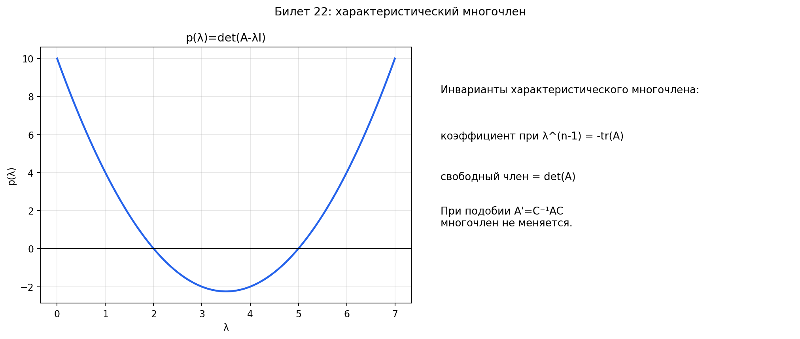

# Билет 22. Характеристическое уравнение и характеристический многочлен матрицы линейного преобразования. Инварианты характеристического многочлена. Независимость характеристического многочлена от выбора базиса.

## Характеристический многочлен и характеристическое уравнение

В билете 21 мы выяснили: собственные значения — это такие `λ`, при которых
`Ax = λx` имеет ненулевое решение. Вопрос: как эти `λ` найти?

Перепишем `Ax = λx` как `(A − λE)x = 0`. Это однородная система. Она имеет
ненулевое решение тогда и только тогда, когда матрица `A − λE` вырождена,
то есть:

`det(A − λE) = 0`

Это и есть **характеристическое уравнение**.

А выражение `p(λ) = det(A − λE)` — это **характеристический многочлен**.
Это обычный многочлен степени `n` от переменной `λ` (где `n` — размер матрицы).

Что в нём записано по сути: мы берём матрицу `A`, вычитаем из каждого
диагонального элемента неизвестное `λ` и считаем определитель. Получается
выражение, которое зависит от `λ`. Приравниваем его к нулю — находим
собственные значения как корни.

**Пример для матрицы 2×2**:

`A = |a  b|`
     `|c  d|`

`A − λE = |a−λ   b |`
          `| c   d−λ|`

`p(λ) = det(A − λE) = (a−λ)(d−λ) − bc = λ² − (a+d)λ + (ad−bc)`

То есть: `p(λ) = λ² − (tr A)·λ + det A`

Корни этого квадратного уравнения — собственные значения.

**Пример с числами**:

`A = |3  1|`
     `|0  2|`

`p(λ) = (3−λ)(2−λ) − 0 = λ² − 5λ + 6 = (λ−2)(λ−3)`

Собственные значения: `λ₁ = 2`, `λ₂ = 3`.

**Общий вид характеристического многочлена** для матрицы `n × n`:

`p(λ) = (−1)ⁿ · λⁿ + (−1)ⁿ⁻¹ · (tr A) · λⁿ⁻¹ + ... + det A`

Степень многочлена равна `n` — значит, по основной теореме алгебры,
у него ровно `n` корней (с учётом кратности, возможно комплексных).

## Пошаговый пример: находим характеристический многочлен, уравнение и собственные значения

Дана матрица:

`A = |4  2|`
     `|1  3|`

**Шаг 1. Составляем `A − λE`** — из диагональных элементов вычитаем `λ`:

`A − λE = |4−λ   2 |`
          `| 1   3−λ|`

(Недиагональные элементы не трогаем — `λ` вычитается только из диагонали.)

**Шаг 2. Считаем определитель** — это и есть характеристический многочлен:

`p(λ) = det(A − λE) = (4−λ)(3−λ) − 2·1`

Раскрываем скобки:
`= 12 − 4λ − 3λ + λ² − 2`
`= λ² − 7λ + 10`

Вот он — характеристический многочлен: `p(λ) = λ² − 7λ + 10`.

**Шаг 3. Приравниваем к нулю** — получаем характеристическое уравнение:

`λ² − 7λ + 10 = 0`

**Шаг 4. Решаем** — обычное квадратное уравнение:

`D = 49 − 40 = 9`
`λ₁ = (7 − 3) / 2 = 2`
`λ₂ = (7 + 3) / 2 = 5`

Собственные значения: `λ₁ = 2`, `λ₂ = 5`.

**Проверка через инварианты**:
- `tr A = 4 + 3 = 7` — должно равняться `λ₁ + λ₂ = 2 + 5 = 7` — сходится
- `det A = 4·3 − 2·1 = 10` — должно равняться `λ₁ · λ₂ = 2 · 5 = 10` — сходится

---

**Ещё пример: матрица 3×3**:

`A = |2  1  0|`
     `|0  3  1|`
     `|0  0  1|`

Матрица верхнетреугольная — определитель равен произведению диагональных элементов.

`A − λE = |2−λ   1    0 |`
          `| 0   3−λ   1 |`
          `| 0    0   1−λ|`

Определитель верхнетреугольной матрицы — произведение диагонали:

`p(λ) = (2−λ)(3−λ)(1−λ)`

Характеристическое уравнение: `(2−λ)(3−λ)(1−λ) = 0`

Собственные значения: `λ₁ = 1`, `λ₂ = 2`, `λ₃ = 3`.

(Для треугольных матриц собственные значения просто стоят на диагонали —
можно читать сразу, без вычислений.)

## Инварианты характеристического многочлена

Инвариант — это величина, которая не меняется при смене базиса.
Если мы перешли в другой базис и матрица стала `A' = C⁻¹AC`,
инварианты у `A` и `A'` одинаковые.

Почему это полезно: если у двух матриц разные инварианты — они точно
не подобны (не могут быть матрицами одного преобразования в разных базисах).
Это быстрый способ проверить «а может ли это быть одно и то же?».

**Главные инварианты**:

**След** — сумма диагональных элементов:

`tr A = a₁₁ + a₂₂ + ... + aₙₙ = λ₁ + λ₂ + ... + λₙ`

След равен сумме всех собственных значений. При смене базиса след не меняется.

**Определитель**:

`det A = λ₁ · λ₂ · ... · λₙ`

Определитель равен произведению всех собственных значений. Тоже не меняется.

**Коэффициенты характеристического многочлена** — все они являются
инвариантами, а след и определитель — просто два самых важных из них.

Для матрицы `2 × 2` характеристический многочлен `p(λ) = λ² − (tr A)λ + det A`
полностью определяется двумя инвариантами: следом и определителем.

Для матрицы `3 × 3` появляется ещё один инвариант — сумма миноров `2 × 2`
на диагонали (обозначается `S₂`):

`p(λ) = −λ³ + (tr A)λ² − S₂·λ + det A`

| Инвариант      | Что это                              | Связь с собственными значениями |
| -------------- | ------------------------------------ | ------------------------------- |
| `tr A`         | Сумма диагональных элементов         | `λ₁ + λ₂ + ... + λₙ`           |
| `det A`        | Определитель                         | `λ₁ · λ₂ · ... · λₙ`           |
| Коэффициенты   | Все коэффициенты хар. многочлена     | Элементарные симм. функции от `λᵢ` |

**Пример**: проверить, подобны ли матрицы:

`A = |1 2|`  и  `B = |3 0|`
     `|0 3|`          `|0 2|`

`tr A = 1 + 3 = 4`, `tr B = 3 + 2 = 5`. Следы разные — матрицы
точно не подобны. Даже определитель считать не нужно.

## Независимость характеристического многочлена от выбора базиса

Утверждение: если `A' = C⁻¹AC` (подобные матрицы), то `det(A' − λE) = det(A − λE)`.

Это значит, что характеристический многочлен — свойство самого
линейного преобразования, а не конкретной матрицы в конкретном базисе.
В каком бы базисе мы ни записали преобразование, характеристический
многочлен будет один и тот же.

Доказательство:

`det(A' − λE) = det(C⁻¹AC − λE)`

`= det(C⁻¹AC − λ · C⁻¹EC)`  (потому что `E = C⁻¹EC`)

`= det(C⁻¹(A − λE)C)`

`= det(C⁻¹) · det(A − λE) · det(C)`

`= det(A − λE)`  (потому что `det(C⁻¹) · det(C) = 1`)

Из этого автоматически следует, что все коэффициенты характеристического
многочлена — инварианты. А значит, и след, и определитель, и собственные
значения не зависят от выбора базиса.

## Строгие определения

**Определение.** Пусть `A` — квадратная матрица порядка `n` над полем `F`.
Многочлен `p(λ) = det(A − λE)` называется **характеристическим многочленом**
матрицы `A`.

**Определение.** Уравнение `det(A − λE) = 0` называется
**характеристическим уравнением** матрицы `A`. Его корни — собственные
значения матрицы `A`.

**Определение.** Величина, одинаковая для всех подобных матриц, называется
**инвариантом подобия** (инвариантом характеристического многочлена).

**Теорема.** Подобные матрицы имеют одинаковый характеристический многочлен.
В частности, у них совпадают след, определитель и все собственные значения.

## Наглядное представление

### Характеристический многочлен и его инварианты

