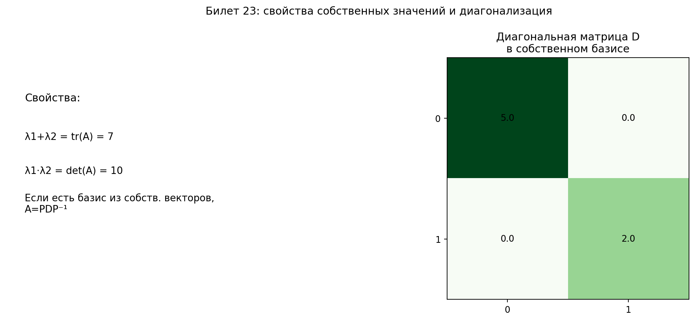

# Билет 23. Свойства собственных значений и собственных векторов. Вид матрицы линейного преобразования в базисе из собственных векторов.

## Свойства собственных значений

1. **Связь с определителем**: произведение всех собственных значений равно определителю матрицы:
   λ₁ · λ₂ · ... · λₙ = det A

2. **Связь со следом**: сумма всех собственных значений равна следу матрицы:
   λ₁ + λ₂ + ... + λₙ = tr A

3. **Собственные значения обратной матрицы**: если λ — собственное значение A, то 1/λ — собственное значение A⁻¹

4. **Собственные значения степени матрицы**: если λ — собственное значение A, то λᵏ — собственное значение Aᵏ

5. **Собственные значения транспонированной матрицы**: матрицы A и Aᵀ имеют одинаковые собственные значения

## Свойства собственных векторов

1. **Линейная независимость**: собственные векторы, отвечающие различным собственным значениям, линейно независимы.

2. **Собственное подпространство** Vλ = {x : Ax = λx} — множество всех собственных векторов для данного λ вместе с нулевым вектором. Это линейное подпространство.

3. **Линейная комбинация**: если x₁ и x₂ — собственные векторы для одного и того же λ, то любая их линейная комбинация (α₁x₁ + α₂x₂) тоже собственный вектор для λ.

4. **Собственный вектор обратной матрицы**: если x — собственный вектор A для λ, то x — собственный вектор A⁻¹ для 1/λ.

## Вид матрицы в базисе из собственных векторов

**Теорема о диагонализации**: если матрица A размера n×n имеет n линейно независимых собственных векторов, то в базисе из этих собственных векторов матрица преобразования принимает диагональный вид:

D = |λ₁  0   0  ... 0 |
    |0   λ₂  0  ... 0 |
    |0   0   λ₃ ... 0 |
    |... ... ... ...  |
    |0   0   0  ... λₙ|

То есть D = diag(λ₁, λ₂, ..., λₙ)

**Связь с исходной матрицей**: A = P · D · P⁻¹

где:
- P — матрица перехода, столбцы которой — собственные векторы
- D — диагональная матрица собственных значений
- На диагонали D стоят собственные значения в том же порядке, что и соответствующие собственные векторы в P

**Когда матрица диагонализируема**:
- Достаточное условие: все собственные значения различны (тогда есть n линейно независимых собственных векторов)
- Необходимое и достаточное: для каждого собственного значения геометрическая кратность равна алгебраической

**Пример**:

A = |4  1|
    |2  3|

1. Характеристическое уравнение: λ² − 7λ + 10 = 0, корни λ₁ = 5, λ₂ = 2

2. Собственные векторы:
   - Для λ₁ = 5: v₁ = (1, 1)
   - Для λ₂ = 2: v₂ = (1, −2)

3. Матрица перехода: P = |1   1|
                         |1  −2|

4. Диагональный вид: D = |5  0|
                         |0  2|

5. Проверка: A = P · D · P⁻¹

## Наглядное представление

### Связь собственных значений с tr(A), det(A) и диагонализацией

