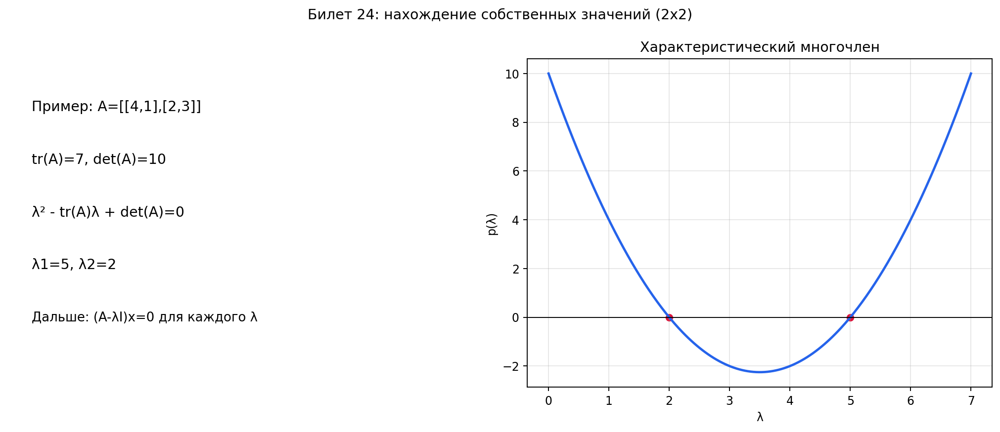

# Билет 24. Нахождение собственных векторов и собственных значений для линейных преобразований в двумерных и трехмерных линейных пространствах.

## Общий алгоритм

Для любой матрицы алгоритм один и тот же — неважно, 2×2 или 3×3:

1. Составить `A − λE` — из диагональных элементов вычесть `λ`
2. Посчитать `det(A − λE)` — получится характеристический многочлен
3. Приравнять к нулю и решить — корни это собственные значения `λᵢ`
4. Для каждого `λᵢ` подставить обратно в `(A − λᵢE)x = 0` и решить
   эту однородную систему — ненулевые решения это собственные векторы

## Случай 2×2 — подробный разбор

Для матрицы `A = |a  b|` всё сводится к квадратному уравнению.
                  `|c  d|`

**Шаг 1. Характеристический многочлен**:

```
A − λE = |a−λ   b |
         | c   d−λ|

p(λ) = (a−λ)(d−λ) − bc = λ² − (a+d)λ + (ad−bc)
```

То есть: `p(λ) = λ² − (tr A)·λ + det A`

Запомнить легко: при `λ²` коэффициент 1, при `λ` — минус след,
свободный член — определитель.

**Шаг 2. Решаем квадратное уравнение**:

`λ = (tr A ± √(D)) / 2`,  где `D = (tr A)² − 4·det A`

- `D > 0` — два различных вещественных собственных значения
- `D = 0` — одно собственное значение кратности 2
- `D < 0` — вещественных собственных значений нет (комплексные корни)

**Шаг 3. Находим собственные векторы**: для каждого `λᵢ` решаем
`(A − λᵢE)x = 0`. Для матрицы 2×2 это система из двух уравнений,
но строки всегда пропорциональны (матрица вырождена), поэтому
по сути одно уравнение с двумя неизвестными — выражаем одну через другую.

---

**Пример 2×2**:

`A = |4  2|`
     `|1  3|`

Шаг 1: `tr A = 7`, `det A = 12 − 2 = 10`

`p(λ) = λ² − 7λ + 10`

Шаг 2: `D = 49 − 40 = 9`

`λ₁ = (7 − 3)/2 = 2`,  `λ₂ = (7 + 3)/2 = 5`

Шаг 3, для `λ₁ = 2`:
```
A − 2E = |2  2| → 2v₁ + 2v₂ = 0 → v₂ = −v₁
         |1  1|
```
Собственный вектор: `(1, −1)`

Шаг 3, для `λ₂ = 5`:
```
A − 5E = |−1  2| → −v₁ + 2v₂ = 0 → v₁ = 2v₂
         | 1 −2|
```
Собственный вектор: `(2, 1)`

Проверка: `A · (1, −1)ᵀ = (4−2, 1−3)ᵀ = (2, −2)ᵀ = 2·(1, −1)ᵀ` — верно.

## Случай 3×3 — подробный разбор

Для матрицы 3×3 характеристический многочлен — кубическое уравнение.
Считать определитель 3×3 дольше, но принцип тот же.

**Шаг 1. Составляем `A − λE`** — из трёх диагональных элементов вычитаем `λ`:

```
A = |a₁₁  a₁₂  a₁₃|        A − λE = |a₁₁−λ  a₁₂    a₁₃  |
    |a₂₁  a₂₂  a₂₃|                  |a₂₁    a₂₂−λ  a₂₃  |
    |a₃₁  a₃₂  a₃₃|                  |a₃₁    a₃₂    a₃₃−λ|
```

**Шаг 2. Считаем определитель** — разложением по строке/столбцу или
правилом Саррюса. Получаем кубический многочлен.

**Шаг 3. Решаем кубическое уравнение**. Лайфхаки:
- Попробовать целые делители свободного члена (`±1, ±2, ±3, ...`) — если
  повезёт, один корень угадается, а дальше делим на `(λ − λ₁)` и решаем
  оставшееся квадратное уравнение
- Если матрица треугольная — собственные значения просто на диагонали
- Используй `tr A = λ₁ + λ₂ + λ₃` и `det A = λ₁·λ₂·λ₃` для проверки

**Шаг 4. Для каждого `λᵢ` решаем систему** `(A − λᵢE)x = 0` методом
Гаусса — приводим к ступенчатому виду, находим свободные переменные,
записываем ФСР.

---

**Пример 3×3**:

`A = |2  1  0|`
     `|0  3  0|`
     `|0  0  1|`

Шаг 1:
```
A − λE = |2−λ   1    0 |
         | 0   3−λ   0 |
         | 0    0   1−λ|
```

Шаг 2: матрица верхнетреугольная, определитель = произведение диагонали:

`p(λ) = (2−λ)(3−λ)(1−λ)`

Шаг 3: `λ₁ = 1`, `λ₂ = 2`, `λ₃ = 3`

Шаг 4, для `λ₁ = 1`:
```
A − E = |1  1  0|
        |0  2  0|
        |0  0  0|
```
Из второй строки: `2v₂ = 0` → `v₂ = 0`
Из первой строки: `v₁ + v₂ = 0` → `v₁ = 0`
`v₃` — свободная.

Собственный вектор: `(0, 0, 1)`

Для `λ₂ = 2`:
```
A − 2E = |0  1  0|
         |0  1  0|
         |0  0 −1|
```
Из первой строки: `v₂ = 0`
Из третьей строки: `−v₃ = 0` → `v₃ = 0`
`v₁` — свободная.

Собственный вектор: `(1, 0, 0)`

Для `λ₃ = 3`:
```
A − 3E = |−1  1   0|
         | 0  0   0|
         | 0  0  −2|
```
Из третьей строки: `v₃ = 0`
Из первой строки: `−v₁ + v₂ = 0` → `v₂ = v₁`
`v₁` — свободная.

Собственный вектор: `(1, 1, 0)`

---

**Ещё один пример 3×3 — с угадыванием корня**:

`A = |1  2  0|`
     `|0  2  1|`
     `|0  0  3|`

Треугольная — собственные значения сразу: `λ₁ = 1`, `λ₂ = 2`, `λ₃ = 3`.

А если бы матрица была не треугольная и получился, например, многочлен
`p(λ) = −λ³ + 6λ² − 11λ + 6`, то:

- Пробуем `λ = 1`: `−1 + 6 − 11 + 6 = 0` — корень!
- Делим: `p(λ) = −(λ−1)(λ² − 5λ + 6) = −(λ−1)(λ−2)(λ−3)`
- Собственные значения: `1, 2, 3`

## Особые случаи

**Кратные собственные значения**: если `λ` — корень кратности `k`,
то собственное подпространство может иметь размерность от 1 до `k`.
- Если размерность = `k` — всё хорошо, матрица диагонализуема
- Если размерность < `k` — собственных векторов не хватает на базис

**Комплексные корни**: у матрицы с вещественными элементами комплексные
собственные значения всегда идут парами: `λ = a ± bi`. Пример — матрица
поворота, у неё `λ = cos θ ± i·sin θ`.

## Формула для 2×2 (быстрый способ)

Для `A = |a  b|`: `p(λ) = λ² − (a+d)λ + (ad−bc)`
         `|c  d|`

`λ = ((a+d) ± √((a+d)² − 4(ad−bc))) / 2`

Можно подставлять числа сразу, без промежуточных вычислений.

## Наглядное представление

### Алгоритм поиска собственных значений через характеристический многочлен

