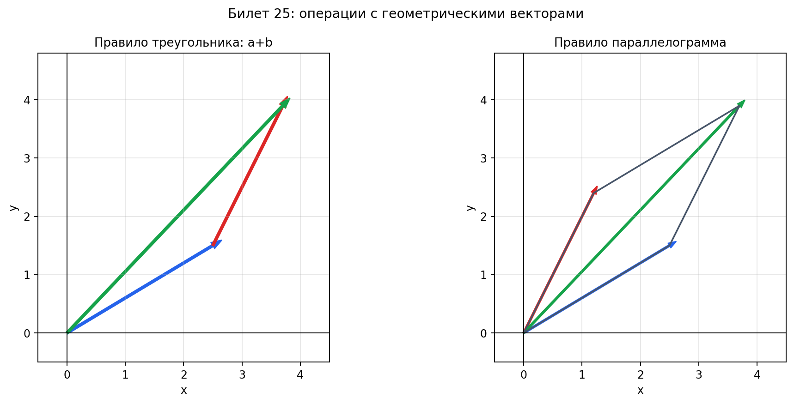

# Билет 25. Вектор. Пространство геометрических векторов. Операции с векторами: сложение векторов, умножение вектора на действительное число.

## Вектор

**Вектор** — это направленный отрезок, то есть упорядоченная пара точек (A, B), где A — начало вектора, B — конец вектора. Обозначается $\vec{AB}$ или $\vec{a}$.

**Характеристики вектора:**
- **Длина (модуль)** — расстояние между началом и концом: $|\vec{AB}|$
- **Направление** — от начала к концу

**Нулевой вектор** $\vec{0}$ — вектор, у которого начало совпадает с концом. Имеет нулевую длину и неопределённое направление.

**Равные векторы** — векторы, имеющие одинаковую длину и одинаковое направление (сонаправленные и равные по модулю).

**Коллинеарные векторы** — векторы, лежащие на одной прямой или на параллельных прямых. Обозначение: $\vec{a} \parallel \vec{b}$.

**Компланарные векторы** — векторы, лежащие в одной плоскости или в параллельных плоскостях.

---

## Пространство геометрических векторов

**Пространство геометрических векторов** — это множество всех направленных
отрезков (стрелочек) в 2D или 3D, для которых определены две операции:
1. **Сложение** — по правилу параллелограмма (или «конец к началу»)
2. **Умножение на число** — растяжение/сжатие стрелочки (отрицательное число — переворот)

При этом два отрезка считаются одним и тем же вектором, если у них одинаковая
длина и направление (неважно, где именно они расположены — их можно параллельно
перенести друг в друга).

Это множество с этими операциями удовлетворяет всем 8 аксиомам линейного
пространства, поле скаляров — `R`. Поэтому:
- геометрические векторы на плоскости = линейное пространство `R²`
- геометрические векторы в пространстве = линейное пространство `R³`

По сути «пространство геометрических векторов» — это просто `R²` или `R³`,
но с акцентом на то, что мы думаем о них как о стрелочках с длиной и
направлением, а не как о столбцах чисел.

При этом выполняются **аксиомы векторного пространства**:

### Аксиомы сложения:
1. **Коммутативность:** $\vec{a} + \vec{b} = \vec{b} + \vec{a}$
2. **Ассоциативность:** $(\vec{a} + \vec{b}) + \vec{c} = \vec{a} + (\vec{b} + \vec{c})$
3. **Существование нулевого элемента:** $\exists \vec{0}: \vec{a} + \vec{0} = \vec{a}$
4. **Существование противоположного элемента:** $\forall \vec{a} \, \exists (-\vec{a}): \vec{a} + (-\vec{a}) = \vec{0}$

### Аксиомы умножения на скаляр:
5. **Ассоциативность:** $\alpha(\beta\vec{a}) = (\alpha\beta)\vec{a}$
6. **Дистрибутивность по сложению векторов:** $\alpha(\vec{a} + \vec{b}) = \alpha\vec{a} + \alpha\vec{b}$
7. **Дистрибутивность по сложению скаляров:** $(\alpha + \beta)\vec{a} = \alpha\vec{a} + \beta\vec{a}$
8. **Унитарность:** $1 \cdot \vec{a} = \vec{a}$

---

## Операции с векторами

### 1. Сложение векторов

#### Правило треугольника
Чтобы сложить векторы $\vec{a}$ и $\vec{b}$:
1. Отложить вектор $\vec{a}$ от произвольной точки A
2. От конца вектора $\vec{a}$ отложить вектор $\vec{b}$
3. Вектор от начала $\vec{a}$ до конца $\vec{b}$ — это сумма $\vec{a} + \vec{b}$

$$\vec{AB} + \vec{BC} = \vec{AC}$$

#### Правило параллелограмма
Для сложения векторов $\vec{a}$ и $\vec{b}$:
1. Отложить оба вектора от одной точки
2. Построить параллелограмм на этих векторах
3. Диагональ параллелограмма из общей точки — это сумма

#### Свойства сложения:
- $\vec{a} + \vec{b} = \vec{b} + \vec{a}$ (коммутативность)
- $(\vec{a} + \vec{b}) + \vec{c} = \vec{a} + (\vec{b} + \vec{c})$ (ассоциативность)
- $\vec{a} + \vec{0} = \vec{a}$
- $\vec{a} + (-\vec{a}) = \vec{0}$

#### Вычитание векторов
$$\vec{a} - \vec{b} = \vec{a} + (-\vec{b})$$

Геометрически: если $\vec{a}$ и $\vec{b}$ отложены от одной точки, то $\vec{a} - \vec{b}$ — вектор от конца $\vec{b}$ к концу $\vec{a}$.

---

### 2. Умножение вектора на действительное число

**Определение:** Произведением вектора $\vec{a}$ на число $\lambda \in \mathbb{R}$ называется вектор $\lambda\vec{a}$, такой что:

- $|\lambda\vec{a}| = |\lambda| \cdot |\vec{a}|$ (модуль умножается на модуль числа)
- При $\lambda > 0$: вектор $\lambda\vec{a}$ сонаправлен с $\vec{a}$
- При $\lambda < 0$: вектор $\lambda\vec{a}$ противоположно направлен $\vec{a}$
- При $\lambda = 0$: $0 \cdot \vec{a} = \vec{0}$

#### Свойства умножения на число:
1. $\lambda(\vec{a} + \vec{b}) = \lambda\vec{a} + \lambda\vec{b}$
2. $(\lambda + \mu)\vec{a} = \lambda\vec{a} + \mu\vec{a}$
3. $\lambda(\mu\vec{a}) = (\lambda\mu)\vec{a}$
4. $1 \cdot \vec{a} = \vec{a}$
5. $(-1) \cdot \vec{a} = -\vec{a}$
6. $0 \cdot \vec{a} = \vec{0}$
7. $\lambda \cdot \vec{0} = \vec{0}$

---

## Следствия

**Критерий коллинеарности:** Векторы $\vec{a}$ и $\vec{b}$ коллинеарны тогда и только тогда, когда существует число $\lambda$ такое, что $\vec{b} = \lambda\vec{a}$ (при $\vec{a} \neq \vec{0}$).

**Линейная комбинация векторов:** Выражение вида
$$\lambda_1\vec{a}_1 + \lambda_2\vec{a}_2 + \ldots + \lambda_n\vec{a}_n$$
где $\lambda_i \in \mathbb{R}$ — называется линейной комбинацией векторов.

## Наглядное представление

### Сложение векторов: правило треугольника и параллелограмма

