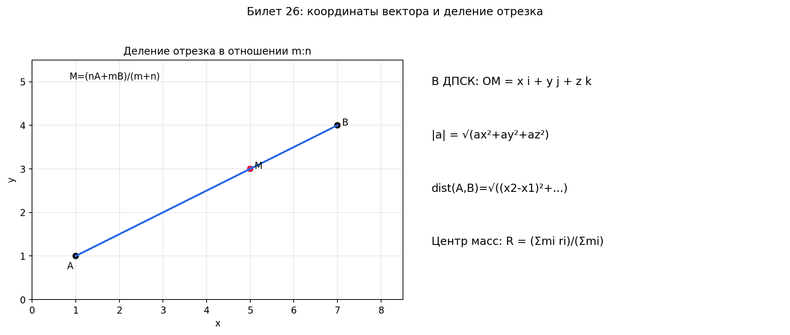

# Билет 26. Системы координат. Аффинная система координат. Прямоугольная декартова система координат. Нахождение координат вектора через координаты начальной и конечной точки. Деление отрезка в заданном соотношении в декартовой системе координат. Расстояние между точками в декартовой системе координат.

## Системы координат

### Аффинная система координат

**Аффинная система координат** — это совокупность точки O (начало координат) и упорядоченного базиса $\{\vec{e}_1, \vec{e}_2, \vec{e}_3\}$ (в пространстве) или $\{\vec{e}_1, \vec{e}_2\}$ (на плоскости).

**Координаты точки M** в аффинной системе — это координаты $(x, y, z)$ радиус-вектора $\vec{OM}$:
$$\vec{OM} = x\vec{e}_1 + y\vec{e}_2 + z\vec{e}_3$$

### Декартова прямоугольная система координат

**Декартова прямоугольная система координат (ДПСК)** — это аффинная система координат, в которой базис ортонормированный:
- Базисные векторы попарно ортогональны: $\vec{e}_i \perp \vec{e}_j$ при $i \neq j$
- Базисные векторы единичные: $|\vec{e}_i| = 1$

Стандартные обозначения базисных векторов: $\vec{i}, \vec{j}, \vec{k}$ (или $\vec{e}_x, \vec{e}_y, \vec{e}_z$).

**Свойства ДПСК:**
- Оси координат попарно перпендикулярны
- Единицы измерения на всех осях одинаковы
- Скалярное произведение базисных векторов: $(\vec{i}, \vec{j}) = (\vec{j}, \vec{k}) = (\vec{i}, \vec{k}) = 0$
- $(\vec{i}, \vec{i}) = (\vec{j}, \vec{j}) = (\vec{k}, \vec{k}) = 1$

**Правая и левая системы координат:**
- **Правая система**: если смотреть с конца вектора $\vec{k}$, то кратчайший поворот от $\vec{i}$ к $\vec{j}$ происходит против часовой стрелки
- **Левая система**: кратчайший поворот от $\vec{i}$ к $\vec{j}$ по часовой стрелке

---

## Координаты вектора

**Координаты вектора** — это коэффициенты разложения вектора по базису.

Если $\vec{a} = a_x\vec{i} + a_y\vec{j} + a_z\vec{k}$, то координаты вектора $\vec{a}$: $(a_x, a_y, a_z)$.

### Координаты вектора по двум точкам

Если даны точки $A(x_1, y_1, z_1)$ и $B(x_2, y_2, z_2)$, то координаты вектора $\vec{AB}$:

$$\vec{AB} = (x_2 - x_1, \, y_2 - y_1, \, z_2 - z_1)$$

### Операции с векторами в координатах

Пусть $\vec{a} = (a_x, a_y, a_z)$ и $\vec{b} = (b_x, b_y, b_z)$.

**Сложение:**
$$\vec{a} + \vec{b} = (a_x + b_x, \, a_y + b_y, \, a_z + b_z)$$

**Вычитание:**
$$\vec{a} - \vec{b} = (a_x - b_x, \, a_y - b_y, \, a_z - b_z)$$

**Умножение на число:**
$$\lambda\vec{a} = (\lambda a_x, \, \lambda a_y, \, \lambda a_z)$$

### Длина вектора (модуль)

$$|\vec{a}| = \sqrt{a_x^2 + a_y^2 + a_z^2}$$

### Расстояние между точками

**Определение:** Расстояние между точками — это длина (модуль) вектора, соединяющего эти точки.

**На плоскости ($\mathbb{R}^2$):**

Для точек $A(x_1, y_1)$ и $B(x_2, y_2)$:

$$\boxed{|AB| = \sqrt{(x_2 - x_1)^2 + (y_2 - y_1)^2}}$$

**В пространстве ($\mathbb{R}^3$):**

Для точек $A(x_1, y_1, z_1)$ и $B(x_2, y_2, z_2)$:

$$\boxed{|AB| = |\vec{AB}| = \sqrt{(x_2 - x_1)^2 + (y_2 - y_1)^2 + (z_2 - z_1)^2}}$$

#### Вывод формулы

Вектор $\vec{AB} = (x_2 - x_1,\; y_2 - y_1,\; z_2 - z_1)$.

Расстояние — это длина этого вектора:

$$|AB| = |\vec{AB}| = \sqrt{(\vec{AB}, \vec{AB})}$$

В ДПСК скалярное произведение вектора на себя равно сумме квадратов координат (по теореме Пифагора в 3D):

$$(\vec{AB}, \vec{AB}) = (x_2 - x_1)^2 + (y_2 - y_1)^2 + (z_2 - z_1)^2$$

> **Словами:** расстояние — это обобщённая теорема Пифагора. На плоскости: два катета, в пространстве — три.

#### Примеры

**Пример 1 (плоскость):** $A(1, 2)$, $B(4, 6)$:

$$|AB| = \sqrt{(4 - 1)^2 + (6 - 2)^2} = \sqrt{9 + 16} = \sqrt{25} = 5$$

**Пример 2 (пространство):** $A(1, 0, 2)$, $B(3, 4, 2)$:

$$|AB| = \sqrt{(3 - 1)^2 + (4 - 0)^2 + (2 - 2)^2} = \sqrt{4 + 16 + 0} = \sqrt{20} = 2\sqrt{5}$$

**Пример 3 (расстояние от начала координат):** $A(0, 0, 0)$, $B(3, 4, 12)$:

$$|OB| = \sqrt{3^2 + 4^2 + 12^2} = \sqrt{9 + 16 + 144} = \sqrt{169} = 13$$

#### Важные замечания

- Формула работает **только в ДПСК** (декартовой прямоугольной системе). В аффинной системе формула другая — нужна матрица Грама.
- Расстояние всегда $\geq 0$, и $|AB| = 0 \iff A = B$.
- $|AB| = |BA|$ (расстояние симметрично).
- Связь с длиной вектора: $|AB|$ — это просто $|\vec{AB}|$.

---

## Деление отрезка в данном отношении

### Определение

Точка M делит отрезок AB **в отношении** $\lambda = m : n$, если:
$$\vec{AM} = \frac{m}{n} \vec{MB}$$

или эквивалентно:
$$\frac{|AM|}{|MB|} = \frac{m}{n}$$

**Знак отношения:**
- $\lambda > 0$: точка M лежит между A и B (внутреннее деление)
- $\lambda < 0$: точка M лежит вне отрезка AB (внешнее деление)

### Формула деления отрезка в отношении m:n

Если $A(x_1, y_1, z_1)$, $B(x_2, y_2, z_2)$, и точка M делит AB в отношении $m:n$, то координаты точки M:

$$M = \left( \frac{mx_2 + nx_1}{m + n}, \, \frac{my_2 + ny_1}{m + n}, \, \frac{mz_2 + nz_1}{m + n} \right)$$

### Частные случаи

**Середина отрезка** ($m = n = 1$, то есть $\lambda = 1$):

$$M = \left( \frac{x_1 + x_2}{2}, \, \frac{y_1 + y_2}{2}, \, \frac{z_1 + z_2}{2} \right)$$

**Деление в отношении 2:1** (точка M ближе к B):

$$M = \left( \frac{2x_2 + x_1}{3}, \, \frac{2y_2 + y_1}{3}, \, \frac{2z_2 + z_1}{3} \right)$$

**Деление в отношении 1:2** (точка M ближе к A):

$$M = \left( \frac{x_2 + 2x_1}{3}, \, \frac{y_2 + 2y_1}{3}, \, \frac{z_2 + 2z_1}{3} \right)$$

---

## Центр масс системы точек

**Центр масс** (центроид) системы точек $A_1, A_2, \ldots, A_n$ с массами $m_1, m_2, \ldots, m_n$:

$$C = \left( \frac{\sum m_i x_i}{\sum m_i}, \, \frac{\sum m_i y_i}{\sum m_i}, \, \frac{\sum m_i z_i}{\sum m_i} \right)$$

**Центр масс треугольника** (точка пересечения медиан):

$$G = \left( \frac{x_1 + x_2 + x_3}{3}, \, \frac{y_1 + y_2 + y_3}{3}, \, \frac{z_1 + z_2 + z_3}{3} \right)$$

---

## Направляющие косинусы

**Направляющие косинусы** вектора $\vec{a} = (a_x, a_y, a_z)$ — это косинусы углов между вектором и координатными осями:

$$\cos\alpha = \frac{a_x}{|\vec{a}|}, \quad \cos\beta = \frac{a_y}{|\vec{a}|}, \quad \cos\gamma = \frac{a_z}{|\vec{a}|}$$

**Основное тождество:**
$$\cos^2\alpha + \cos^2\beta + \cos^2\gamma = 1$$

**Единичный вектор** (орт) в направлении $\vec{a}$:
$$\vec{a}^0 = \frac{\vec{a}}{|\vec{a}|} = (\cos\alpha, \cos\beta, \cos\gamma)$$

## Наглядное представление

### Координатная геометрия: векторы, расстояния, деление отрезка

