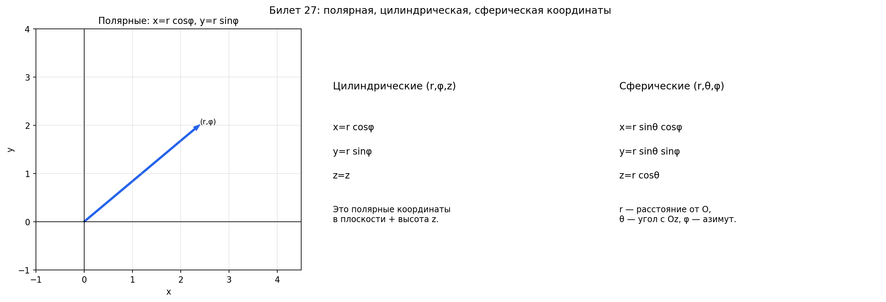

# Билет 27. Системы координат. Полярная, цилиндрическая и сферическая системы координат. Их связь с декартовой системой координат.

## Зачем нужны разные системы координат

Декартова система `(x, y, z)` — самая привычная, но не всегда удобная.
Если объект круглый, формулы в декартовых координатах получаются громоздкими.

Пример: окружность радиуса `R` с центром в начале координат.
- В декартовой: `x² + y² = R²` — нужно два числа, связанных уравнением
- В полярной: `r = R` — одно число, всё

Суть: система координат — это способ описать положение точки числами.
Какую выбрать — зависит от формы объекта. Круглое — полярная/сферическая.
Прямое — декартова.

## Декартова система координат (напоминание)

**Определение.** Декартова (прямоугольная) система координат — это система
координат, в которой положение точки определяется расстояниями (с учётом знака)
от взаимно перпендикулярных осей, пересекающихся в начале координат `O`.
Базисные векторы ортонормированы (попарно перпендикулярны и имеют длину 1).

Точка задаётся проекциями на взаимно перпендикулярные оси единичной длины:
- На плоскости: `(x, y)`
- В пространстве: `(x, y, z)`

Расстояние от начала координат: `r = √(x² + y²)` (2D) или `r = √(x² + y² + z²)` (3D).

## Полярная система координат (2D)

**Определение.** Полярная система координат — это система координат на плоскости,
в которой положение точки определяется расстоянием от фиксированной точки (полюса)
и углом, отсчитываемым от фиксированного луча (полярной оси).

Точка на плоскости задаётся двумя числами:
- `r` — расстояние от начала координат (полюса), `r ≥ 0`
- `φ` — угол от положительного направления оси `x` (полярный угол), `0 ≤ φ < 2π`

Вместо «иди на 3 вправо и на 4 вверх» говорим «иди на 5 в направлении
угла `φ`». Описываем не «куда по клеточкам», а «как далеко и в какую сторону».

**Связь с декартовой (полярная → декартова)**:
```
x = r · cos φ
y = r · sin φ
```

**Обратный переход (декартова → полярная)**:
```
r = √(x² + y²)
φ = arctg(y / x)    (с учётом четверти)
```

**Примеры — как выглядят точки на фигурах**:

Окружность радиуса 3 (несколько точек на ней):

| Точка      | Декартова `(x, y)`      | Полярная `(r, φ)`  |
| ---------- | ----------------------- | ------------------ |
| Правая     | `(3, 0)`                | `(3, 0)`           |
| Верхняя    | `(0, 3)`                | `(3, π/2)`         |
| Левая      | `(−3, 0)`               | `(3, π)`           |
| Нижняя     | `(0, −3)`               | `(3, 3π/2)`        |
| Под 45°    | `(3√2/2, 3√2/2)`       | `(3, π/4)`         |

Видно: `r` везде одинаковый (= 3), меняется только угол `φ`. Вся
окружность описывается одним условием: `r = 3`.

Луч из начала координат под углом 60°:

| Точка      | Декартова `(x, y)` | Полярная `(r, φ)` |
| ---------- | ------------------ | ------------------ |
| Близкая    | `(1, √3)`         | `(2, π/3)`         |
| Средняя    | `(2, 2√3)`        | `(4, π/3)`         |
| Дальняя    | `(3, 3√3)`        | `(6, π/3)`         |

Видно: `φ` везде одинаковый (= π/3), меняется только `r`.

## Цилиндрическая система координат (3D)

**Определение.** Цилиндрическая система координат — это система координат
в пространстве, в которой положение точки определяется полярными координатами
`(r, φ)` её проекции на плоскость `xy` и высотой `z` над этой плоскостью.

По сути берём полярные координаты на плоскости `xy` и добавляем обычную высоту `z`.
Точка задаётся тройкой `(r, φ, z)`:
- `r` — расстояние от оси `z` (не от начала координат!), `r ≥ 0`
- `φ` — угол в плоскости `xy`, `0 ≤ φ < 2π`
- `z` — высота (как в декартовой)

Удобна для всего, что имеет ось симметрии: цилиндры, трубы, колонны, конусы.

**Связь с декартовой (цилиндрическая → декартова)**:
```
x = r · cos φ
y = r · sin φ
z = z
```

Первые две строчки — то же самое, что в полярной. Третья — просто `z = z`.

**Обратный переход (декартова → цилиндрическая)**:
```
r = √(x² + y²)
φ = arctg(y / x)    (с учётом четверти)
z = z
```

**Примеры — как выглядят точки на фигурах**:

Цилиндр радиуса 2, несколько точек на его поверхности:

| Точка             | Декартова `(x, y, z)`  | Цилиндрическая `(r, φ, z)` |
| ----------------- | ---------------------- | --------------------------- |
| Спереди, внизу    | `(2, 0, 0)`           | `(2, 0, 0)`                |
| Справа, на высоте | `(0, 2, 5)`           | `(2, π/2, 5)`              |
| Сзади, наверху    | `(−2, 0, 10)`         | `(2, π, 10)`               |
| Под 45°, на высоте| `(√2, √2, 3)`         | `(2, π/4, 3)`              |

Видно: `r` везде = 2, а `φ` и `z` меняются. Вся поверхность
цилиндра: `r = 2` (одно условие!).

## Сферическая система координат (3D)

**Определение.** Сферическая система координат — это система координат
в пространстве, в которой положение точки определяется расстоянием `r` от
начала координат, зенитным углом `θ` (от оси `z`) и азимутальным углом `φ`
(в плоскости `xy`).

Точка задаётся тройкой `(r, θ, φ)`:
- `r` — расстояние от начала координат, `r ≥ 0`
- `θ` (тета) — угол от положительного направления оси `z` (зенитный угол,
  «широта наоборот»), `0 ≤ θ ≤ π`
- `φ` (фи) — угол в плоскости `xy` (азимутальный угол, как в полярной),
  `0 ≤ φ < 2π`

Представь глобус: `r` — расстояние от центра Земли, `θ` — от северного
полюса вниз (0 — полюс, π/2 — экватор, π — южный полюс), `φ` — долгота.

Удобна для сфер, планет, излучения из точки — всего, что симметрично
относительно одной точки.

**Связь с декартовой (сферическая → декартова)**:
```
x = r · sin θ · cos φ
y = r · sin θ · sin φ
z = r · cos θ
```

**Обратный переход (декартова → сферическая)**:
```
r = √(x² + y² + z²)
θ = arccos(z / r)
φ = arctg(y / x)    (с учётом четверти)
```

**Примеры — как выглядят точки на фигурах**:

Сфера радиуса 4, несколько точек на ней:

| Точка              | Декартова `(x, y, z)`    | Сферическая `(r, θ, φ)`  |
| ------------------ | ------------------------ | ------------------------- |
| Северный полюс     | `(0, 0, 4)`             | `(4, 0, любой)`           |
| На экваторе справа | `(4, 0, 0)`             | `(4, π/2, 0)`             |
| На экваторе вперёд | `(0, 4, 0)`             | `(4, π/2, π/2)`           |
| Южный полюс        | `(0, 0, −4)`            | `(4, π, любой)`           |
| Под 45° к полюсу   | `(2√2, 0, 2√2)`        | `(4, π/4, 0)`             |

Видно: `r` везде = 4, а `θ` и `φ` меняются. Вся сфера: `r = 4`.
На полюсах `φ` не определён — там все долготы сходятся в одну точку
(как на глобусе).

## Сводная таблица

| Система         | Координаты    | Связь с декартовой                                       | Удобна для                  |
| --------------- | ------------- | -------------------------------------------------------- | --------------------------- |
| Декартова       | `(x, y, z)`  | —                                                        | Прямые, плоскости, кубы     |
| Полярная (2D)   | `(r, φ)`     | `x = r cos φ`, `y = r sin φ`                            | Окружности, спирали         |
| Цилиндрическая  | `(r, φ, z)`  | `x = r cos φ`, `y = r sin φ`, `z = z`                   | Цилиндры, трубы, конусы     |
| Сферическая     | `(r, θ, φ)`  | `x = r sin θ cos φ`, `y = r sin θ sin φ`, `z = r cos θ` | Сферы, планеты, излучение   |

## Связь между цилиндрической и сферической

Цилиндрическая `(rц, φ, z)` и сферическая `(rс, θ, φ)`:
```
rц = rс · sin θ
z  = rс · cos θ
φ  = φ (одинаковый)
```

## Пример с числами

Точка имеет декартовы координаты `(1, 1, √2)`. Найти её координаты
во всех системах.

**Полярная** (проекция на плоскость `xy`):
```
r = √(1² + 1²) = √2
φ = arctg(1/1) = π/4 (45°)
```

**Цилиндрическая**:
```
(r, φ, z) = (√2, π/4, √2)
```

**Сферическая**:
```
r = √(1² + 1² + (√2)²) = √(1 + 1 + 2) = 2
θ = arccos(√2 / 2) = π/4 (45°)
φ = π/4 (45°)
```

Ответ: `(2, π/4, π/4)`.

Проверка обратно: `x = 2 · sin(π/4) · cos(π/4) = 2 · (√2/2) · (√2/2) = 1` — сходится.

## Наглядное представление

### Переходы между системами координат

![[Снимок экрана 2026-02-14 в 19.44.47.png]]