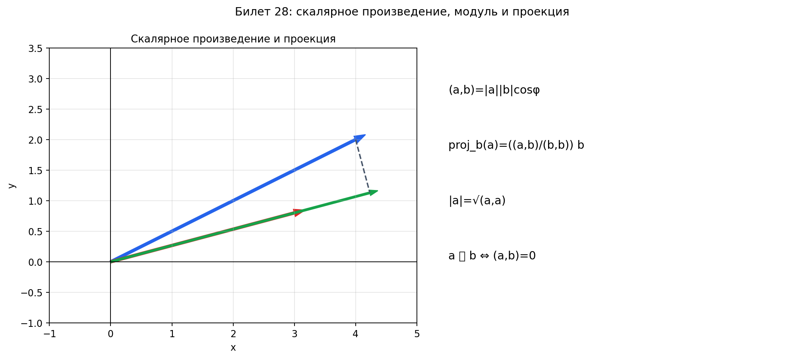

# Билет 28. Определение скалярного произведения векторов (направленных отрезков). Скалярное произведение в координатной форме. Модуль и проекция вектора. Признак ортогональности векторов.

## Определение скалярного произведения

### Геометрическое определение

**Скалярное произведение** двух векторов $\vec{a}$ и $\vec{b}$ — это число,
равное произведению длин этих векторов на косинус угла между ними:

$$(\vec{a}, \vec{b}) = |\vec{a}| \cdot |\vec{b}| \cdot \cos\varphi$$

где $\varphi$ — угол между векторами ($0 \leq \varphi \leq \pi$).

Словами: берём длину первого вектора, длину второго, умножаем друг на друга
и на косинус угла между ними. Получаем одно число (не вектор, а скаляр —
поэтому и называется «скалярное»).

Что это число показывает: насколько два вектора «сонаправлены».
- Если угол острый (`φ < π/2`) — скалярное произведение положительное
  (векторы смотрят примерно в одну сторону)
- Если угол прямой (`φ = π/2`) — скалярное произведение равно нулю
  (векторы перпендикулярны)
- Если угол тупой (`φ > π/2`) — скалярное произведение отрицательное
  (векторы смотрят примерно в разные стороны)

Пример: `a = (1, 0)`, `b = (1, 0)` — одинаковые, угол 0°.
`(a, b) = 1 · 1 · cos 0° = 1` — максимальное «совпадение».

Пример: `a = (1, 0)`, `b = (0, 1)` — перпендикулярны, угол 90°.
`(a, b) = 1 · 1 · cos 90° = 0` — ничего общего.

### Координатная форма

Если $\vec{a} = (a_1, a_2, a_3)$ и $\vec{b} = (b_1, b_2, b_3)$, то:

$$(\vec{a}, \vec{b}) = a_1 b_1 + a_2 b_2 + a_3 b_3$$

Словами: перемножаем соответствующие координаты и складываем. Первую
с первой, вторую со второй, третью с третьей — и всё суммируем.

Пример: `a = (2, 3, 1)`, `b = (4, −1, 2)`.
`(a, b) = 2·4 + 3·(−1) + 1·2 = 8 − 3 + 2 = 7`

---

## Свойства скалярного произведения

1. **Коммутативность:** $(\vec{a}, \vec{b}) = (\vec{b}, \vec{a})$
   — неважно, кого на кого «проецируем», результат одинаковый

2. **Ассоциативность с числом:** $(\lambda\vec{a}, \vec{b}) = \lambda(\vec{a}, \vec{b})$
   — число можно вынести за скобки

3. **Дистрибутивность:** $(\vec{a} + \vec{b}, \vec{c}) = (\vec{a}, \vec{c}) + (\vec{b}, \vec{c})$
   — можно раскрывать скобки как в обычной алгебре

4. **Положительная определённость:** $(\vec{a}, \vec{a}) \geq 0$, причём $(\vec{a}, \vec{a}) = 0 \Leftrightarrow \vec{a} = \vec{0}$
   — скалярное произведение вектора на себя = квадрат его длины, всегда ≥ 0

---

## Модуль вектора

**Модуль (длина) вектора** — расстояние от начала до конца вектора.

### Формула через скалярное произведение

$$|\vec{a}| = \sqrt{(\vec{a}, \vec{a})}$$

Словами: чтобы найти длину — умножь вектор сам на себя скалярно
и возьми корень. Скалярное произведение вектора на себя — это
квадрат его длины.

### Координатная формула

Для вектора $\vec{a} = (a_1, a_2, a_3)$:

$$|\vec{a}| = \sqrt{a_1^2 + a_2^2 + a_3^2}$$

Словами: возводим каждую координату в квадрат, складываем, берём корень.
Это обобщение теоремы Пифагора на три измерения.

На плоскости для $\vec{a} = (a_1, a_2)$:

$$|\vec{a}| = \sqrt{a_1^2 + a_2^2}$$

Пример: `a = (3, 4)`. `|a| = √(9 + 16) = √25 = 5`.

### Свойства модуля

1. **Неотрицательность:** $|\vec{a}| \geq 0$, причём $|\vec{a}| = 0 \Leftrightarrow \vec{a} = \vec{0}$
   — длина всегда неотрицательна, ноль только у нулевого вектора
2. **Однородность:** $|\lambda\vec{a}| = |\lambda| \cdot |\vec{a}|$
   — умножение на число растягивает длину в |λ| раз
3. **Неравенство треугольника:** $|\vec{a} + \vec{b}| \leq |\vec{a}| + |\vec{b}|$
   — «напрямик» всегда не длиннее, чем «в обход»

### Единичный вектор (орт)

**Орт** вектора $\vec{a}$ — единичный вектор того же направления:

$$\vec{a}^0 = \frac{\vec{a}}{|\vec{a}|}$$

Словами: делим вектор на его длину — получаем вектор длины 1,
смотрящий в ту же сторону. Это «нормализация» вектора.

Пример: `a = (3, 4)`, `|a| = 5`. Орт: `a⁰ = (3/5, 4/5)`.
Проверка: `|(3/5, 4/5)| = √(9/25 + 16/25) = √(25/25) = 1` — длина 1.

---

## Проекция вектора

Проекция — это «тень» вектора на заданное направление. Представь
фонарик, который светит перпендикулярно некоторой оси. Тень вектора
на эту ось — и есть его проекция.

### Проекция вектора на ось

**Проекция вектора $\vec{a}$ на ось $l$** — это число (длина «тени» со знаком):

$$\text{пр}_l \vec{a} = |\vec{a}| \cos\varphi$$

где $\varphi$ — угол между вектором $\vec{a}$ и осью $l$.

Словами: берём длину вектора и умножаем на косинус угла между ним и осью.
Если угол острый — проекция положительная (тень в ту же сторону).
Если тупой — отрицательная (тень в обратную сторону).
Если прямой — проекция ноль (вектор перпендикулярен оси, тени нет).

### Проекция через скалярное произведение

**Проекция вектора $\vec{a}$ на направление вектора $\vec{b}$:**

$$\text{пр}_{\vec{b}}\vec{a} = \frac{(\vec{a}, \vec{b})}{|\vec{b}|}$$

Словами: считаем скалярное произведение и делим на длину того вектора,
на который проецируем. По сути — «какая часть вектора `a` идёт вдоль `b`».

### Примеры проекции

Проекция `a = (3, 4)` на ось `x` (вектор `b = (1, 0)`):
`пр = (3·1 + 4·0) / 1 = 3` — просто первая координата.

Проекция `a = (4, 3)` на диагональ `b = (1, 1)`:
`пр = (4·1 + 3·1) / √2 = 7/√2 = 7√2/2 ≈ 4.95`

Проекция `a = (0, 5)` на `b = (3, 0)`:
`пр = (0·3 + 5·0) / 3 = 0` — вектор перпендикулярен, тени нет.

### Проекция на координатные оси

Для вектора $\vec{a} = (a_1, a_2, a_3)$:
- $\text{пр}_{Ox}\vec{a} = a_1$
- $\text{пр}_{Oy}\vec{a} = a_2$
- $\text{пр}_{Oz}\vec{a} = a_3$

Словами: координаты вектора — это его проекции на координатные оси.
Первая координата — это тень на ось `x`, вторая — на ось `y`, третья — на `z`.

### Свойства проекции

1. **Аддитивность:** $\text{пр}_l(\vec{a} + \vec{b}) = \text{пр}_l\vec{a} + \text{пр}_l\vec{b}$
   — проекция суммы = сумма проекций
2. **Однородность:** $\text{пр}_l(\lambda\vec{a}) = \lambda \cdot \text{пр}_l\vec{a}$
   — число выносится за проекцию
3. **Теорема Пифагора:** $|\vec{a}|^2 = (\text{пр}_{Ox}\vec{a})^2 + (\text{пр}_{Oy}\vec{a})^2 + (\text{пр}_{Oz}\vec{a})^2$
   — квадрат длины = сумма квадратов проекций

### Векторная проекция

Скалярная проекция — это число (длина тени). А **векторная проекция** — это
вектор: тень, у которой есть и длина, и направление.

$$\text{пр}_{\vec{b}}\vec{a} \cdot \frac{\vec{b}}{|\vec{b}|} = \frac{(\vec{a}, \vec{b})}{|\vec{b}|^2} \cdot \vec{b}$$

Словами: берём скалярную проекцию (число) и умножаем на единичный вектор
направления `b`. Получаем вектор, лежащий вдоль `b`, длина которого
равна проекции.

Пример: `a = (4, 3)`, `b = (1, 1)`.
Скалярная проекция: `7/√2`.
Векторная проекция: `(7/2)/(1²+1²) · (1, 1) = 7/2 · (1, 1) = (3.5, 3.5)`.

---

## Угол между векторами

$$\cos\varphi = \frac{(\vec{a}, \vec{b})}{|\vec{a}| \cdot |\vec{b}|}$$

Словами: чтобы найти угол между векторами — считаем скалярное произведение
и делим на произведение длин. Получаем косинус угла, потом берём `arccos`.

Пример: `a = (1, 0)`, `b = (1, 1)`.
`cos φ = (1·1 + 0·1) / (1 · √2) = 1/√2` → `φ = π/4 (45°)`.

### Признак ортогональности

$$\vec{a} \perp \vec{b} \Leftrightarrow (\vec{a}, \vec{b}) = 0$$

Словами: два вектора ортоганальны тогда и только тогда, когда их
скалярное произведение равно нулю. Это самый быстрый способ проверить
 ортоганальность — не нужно считать угол, достаточно проверить
равно ли скалярное произведение нулю.

Пример: `a = (3, −2)`, `b = (2, 3)`.
`(a, b) = 3·2 + (−2)·3 = 6 − 6 = 0` → перпендикулярны.

## Наглядное представление

### Скалярное произведение и проекция вектора

