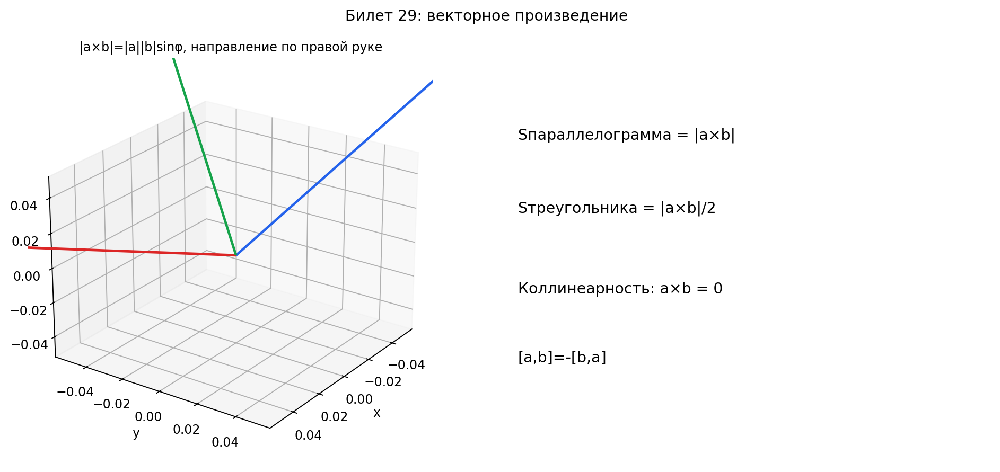

# Билет 29. Определение векторного произведения и его свойства. Площадь параллелограмма и треугольника. Признак коллинеарности векторов.

## Определение векторного произведения

Скалярное произведение давало число. Векторное произведение даёт **вектор**.

**Векторное произведение** двух векторов `a` и `b` — это вектор `a × b`
(обозначается также `[a, b]`), который определяется тремя условиями:

1. **Перпендикулярен обоим** — результат торчит «вверх» из плоскости,
   в которой лежат `a` и `b`. Он перпендикулярен и к `a`, и к `b`.

2. **Длина равна** `|a × b| = |a| · |b| · sin φ` — где `φ` — угол
   между векторами. Длина равна площади параллелограмма, построенного
   на `a` и `b`.

3. **Направление по правилу правой руки** — если пальцы правой руки
   закручиваются от `a` к `b` (по кратчайшему углу), то большой палец
   показывает направление `a × b`.

Словами: берём два вектора, строим на них параллелограмм. Векторное
произведение — это вектор, перпендикулярный этому параллелограмму,
длина которого равна площади параллелограмма.

Важно: векторное произведение существует только в трёхмерном пространстве
(в 2D его нет).

## Координатная форма

Если `a = (a₁, a₂, a₃)` и `b = (b₁, b₂, b₃)`, то:

`a × b = (a₂b₃ − a₃b₂,  a₃b₁ − a₁b₃,  a₁b₂ − a₂b₁)`

Запоминать проще через определитель:

```
         | i   j   k |
a × b =  | a₁  a₂  a₃| = i(a₂b₃ − a₃b₂) − j(a₁b₃ − a₃b₁) + k(a₁b₂ − a₂b₁)
         | b₁  b₂  b₃|
```

Словами: записываем «матрицу» из единичных векторов `i, j, k` в первой
строке, координат `a` во второй, координат `b` в третьей — и раскладываем
определитель по первой строке.

Пример: `a = (1, 2, 3)`, `b = (4, 5, 6)`.

```
a × b = (2·6 − 3·5,  3·4 − 1·6,  1·5 − 2·4)
      = (12 − 15,  12 − 6,  5 − 8)
      = (−3, 6, −3)
```

Проверка перпендикулярности:
`(a, a×b) = 1·(−3) + 2·6 + 3·(−3) = −3 + 12 − 9 = 0` — перпендикулярен `a`.
`(b, a×b) = 4·(−3) + 5·6 + 6·(−3) = −12 + 30 − 18 = 0` — перпендикулярен `b`.

## Свойства векторного произведения

1. **Антикоммутативность:** `a × b = −(b × a)`
   — при перестановке множителей вектор переворачивается. Это не как
   в обычном умножении, где `ab = ba`. Здесь порядок важен!

2. **Однородность:** `(λa) × b = λ(a × b)`
   — число можно вынести за произведение

3. **Дистрибутивность:** `(a + b) × c = a × c + b × c`
   — можно раскрывать скобки

4. **Произведение вектора на себя равно нулю:** `a × a = 0`
   — вектор параллелен сам себе, sin 0° = 0, поэтому длина ноль

5. **Не ассоциативно:** `(a × b) × c ≠ a × (b × c)` в общем случае
   — скобки переставлять нельзя!

## Площадь параллелограмма и треугольника

**Площадь параллелограмма**, построенного на векторах `a` и `b`:

`S = |a × b|`

Словами: длина векторного произведения — это и есть площадь
параллелограмма. Потому что `|a| · |b| · sin φ` — это основание
на высоту.

**Площадь треугольника** — половина параллелограмма:

`S = ½ · |a × b|`

Пример: найти площадь треугольника с вершинами `A(1, 0, 0)`,
`B(0, 1, 0)`, `C(0, 0, 1)`.

Векторы сторон: `AB = (−1, 1, 0)`, `AC = (−1, 0, 1)`.

```
AB × AC = (1·1 − 0·0,  0·(−1) − (−1)·1,  (−1)·0 − 1·(−1))
        = (1, 1, 1)
```

`|AB × AC| = √(1 + 1 + 1) = √3`

`S = ½ · √3 ≈ 0.87`

## Признак коллинеарности векторов

Векторы коллинеарны (параллельны) тогда и только тогда, когда:

`a ∥ b  ⟺  a × b = 0`  (векторное произведение = ноль)

или то же самое:

`a = λb`  (один вектор кратен другому)

Пример: `a = (2, 4, 6)`, `b = (1, 2, 3)` — коллинеарны, `a = 2b`.

## Наглядное представление

### Векторное произведение: нормаль, площадь и ориентация

