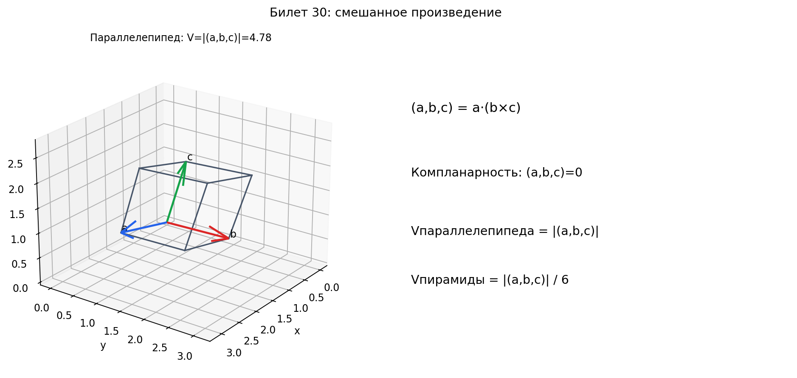

# Билет 30. Определение смешанного произведения и его свойства. Признак компланарности векторов. Объем параллелепипеда и пирамиды.

## Определение смешанного произведения

Скалярное произведение — число, показывает «сонаправленность» двух векторов.
Векторное произведение — вектор, перпендикулярный двум, длина = площадь.
Смешанное произведение — число, показывает объём, который «натягивают» три вектора.

**Смешанное произведение** трёх векторов `a`, `b`, `c` — это скалярное
произведение вектора `a` на векторное произведение `b × c`:

`(a, b, c) = (a, [b, c]) = a · (b × c)`

Словами: сначала берём векторное произведение `b × c` — получаем вектор,
перпендикулярный плоскости `b` и `c`, длина которого равна площади
параллелограмма на `b` и `c`. Потом берём скалярное произведение `a`
на этот вектор — по сути проецируем `a` на нормаль к плоскости.
Получаем площадь основания × высоту = объём.

Результат — число (скаляр), может быть положительным, отрицательным или нулём.

## Координатная форма

Если `a = (a₁, a₂, a₃)`, `b = (b₁, b₂, b₃)`, `c = (c₁, c₂, c₃)`, то:

```
              |a₁  a₂  a₃|
(a, b, c) =  |b₁  b₂  b₃|
              |c₁  c₂  c₃|
```

Словами: записываем координаты трёх векторов в строки матрицы 3×3
и считаем определитель. Определитель — это и есть смешанное произведение.

Пример: `a = (1, 0, 0)`, `b = (0, 1, 0)`, `c = (0, 0, 1)`.

```
|1  0  0|
|0  1  0| = 1·1·1 = 1
|0  0  1|
```

Смешанное произведение = 1. Это единичный куб — объём 1.

Пример: `a = (1, 2, 3)`, `b = (4, 5, 6)`, `c = (7, 8, 9)`.

```
|1  2  3|
|4  5  6| = 1(45−48) − 2(36−42) + 3(32−35) = −3 + 12 − 9 = 0
|7  8  9|
```

Смешанное произведение = 0. Значит векторы компланарны (лежат в одной плоскости).

## Свойства смешанного произведения

1. **Циклическая перестановка не меняет значение:**
   `(a, b, c) = (b, c, a) = (c, a, b)`
   — можно «сдвигать» по кругу

2. **Перестановка двух соседних векторов меняет знак:**
   `(a, b, c) = −(b, a, c) = −(a, c, b)`
   — поменял двух местами → минус (как при перестановке строк определителя)

3. **Однородность:** `(λa, b, c) = λ(a, b, c)`
   — число выносится

4. **Дистрибутивность:** `(a + d, b, c) = (a, b, c) + (d, b, c)`
   — можно раскрывать скобки

## Объём параллелепипеда и пирамиды

**Объём параллелепипеда**, построенного на трёх векторах `a`, `b`, `c`:

`V = |(a, b, c)|`

Словами: берём модуль смешанного произведения — это объём.
Модуль нужен потому, что смешанное произведение может быть отрицательным
(зависит от ориентации векторов), а объём всегда положительный.

**Объём пирамиды** с теми же рёбрами:

`V = ⅙ · |(a, b, c)|`

Словами: пирамида — это ⅙ параллелепипеда (как треугольник — ½ параллелограмма,
только в 3D добавляется ещё множитель ⅓ от высоты, итого ½ · ⅓ = ⅙).

Пример: найти объём пирамиды с вершинами `A(1,0,0)`, `B(0,2,0)`,
`C(0,0,3)`, `D(0,0,0)`.

Векторы из `D`: `DA = (1,0,0)`, `DB = (0,2,0)`, `DC = (0,0,3)`.

```
|1  0  0|
|0  2  0| = 1·2·3 = 6
|0  0  3|
```

`V = ⅙ · |6| = 1`

## Признак компланарности векторов

Три вектора компланарны (лежат в одной плоскости) тогда и только тогда, когда:

`a, b, c компланарны  ⟺  (a, b, c) = 0`

или то же самое: определитель матрицы из их координат равен нулю.

Почему: если три вектора лежат в одной плоскости, то объём параллелепипеда
на них равен нулю — он «плоский», без высоты.

Пример: `a = (1, 2, 3)`, `b = (4, 5, 6)`, `c = (5, 7, 9)`.
`c = a + b`, поэтому все три лежат в одной плоскости.
`(a, b, c) = 0` — компланарны.

## Сравнение трёх произведений

| | Скалярное `(a,b)` | Векторное `a×b` | Смешанное `(a,b,c)` |
|---|---|---|---|
| Сколько векторов | 2 | 2 | 3 |
| Результат | число | вектор | число |
| Что даёт | «сонаправленность» | нормаль к плоскости | объём |
| Геометрия | проекция | площадь параллелограмма | объём параллелепипеда |
| = 0 означает | перпендикулярны | коллинеарны | компланарны |

## Наглядное представление

### Смешанное произведение как ориентированный объём

