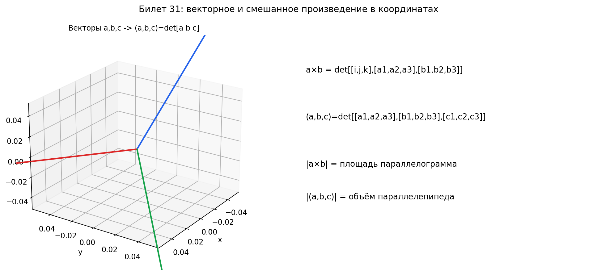

# Билет 31. Векторное и смешанное произведение в координатной форме.

## Векторное произведение в координатной форме

Если $\vec{a} = (a_1, a_2, a_3)$ и $\vec{b} = (b_1, b_2, b_3)$, то:

$$\vec{a} \times \vec{b} = \begin{vmatrix} \vec{i} & \vec{j} & \vec{k} \\ a_1 & a_2 & a_3 \\ b_1 & b_2 & b_3 \end{vmatrix}$$

Раскладываем определитель по первой строке:

$$\vec{a} \times \vec{b} = \vec{i}(a_2 b_3 - a_3 b_2) - \vec{j}(a_1 b_3 - a_3 b_1) + \vec{k}(a_1 b_2 - a_2 b_1)$$

Или покомпонентно:

$$\vec{a} \times \vec{b} = (a_2 b_3 - a_3 b_2, \; a_3 b_1 - a_1 b_3, \; a_1 b_2 - a_2 b_1)$$

Словами: записываем в первую строку единичные векторы $\vec{i}, \vec{j}, \vec{k}$,
во вторую — координаты $\vec{a}$, в третью — координаты $\vec{b}$, и считаем
определитель. Результат — вектор, перпендикулярный обоим исходным.

### Пример

$\vec{a} = (2, 3, 1)$, $\vec{b} = (1, -1, 4)$

$$\vec{a} \times \vec{b} = \begin{vmatrix} \vec{i} & \vec{j} & \vec{k} \\ 2 & 3 & 1 \\ 1 & -1 & 4 \end{vmatrix}$$

$$= \vec{i}(3 \cdot 4 - 1 \cdot (-1)) - \vec{j}(2 \cdot 4 - 1 \cdot 1) + \vec{k}(2 \cdot (-1) - 3 \cdot 1)$$

$$= \vec{i}(12 + 1) - \vec{j}(8 - 1) + \vec{k}(-2 - 3) = (13, -7, -5)$$

Проверка — скалярное произведение с $\vec{a}$ должно быть 0:
$(2 \cdot 13 + 3 \cdot (-7) + 1 \cdot (-5)) = 26 - 21 - 5 = 0$ — верно.

---

## Смешанное произведение в координатной форме

Если $\vec{a} = (a_1, a_2, a_3)$, $\vec{b} = (b_1, b_2, b_3)$, $\vec{c} = (c_1, c_2, c_3)$, то:

$$(\vec{a}, \vec{b}, \vec{c}) = \begin{vmatrix} a_1 & a_2 & a_3 \\ b_1 & b_2 & b_3 \\ c_1 & c_2 & c_3 \end{vmatrix}$$

Раскладываем по первой строке:

$$= a_1(b_2 c_3 - b_3 c_2) - a_2(b_1 c_3 - b_3 c_1) + a_3(b_1 c_2 - b_2 c_1)$$

Словами: записываем координаты трёх векторов в строки матрицы $3 \times 3$
и считаем определитель. Результат — число, равное объёму параллелепипеда
(со знаком).

### Пример

$\vec{a} = (1, 2, -1)$, $\vec{b} = (3, 0, 1)$, $\vec{c} = (2, 1, 2)$

$$(\vec{a}, \vec{b}, \vec{c}) = \begin{vmatrix} 1 & 2 & -1 \\ 3 & 0 & 1 \\ 2 & 1 & 2 \end{vmatrix}$$

$$= 1(0 \cdot 2 - 1 \cdot 1) - 2(3 \cdot 2 - 1 \cdot 2) + (-1)(3 \cdot 1 - 0 \cdot 2)$$

$$= 1(-1) - 2(4) + (-1)(3) = -1 - 8 - 3 = -12$$

Объём параллелепипеда: $V = |{-12}| = 12$

Объём пирамиды: $V = \frac{1}{6} \cdot 12 = 2$

---

## Связь формул

| Произведение | Формула | Результат | Геометрический смысл |
|---|---|---|---|
| Скалярное $(\vec{a}, \vec{b})$ | $a_1 b_1 + a_2 b_2 + a_3 b_3$ | число | проекция, угол |
| Векторное $\vec{a} \times \vec{b}$ | определитель $3 \times 3$ с $\vec{i}, \vec{j}, \vec{k}$ | вектор | площадь, нормаль |
| Смешанное $(\vec{a}, \vec{b}, \vec{c})$ | определитель $3 \times 3$ из координат | число | объём |

## Наглядное представление

### Координатные формулы векторного и смешанного произведений

