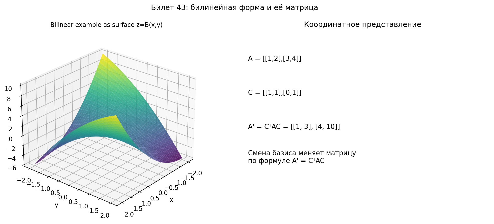

# Билет 43. Билинейные формы. Примеры. Координатное представление. Преобразование при смене базиса.

---

## 1. Определение билинейной формы

**Определение.** Билинейная форма — это функция $B: V \times V \to \mathbb{R}$, которая **линейна по каждому аргументу**:

1. **Линейность по первому аргументу:**
   $$B(\alpha x + \beta y, z) = \alpha B(x, z) + \beta B(y, z)$$

2. **Линейность по второму аргументу:**
   $$B(x, \alpha y + \beta z) = \alpha B(x, y) + \beta B(x, z)$$

**Словами:** билинейная форма берёт два вектора и выдаёт число. Если зафиксировать один из аргументов, то по другому аргументу она — линейная функция.

**"Билинейная"** = линейная по обоим (bi = два).

---

## 2. Примеры билинейных форм

### Пример 1: Скалярное произведение

$$B(x, y) = (x, y) = x_1 y_1 + x_2 y_2 + \ldots + x_n y_n$$

Это **симметричная** билинейная форма: $B(x, y) = B(y, x)$.

### Пример 2: Несимметричная форма

$$B(x, y) = x_1 y_1 + x_1 y_2 + x_2 y_1$$

В $\mathbb{R}^2$:
- $B((1, 0), (0, 1)) = 0 + 1 + 0 = 1$
- $B((0, 1), (1, 0)) = 0 + 0 + 1 = 1$

Тут случайно симметрично, но в общем случае — нет.

### Пример 3: Кососимметричная (антисимметричная) форма

$$B(x, y) = x_1 y_2 - x_2 y_1$$

Свойство: $B(x, y) = -B(y, x)$ и $B(x, x) = 0$.

**Геометрический смысл:** ориентированная площадь параллелограмма на векторах $x$ и $y$ в $\mathbb{R}^2$ (определитель матрицы $2 \times 2$).

### Пример 4: Общая билинейная форма в $\mathbb{R}^2$

$$B(x, y) = 2x_1 y_1 + 3x_1 y_2 - x_2 y_1 + 4x_2 y_2$$

### Проверка линейности (пример)

$B(x, y) = x_1 y_1 + x_1 y_2$. Проверим линейность по первому аргументу:

$$B(\alpha x, y) = (\alpha x_1) y_1 + (\alpha x_1) y_2 = \alpha(x_1 y_1 + x_1 y_2) = \alpha B(x, y) \;\checkmark$$

$$B(x + z, y) = (x_1 + z_1)y_1 + (x_1 + z_1)y_2 = x_1 y_1 + z_1 y_1 + x_1 y_2 + z_1 y_2$$
$$= (x_1 y_1 + x_1 y_2) + (z_1 y_1 + z_1 y_2) = B(x, y) + B(z, y) \;\checkmark$$

Аналогично проверяется по второму аргументу.

---

## 3. Координатное представление билинейной формы

**Теорема.** В фиксированном базисе любая билинейная форма представима в виде:

$$\boxed{B(x, y) = x^T A y = \sum_{i=1}^n \sum_{j=1}^n a_{ij} x_i y_j}$$

где $A = (a_{ij})$ — **матрица билинейной формы**, $x = (x_1, \ldots, x_n)^T$, $y = (y_1, \ldots, y_n)^T$ — координаты векторов.

### Как найти матрицу $A$

$$a_{ij} = B(e_i, e_j)$$

где $e_i$ — векторы базиса.

**Словами:** элемент $a_{ij}$ — это значение билинейной формы на паре базисных векторов $e_i$ и $e_j$.

### Числовой пример 1: скалярное произведение

В стандартном базисе $\mathbb{R}^2$:

$$B(x, y) = x_1 y_1 + x_2 y_2$$

Матрица: $A = \begin{pmatrix} 1 & 0 \\ 0 & 1 \end{pmatrix} = E$ (единичная).

Проверка: $x^T A y = (x_1, x_2) \begin{pmatrix} 1 & 0 \\ 0 & 1 \end{pmatrix} \begin{pmatrix} y_1 \\ y_2 \end{pmatrix} = x_1 y_1 + x_2 y_2$ ✓

### Числовой пример 2: несимметричная форма

$$B(x, y) = x_1 y_1 + x_1 y_2 + x_2 y_1$$

Запишем через матрицу:

$$B(x, y) = (x_1, x_2) \begin{pmatrix} a_{11} & a_{12} \\ a_{21} & a_{22} \end{pmatrix} \begin{pmatrix} y_1 \\ y_2 \end{pmatrix}$$

$$= (x_1, x_2) \begin{pmatrix} a_{11} y_1 + a_{12} y_2 \\ a_{21} y_1 + a_{22} y_2 \end{pmatrix} = x_1(a_{11} y_1 + a_{12} y_2) + x_2(a_{21} y_1 + a_{22} y_2)$$

$$= a_{11} x_1 y_1 + a_{12} x_1 y_2 + a_{21} x_2 y_1 + a_{22} x_2 y_2$$

Сравниваем с $B(x, y) = x_1 y_1 + x_1 y_2 + x_2 y_1$:

- $a_{11} = 1$
- $a_{12} = 1$
- $a_{21} = 1$
- $a_{22} = 0$

$$A = \begin{pmatrix} 1 & 1 \\ 1 & 0 \end{pmatrix}$$

Проверка: $B((2, 3), (1, 4)) = 2 \cdot 1 + 2 \cdot 4 + 3 \cdot 1 = 2 + 8 + 3 = 13$.

Через матрицу: $(2, 3) \begin{pmatrix} 1 & 1 \\ 1 & 0 \end{pmatrix} \begin{pmatrix} 1 \\ 4 \end{pmatrix} = (2, 3) \begin{pmatrix} 5 \\ 1 \end{pmatrix} = 10 + 3 = 13$ ✓

### Числовой пример 3: кососимметричная форма

$$B(x, y) = x_1 y_2 - x_2 y_1$$

Матрица: $A = \begin{pmatrix} 0 & 1 \\ -1 & 0 \end{pmatrix}$ (кососимметричная: $A^T = -A$).

---

## 4. Свойства матрицы билинейной формы

1. **Симметричная** билинейная форма ($B(x, y) = B(y, x)$) → матрица **симметрична**: $A^T = A$

2. **Кососимметричная** ($B(x, y) = -B(y, x)$) → матрица **кососимметрична**: $A^T = -A$

3. **Любую** билинейную форму можно разложить на симметричную + кососимметричную:
   $$B(x, y) = \frac{B(x, y) + B(y, x)}{2} + \frac{B(x, y) - B(y, x)}{2}$$

---

## 5. Преобразование при смене базиса

**Теорема.** При переходе от старого базиса к новому с матрицей перехода $C$ матрица билинейной формы преобразуется:

$$\boxed{A' = C^T A C}$$

где:
- $A$ — матрица билинейной формы в старом базисе
- $A'$ — матрица той же формы в новом базисе
- $C$ — матрица перехода (столбцы = координаты нового базиса в старом)

### Вывод формулы

Пусть $x$ и $y$ — координаты векторов в старом базисе, $x'$ и $y'$ — в новом. Связь: $x = Cx'$, $y = Cy'$.

В старом базисе:
$$B(x, y) = x^T A y = (Cx')^T A (Cy') = (x')^T C^T A C y'$$

Значит в новом базисе матрица $A' = C^T A C$.

### Числовой пример

Старый базис: $e_1 = (1, 0)$, $e_2 = (0, 1)$. Форма: $B(x, y) = x_1 y_1 + x_1 y_2 + x_2 y_1$.

Матрица в старом базисе: $A = \begin{pmatrix} 1 & 1 \\ 1 & 0 \end{pmatrix}$.

Новый базис: $e'_1 = (1, 1)$, $e'_2 = (1, -1)$ (в координатах старого базиса).

Матрица перехода: $C = \begin{pmatrix} 1 & 1 \\ 1 & -1 \end{pmatrix}$ (столбцы = новые векторы в старом базисе).

Вычисляем $A' = C^T A C$:

$$C^T = \begin{pmatrix} 1 & 1 \\ 1 & -1 \end{pmatrix}$$

$$C^T A = \begin{pmatrix} 1 & 1 \\ 1 & -1 \end{pmatrix} \begin{pmatrix} 1 & 1 \\ 1 & 0 \end{pmatrix} = \begin{pmatrix} 2 & 1 \\ 0 & 1 \end{pmatrix}$$

$$A' = \begin{pmatrix} 2 & 1 \\ 0 & 1 \end{pmatrix} \begin{pmatrix} 1 & 1 \\ 1 & -1 \end{pmatrix} = \begin{pmatrix} 3 & 1 \\ 1 & -1 \end{pmatrix}$$

Матрица в новом базисе: $A' = \begin{pmatrix} 3 & 1 \\ 1 & -1 \end{pmatrix}$.

---

## 6. Сравнение преобразований

| Что | Формула | Комментарий |
|-----|---------|-------------|
| Координаты вектора | $x' = C^{-1} x$ | Обратная матрица |
| Линейный оператор | $A' = C^{-1} A C$ | Обратная + прямая |
| Билинейная форма | $A' = C^T A C$ | **Транспонированная + прямая** |
| Квадратичная форма | $A' = C^T A C$ | То же что билинейная |

**Почему транспонированная:** потому что в $x^T A y$ есть транспонирование первого вектора.

---

## 7. Итоговая сводка

**Билинейная форма:**
- Функция двух векторов, линейная по каждому
- Записывается как $B(x, y) = x^T A y$
- Матрица $A$: элемент $a_{ij} = B(e_i, e_j)$

**Примеры:**
- Скалярное произведение (симметричная)
- Определитель $2 \times 2$ (кососимметричная)

**Преобразование при смене базиса:**
$$A' = C^T A C$$

## Наглядное представление

### Билинейная форма: поверхность значений и матричная запись

