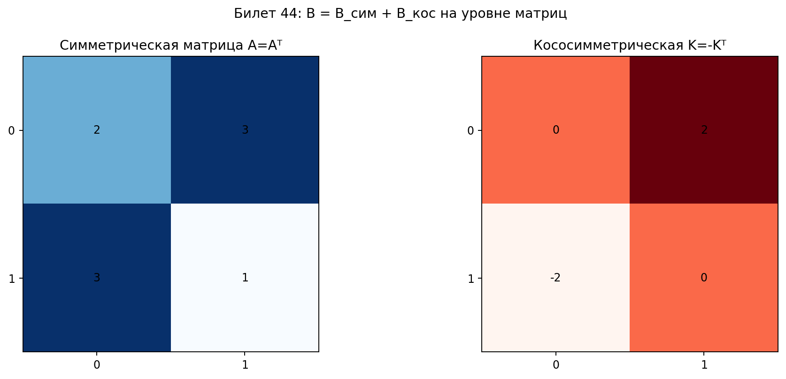

# Билет 44. Симметричные и кососимметричные билинейные формы. Симметрирование и альтернирование билинейных форм. Разложение билинейной формы на симметричную и кососимметричную составляющие.

## Определения

**Симметрическая билинейная форма**: B(x, y) = B(y, x)
Матрица симметрична: A = Aᵀ

**Кососимметрическая (антисимметрическая) билинейная форма**: B(x, y) = −B(y, x)
Матрица кососимметрична: A = −Aᵀ

## Теоремы

**Симметрирование**: B_сим(x, y) = ½(B(x, y) + B(y, x))

**Альтернирование**: B_кос(x, y) = ½(B(x, y) − B(y, x))

**Разложение**: любая билинейная форма единственным образом представляется как сумма симметрической и кососимметрической: B = B_сим + B_кос

## Наглядное представление

### Разложение билинейной формы на симметрическую и кососимметрическую части

