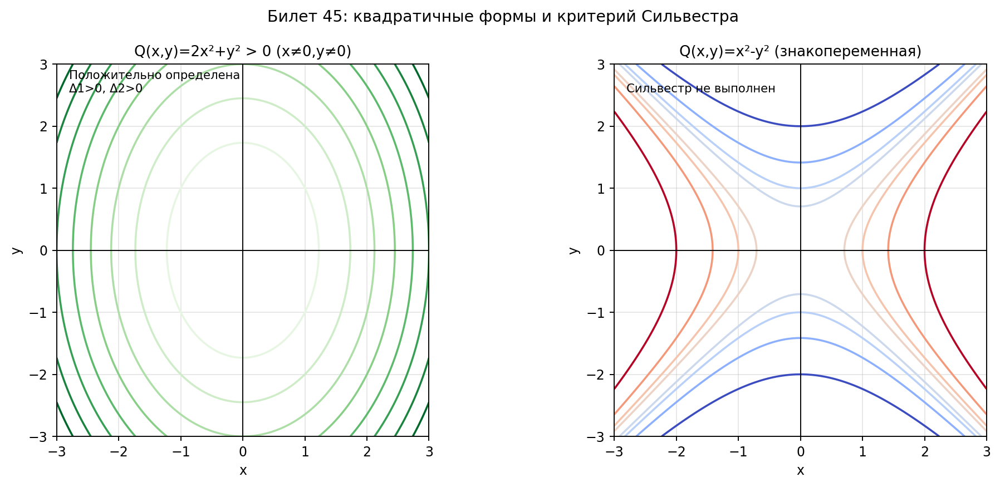

# Билет 45. Квадратичные формы. Положительно и отрицательно определённые квадратичные формы. Критерий Сильвестра.

## Определения

**Квадратичная форма**: Q(x) = B(x, x) = xᵀAx, где A — симметрическая матрица.

**Положительно определённая**: Q(x) > 0 для всех x ≠ 0

**Отрицательно определённая**: Q(x) < 0 для всех x ≠ 0

**Знакопеременная**: принимает значения разных знаков

**Главные угловые миноры** Δₖ — определители подматриц в левом верхнем углу.

## Теоремы (Критерий Сильвестра)

**Положительная определённость** ⇔ Δ₁ > 0, Δ₂ > 0, ..., Δₙ > 0

**Отрицательная определённость** ⇔ Δ₁ < 0, Δ₂ > 0, Δ₃ < 0, ... (знаки чередуются)

## Наглядное представление

### Квадратичная форма: тип поверхности уровня и знакоопределённость

