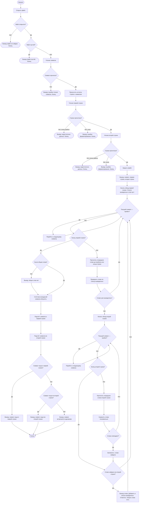

```mermaid
flowchart TD
    A([Начало]) --> B[Открыть файл]
    B --> C{Файл открылся?}
    C -- Нет --> D([Вывод: файл не найден. Конец])
    C -- Да --> E{Файл пустой?}
    E -- Да --> F([Вывод: файл пустой. Конец])
    E -- Нет --> G[Чтение символа]
    G --> H{Символ прочитан?}
    H -- Нет --> I([Вывод: ошибка чтения символа. Конец])
    H -- Да --> J[Пропустить остаток строки с символом]
    J --> K[Чтение первой строки]
    K --> L{Строка прочитана?}
    L -- Нет, конец файла --> M([Вывод: недостаточно данных. Конец])
    L -- Нет, иное --> N([Вывод: ошибка форматирования. Конец])
    L -- Да --> O[Чтение второй строки]
    O --> P{Строка прочитана?}
    P -- Нет, конец файла --> Q([Вывод: недостаточно данных. Конец])
    P -- Нет, иное --> R([Вывод: ошибка форматирования. Конец])
    P -- Да --> S[Закрыть файл]
    S --> T[Вывод: символ, первая строка, вторая строка]

    T --> U[Начать обход первой строки. Список выведенных слов пуст]

    U --> V{Текущий символ — пробел?}
    V -- Да --> W[Перейти к следующему символу] --> V
    V -- Нет --> X{Конец первой строки?}
    X -- Да --> Y{Были общие слова?}
    X -- Нет --> Z[Прочитать очередное слово до пробела или конца строки]

    Z --> AA[Проверить слово по списку выведенных]
    AA --> AB{Слово уже выводилось?}
    AB -- Да --> V
    AB -- Нет --> AF[Начать обход второй строки]

    AF --> AG{Текущий символ — пробел?}
    AG -- Да --> AH[Перейти к следующему символу] --> AG
    AG -- Нет --> AI{Конец второй строки?}
    AI -- Да --> AJ{Слово найдено во второй строке?}
    AI -- Нет --> AK[Прочитать очередное слово второй строки]
    AK --> AL[Сравнить слова посимвольно]
    AL --> AM{Слова совпадают?}
    AM -- Да --> AN[Запомнить: слово найдено] --> AJ
    AM -- Нет --> AG

    AJ -- Да --> AO[Вывод слова. Добавить в список выведенных. Отметить: общие слова есть]
    AJ -- Нет --> V
    AO --> V

    Y -- Нет --> AP[Вывод: общих слов нет]
    Y -- Да --> AQ
    AP --> AQ

    AQ[Счётчики вхождений символа обнулить]
    AQ --> AR[Подсчёт символа в первой строке]
    AR --> AS[Подсчёт символа во второй строке]
    AS --> AT{Символ чаще в первой строке?}
    AT -- Да --> AU[Вывод: символ чаще в первой строке]
    AT -- Нет --> AV{Символ чаще во второй строке?}
    AV -- Да --> AW[Вывод: символ чаще во второй строке]
    AV -- Нет --> AX[Вывод: символ встречается одинаково]
    AU --> AY([Конец])
    AW --> AY
    AX --> AY
```
