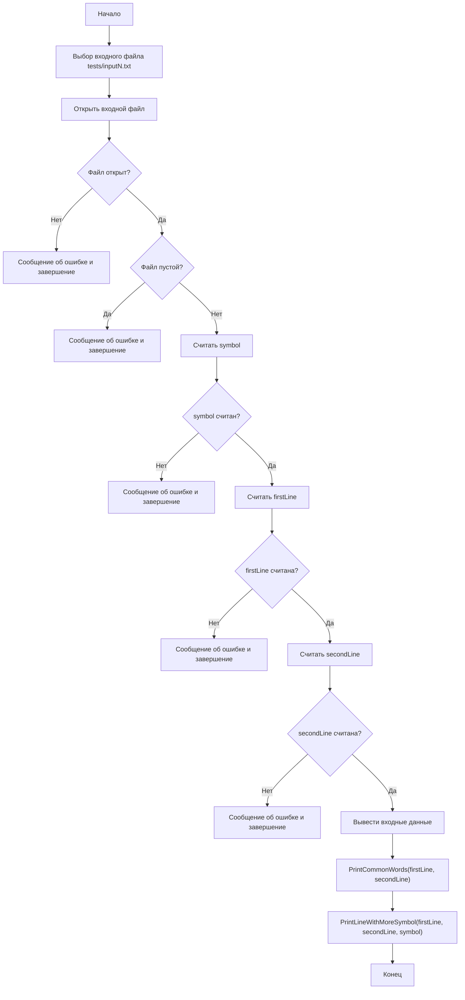

# Задание 3

ВАРИАНТ № 4.

В файле исходных данных задается отдельный символ и две строки слов.
Написать программу, включающую две процедуры, выполняющие следующие действия:
1. печать слов, встречающихся в обеих заданных строках;
2. выявление строки, в которой заданный символ встречается чаще.

Чтение данных из файла производить с использованием функций ввода/вывода языка C++.
Алгоритм должен быть параметризован; обмен данными с подпрограммой должен осуществляться только через параметры; каждый из наборов исходных данных хранится в отдельном файле.

# Структурная схема алгоритма (блок-схема)



# Псевдокод (по ГОСТу)

```text
КОНСТ MAX_LINE_LEN = 256
КОНСТ MAX_WORD_LEN = 64
КОНСТ MAX_WORDS = 128

ПРОЦЕДУРА PrintCommonWords(firstLine, secondLine)
НАЧАЛО
    pos := 0
    printedCount := 0
    hasCommonWords := ЛОЖЬ

    ПОКА есть следующее слово word в firstLine
    НЦ
        ЕСЛИ word не находится в printedWords И word находится во secondLine
        ТО
            ВЫВЕСТИ word
            hasCommonWords := ИСТИНА
            ЕСЛИ printedCount < MAX_WORDS
            ТО
                добавить word в printedWords
                printedCount := printedCount + 1
            КОНЕЦ ЕСЛИ
        КОНЕЦ ЕСЛИ
    КЦ

    ЕСЛИ hasCommonWords = ЛОЖЬ
    ТО
        ВЫВЕСТИ "(общих слов нет)"
    КОНЕЦ ЕСЛИ
КОНЕЦ

ФУНКЦИЯ CountSymbolInLine(line, symbol): цел
НАЧАЛО
    count := 0
    i := 0
    ПОКА line[i] != '\0'
    НЦ
        ЕСЛИ line[i] = symbol
        ТО count := count + 1
        КОНЕЦ ЕСЛИ
        i := i + 1
    КЦ
    ВОЗВРАТ count
КОНЕЦ

ПРОЦЕДУРА PrintLineWithMoreSymbol(firstLine, secondLine, symbol)
НАЧАЛО
    firstCount := CountSymbolInLine(firstLine, symbol)
    secondCount := CountSymbolInLine(secondLine, symbol)

    ЕСЛИ firstCount > secondCount
    ТО
        ВЫВЕСТИ "Символ чаще в первой строке"
    ИНАЧЕ ЕСЛИ secondCount > firstCount
    ТО
        ВЫВЕСТИ "Символ чаще во второй строке"
    ИНАЧЕ
        ВЫВЕСТИ "Частоты символа равны"
    КОНЕЦ ЕСЛИ
КОНЕЦ

ПРОГРАММА main
НАЧАЛО
    выбрать inputPath = tests/inputN.txt
    открыть файл fin

    ЕСЛИ fin.fail()
    ТО ВЫВЕСТИ ошибку; ВЫХОД(1)
    КОНЕЦ ЕСЛИ

    ЕСЛИ fin.peek() = EOF
    ТО ВЫВЕСТИ ошибку; закрыть fin; ВЫХОД(2)
    КОНЕЦ ЕСЛИ

    считать symbol
    ЕСЛИ ошибка
    ТО ВЫВЕСТИ ошибку; закрыть fin; ВЫХОД(3)
    КОНЕЦ ЕСЛИ

    считать firstLine
    ЕСЛИ ошибка
    ТО ВЫВЕСТИ ошибку; закрыть fin; ВЫХОД(4)
    КОНЕЦ ЕСЛИ

    считать secondLine
    ЕСЛИ ошибка
    ТО ВЫВЕСТИ ошибку; закрыть fin; ВЫХОД(5)
    КОНЕЦ ЕСЛИ

    закрыть fin

    ВЫВЕСТИ symbol, firstLine, secondLine
    PrintCommonWords(firstLine, secondLine)
    PrintLineWithMoreSymbol(firstLine, secondLine, symbol)
КОНЕЦ
```

# Код (код программы)

```cpp
/****************************************************************
*
* Project Type  : Win32 Console Application
* Project Name  : Lab 1, Task 3
* File Name     : main.cpp
* Language      : C/C++
* Programmer    : student
* Created       : 06/03/26
* Comment       : Символьные данные. Вариант 4.
*
****************************************************************/

#include <fstream>  // для работы с файлами (ifstream)
#include <iostream> // ввод/вывод
#include <limits>   // numeric_limits

using namespace std;

const int MAX_LINE_LEN = 256; // максимальная длина строки
const int MAX_WORD_LEN = 64;  // максимальная длина одного слова
const int MAX_WORDS = 128;    // максимум слов для массива уже выведенных

/*******************************************************************/
/*                 В С П О М О Г А Т Е Л Ь Н Ы Е                 */
/*                        Ф У Н К Ц И И                            */
/*******************************************************************/

bool WordsEqual(const char* left, const char* right)
{
    int i;

    i = 0;
    while (left[i] != '\0' && right[i] != '\0') {
        if (left[i] != right[i]) {
            return false;
        }
        ++i;
    }

    return left[i] == right[i];
}

void CopyWord(const char* from, char* to)
{
    int i;

    i = 0;
    while (from[i] != '\0' && i < MAX_WORD_LEN - 1) {
        to[i] = from[i];
        ++i;
    }
    to[i] = '\0';
}

bool ReadNextWord(const char* str, int& pos, char* word)
{
    int i;

    while (str[pos] != '\0' && str[pos] <= ' ') {
        ++pos;
    }

    if (str[pos] == '\0') {
        word[0] = '\0';
        return false;
    }

    i = 0;
    while (str[pos] != '\0' && str[pos] > ' ') {
        if (i < MAX_WORD_LEN - 1) {
            word[i] = str[pos];
            ++i;
        }
        ++pos;
    }
    word[i] = '\0';

    return true;
}

bool WordExistsInLine(const char* targetWord, const char* line)
{
    int pos;
    char currentWord[MAX_WORD_LEN];

    pos = 0;
    while (ReadNextWord(line, pos, currentWord)) {
        if (WordsEqual(targetWord, currentWord)) {
            return true;
        }
    }

    return false;
}

bool WordAlreadyPrinted(const char* word, const char printedWords[MAX_WORDS][MAX_WORD_LEN], int printedCount)
{
    int i;

    for (i = 0; i < printedCount; ++i) {
        if (WordsEqual(word, printedWords[i])) {
            return true;
        }
    }

    return false;
}

/*******************************************************************/
/*                 П Р О Ц Е Д У Р Ы   П О   З А Д А Н И Ю        */
/*******************************************************************/

void PrintCommonWords(const char* firstLine, const char* secondLine)
{
    int pos;
    int printedCount;
    bool hasCommonWords;

    char word[MAX_WORD_LEN];
    char printedWords[MAX_WORDS][MAX_WORD_LEN];

    pos = 0;
    printedCount = 0;
    hasCommonWords = false;

    while (ReadNextWord(firstLine, pos, word)) {
        if (!WordAlreadyPrinted(word, printedWords, printedCount) && WordExistsInLine(word, secondLine)) {
            cout << word << '\n';
            hasCommonWords = true;

            if (printedCount < MAX_WORDS) {
                CopyWord(word, printedWords[printedCount]);
                ++printedCount;
            }
        }
    }

    if (!hasCommonWords) {
        cout << "(общих слов нет)" << '\n';
    }
}

int CountSymbolInLine(const char* line, char symbol)
{
    int count;
    int i;

    count = 0;
    i = 0;
    while (line[i] != '\0') {
        if (line[i] == symbol) {
            ++count;
        }
        ++i;
    }

    return count;
}

void PrintLineWithMoreSymbol(const char* firstLine, const char* secondLine, char symbol)
{
    int firstCount;
    int secondCount;

    firstCount = CountSymbolInLine(firstLine, symbol);
    secondCount = CountSymbolInLine(secondLine, symbol);

    if (firstCount > secondCount) {
        cout << "Символ '" << symbol << "' чаще встречается в первой строке: "
             << firstCount << " против " << secondCount << "." << '\n';
    }
    else if (secondCount > firstCount) {
        cout << "Символ '" << symbol << "' чаще встречается во второй строке: "
             << secondCount << " против " << firstCount << "." << '\n';
    }
    else {
        cout << "Символ '" << symbol << "' встречается одинаково в обеих строках: "
             << firstCount << "." << '\n';
    }
}

/*******************************************************************/
/*                 О С Н О В Н А Я   П Р О Г Р А М М А            */
/*******************************************************************/

int main()
{
    // Выберите нужный набор входных данных:
    const char* inputPath = "tests/input1.txt"; // Тест 1: общие слова есть, символ чаще в 1-й строке.
    // const char* inputPath = "tests/input2.txt"; // Тест 2: общих слов нет, символ чаще во 2-й строке.
    // const char* inputPath = "tests/input3.txt"; // Тест 3: общих слов нет, частоты символа равны.
    // const char* inputPath = "tests/input4.txt"; // Тест 4: дубли слов в первой строке.
    // const char* inputPath = "tests/input5.txt"; // Тест 5: лишние пробелы в строках.

    // Объявление переменных
    ifstream fin;                   // поток для чтения входного файла
    char symbol;                    // заданный символ
    char firstLine[MAX_LINE_LEN];   // первая строка слов
    char secondLine[MAX_LINE_LEN];  // вторая строка слов

    // Открытие входного файла
    fin.open(inputPath);

    // Проверка открытия входного файла
    if (fin.fail()) {
        cout << "Ошибка: Файл " << inputPath << " не найден!\n";
        return 1;
    }

    // Проверка, что файл не пустой
    if (fin.peek() == EOF) {
        cout << "Ошибка: файл " << inputPath << " пустой\n";
        fin.close();
        return 2;
    }

    // Чтение символа
    fin >> symbol;
    if (fin.fail()) {
        cout << "Ошибка чтения символа из файла: неверный формат данных\n";
        fin.close();
        return 3;
    }

    // Переход на следующую строку перед getline
    fin.ignore(numeric_limits<streamsize>::max(), '\n');

    // Чтение первой строки
    if (!fin.getline(firstLine, MAX_LINE_LEN)) {
        cout << "Ошибка чтения первой строки из файла\n";
        if (fin.eof()) {
            cout << "недостаточно данных в файле (достигнут конец файла)\n";
        }
        else {
            cout << "Ошибка форматирования данных\n";
        }
        fin.close();
        return 4;
    }

    // Чтение второй строки
    if (!fin.getline(secondLine, MAX_LINE_LEN)) {
        cout << "Ошибка чтения второй строки из файла\n";
        if (fin.eof()) {
            cout << "недостаточно данных в файле (достигнут конец файла)\n";
        }
        else {
            cout << "Ошибка форматирования данных\n";
        }
        fin.close();
        return 5;
    }

    fin.close(); // закрываем входной файл после чтения

    // Вывод входных данных
    cout << "Символ: " << symbol << '\n';
    cout << "Первая строка: " << firstLine << '\n';
    cout << "Вторая строка: " << secondLine << '\n';

    // 1. Печать слов, встречающихся в обеих строках
    cout << "\nСлова, встречающиеся в обеих строках:" << '\n';
    PrintCommonWords(firstLine, secondLine);

    // 2. Выявление строки, в которой символ встречается чаще
    cout << "\nСравнение частоты символа:" << '\n';
    PrintLineWithMoreSymbol(firstLine, secondLine, symbol);

    return 0;
}
```

# Результаты работы программы (тесты на разные случаи входных данных)

> Для каждого теста в `main.cpp` выбирался соответствующий файл `tests/inputN.txt`.

## Тест 1

Входные данные (`tests/input1.txt`):
```text
a
cat dog sky cat
dog sun cat
```

Вывод:
```text
Символ: a
Первая строка: cat dog sky cat
Вторая строка: dog sun cat

Слова, встречающиеся в обеих строках:
cat
dog

Сравнение частоты символа:
Символ 'a' чаще встречается в первой строке: 2 против 1.
```

## Тест 2

Входные данные (`tests/input2.txt`):
```text
x
alpha beta gamma
delta epsilon zeta xylophone
```

Вывод:
```text
Символ: x
Первая строка: alpha beta gamma
Вторая строка: delta epsilon zeta xylophone

Слова, встречающиеся в обеих строках:
(общих слов нет)

Сравнение частоты символа:
Символ 'x' чаще встречается во второй строке: 1 против 0.
```

## Тест 3

Входные данные (`tests/input3.txt`):
```text
e
red blue
green
```

Вывод:
```text
Символ: e
Первая строка: red blue
Вторая строка: green

Слова, встречающиеся в обеих строках:
(общих слов нет)

Сравнение частоты символа:
Символ 'e' встречается одинаково в обеих строках: 2.
```

## Тест 4

Входные данные (`tests/input4.txt`):
```text
h
kiwi kiwi lime fig
fig kiwi chili
```

Вывод:
```text
Символ: h
Первая строка: kiwi kiwi lime fig
Вторая строка: fig kiwi chili

Слова, встречающиеся в обеих строках:
kiwi
fig

Сравнение частоты символа:
Символ 'h' чаще встречается во второй строке: 1 против 0.
```

## Тест 5

Входные данные (`tests/input5.txt`):
```text
s
   sea  sun   sand
sand sea
```

Вывод:
```text
Символ: s
Первая строка:    sea  sun   sand
Вторая строка: sand sea

Слова, встречающиеся в обеих строках:
sea
sand

Сравнение частоты символа:
Символ 's' чаще встречается в первой строке: 3 против 2.
```

# Вывод

Разработка завершена на том основании, что:
1. Ожидаемые результаты совпали с полученными.
2. Считаем набор тестов полным.
